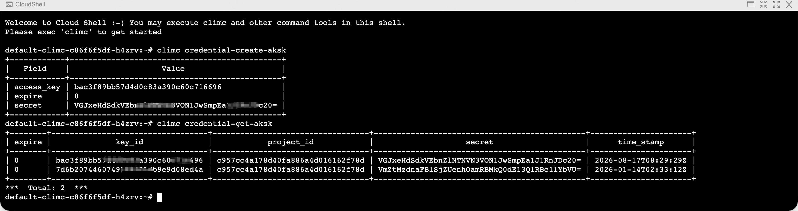
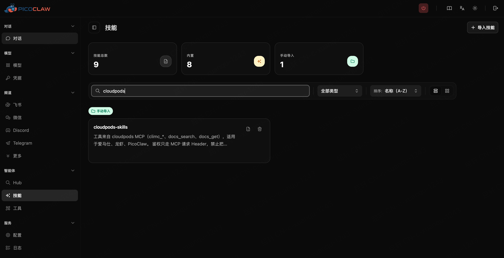
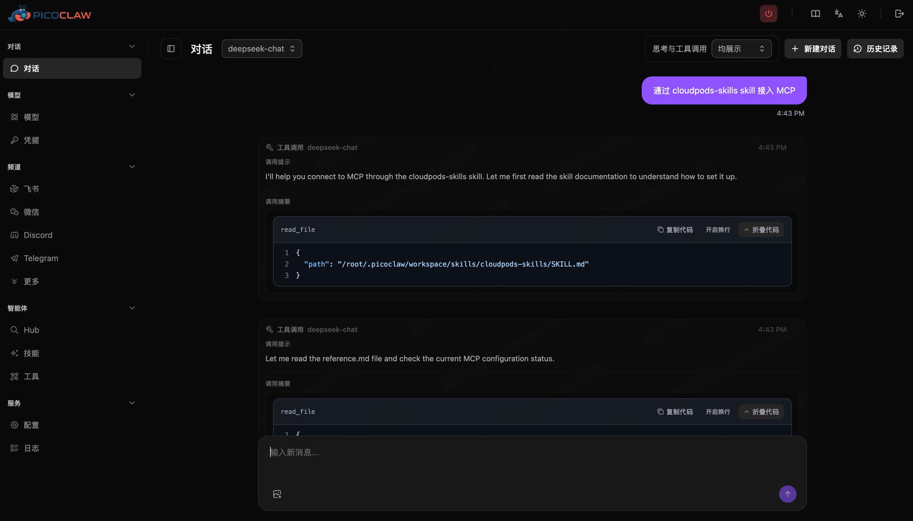
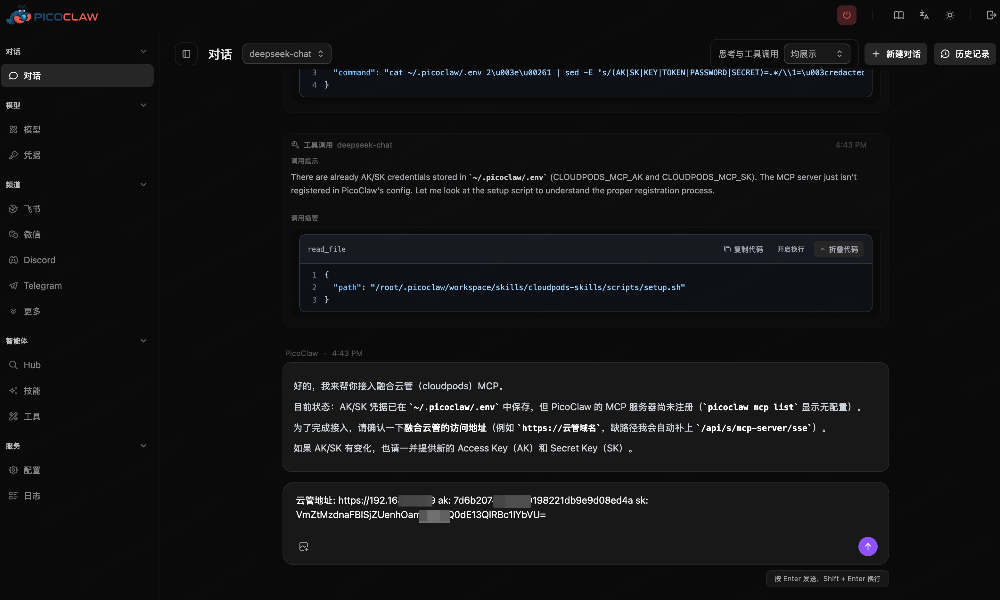
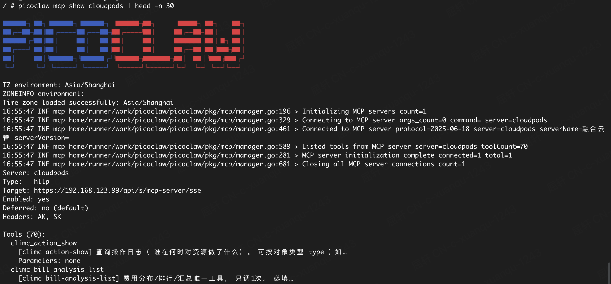
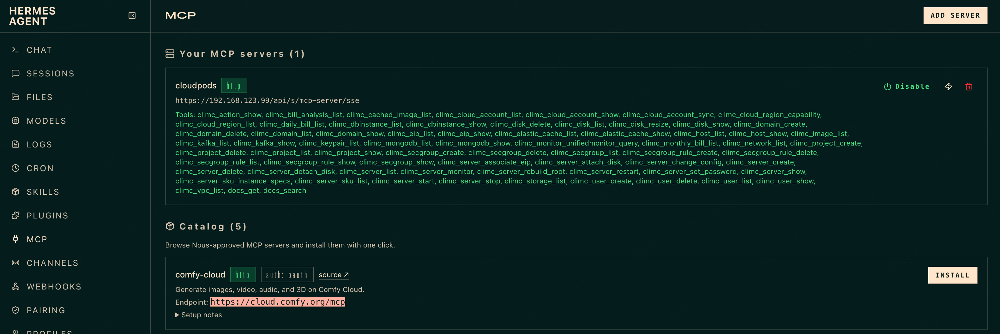
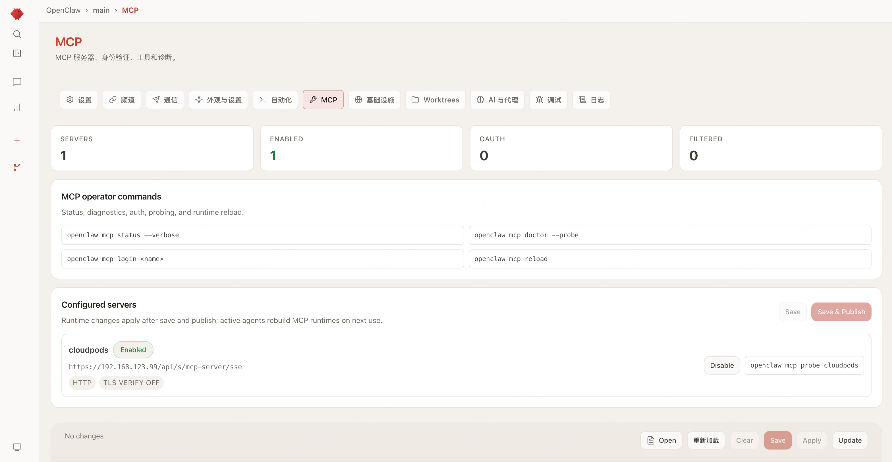
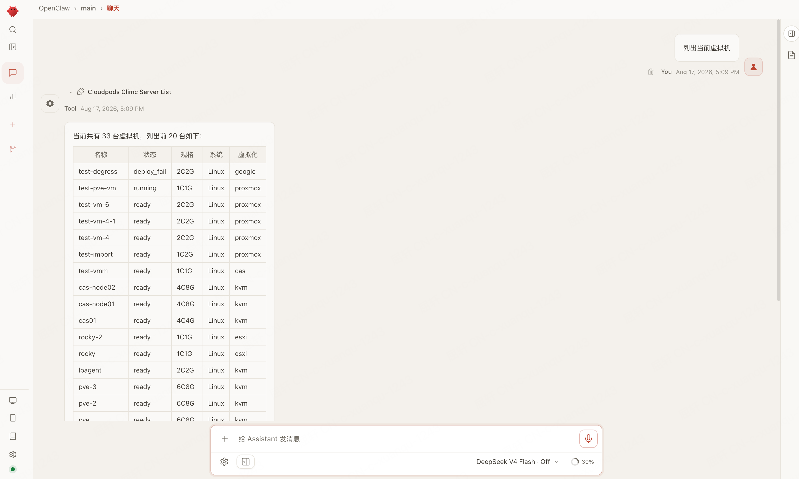
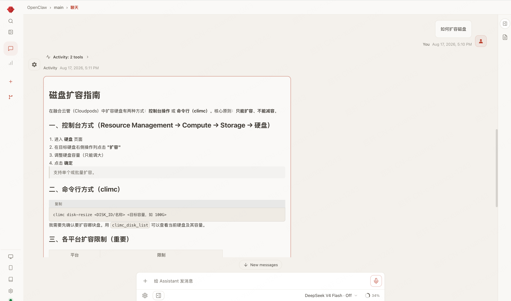

# 把融合云管接到智能体：cloudpods-skills 接入指南

[cloudpods-skills](https://github.com/yunionio/cloudpods-skills) 是融合云管 / [Cloudpods](https://github.com/yunionio/cloudpods) 的 Agent Skill。装上之后，PicoClaw、爱马仕（Hermes）、龙虾（OpenClaw）就能通过 MCP 工具操作云资源；企业版还可查阅官方文档、查看账单。

本文按「安装技能 → 对话里接入 MCP → 确认工具可用」的顺序走完一遍，适合第一次把云管接到智能体的同学。

<!--truncate-->

## 接入之后能做什么

智能体拿到的不是一段提示词，而是一组可调用的 MCP 工具，例如：

- 查区域、规格、镜像，再创建、启停、改配虚拟机
- 查监控指标
- **企业版**：按官方文档回答「如何扩容磁盘」这类产品问题（`docs_search`、`docs_get`）
- **企业版**：看本月 / 上月费用分布（`climc_bill_analysis_list` 等）

开源版可使用虚拟机、磁盘、网络、监控等 `climc_*` 资源操作。**文档工具（`docs_search`、`docs_get`）和费用工具仅企业版支持**；接到开源版时这两类工具不会出现，也不要拿它们做自检。

Skill 名是 `cloudpods-skills`，MCP 服务名是 `cloudpods`，斜杠命令是 `/cloudpods-skills`。仓库与配置样例见 [yunionio/cloudpods-skills](https://github.com/yunionio/cloudpods-skills)。

## 开始前准备三样东西

1. **融合云管访问地址**，例如 `https://your-company.com`。缺路径时会自动补上 `/api/s/mcp-server/sse`
2. **Access Key（AK）**
3. **Secret Key（SK）**

MCP 地址只走 Gateway，路径固定，只换主机：

```text
https://<主机>/api/s/mcp-server/sse
```

**SK 本身已经是 base64，不要再解码，也不要再包一层 `base64(ak:sk)`。** 智能体会把 AK / SK 原样写进请求 Header。若你手头已有一整串现成的 `X-API-Key`，也可以直接给，不要改它。

Access Key 需要用 climc 生成。请先在控制台打开 [CloudShell](/docs/cmp/introduction/login#cloudshell)（已注入当前登录用户的认证，不必再 `source` rc），再按 [API 调用过程](/docs/cmp/development/apisdk/api) 创建并查出密钥。

```bash
$ climc credential-create-aksk
+--------+----------------------------------------------+
| Field  |                    Value                     |
+--------+----------------------------------------------+
| expire | 0                                            |
| secret | <请妥善保存，已是 base64>                      |
+--------+----------------------------------------------+

$ climc credential-get-aksk
+--------+----------------------------------+----------------------------------+----------------------------------------------+----------------------+
| expire |              key_id              |            project_id            |                    secret                    |      time_stamp      |
+--------+----------------------------------+----------------------------------+----------------------------------------------+----------------------+
| 0      | <Access Key>                     | ...                              | <Secret Key>                                 | ...                  |
+--------+----------------------------------+----------------------------------+----------------------------------------------+----------------------+
```

`key_id` 就是 Access Key（AK），`secret` 就是 Secret Key（SK）。



*图 1：在 CloudShell 里用 climc 创建访问密钥。*

## 整体流程

解压或导入技能**不会**自动配 MCP。推荐路径是：先装上 Skill，再在对话里说「通过 cloudpods-skills skill 接入 MCP」，把地址和密钥交给智能体，由它在后台写入配置。

```text
安装 cloudpods-skills
        │
        ▼
对话里说「通过 cloudpods-skills skill 接入 MCP」
        │
        ▼
回复：云管地址、AK、SK
        │
        ▼
重启 PicoClaw / 龙虾 Gateway，或爱马仕执行 /reload-mcp
        │
        ▼
工具列表出现 climc_*（企业版另有 docs_search、docs_get、费用类工具）
```

不要自己去跑 `scripts/setup.sh`。脚本是给智能体在后台执行的。

## 一、安装 Skill

源码在 [github.com/yunionio/cloudpods-skills](https://github.com/yunionio/cloudpods-skills)，目录结构如下：

```text
cloudpods-skills/
├── SKILL.md              # 智能体指令（必填）
├── README.md
├── reference.md          # 各客户端 MCP 配置样例
└── scripts/
    └── setup.sh          # 由智能体在后台写入 MCP
```


### PicoClaw：下载 zip 后在前端导入

PicoClaw 支持在前端 Skills 页面导入压缩包，不必自己解压到目录。

1. 打开 [cloudpods-skills](https://github.com/yunionio/cloudpods-skills)，点 **Code → Download ZIP**，得到 `cloudpods-skills-main.zip`（压缩包内需包含 `SKILL.md`，GitHub 下载的 zip 符合这个结构）。
2. 打开 PicoClaw 前端，进入 **Skills** 页面，点导入（或把 zip 拖进页面）。
3. 导入成功后，技能列表里应出现 `cloudpods-skills`。




*图 2：在 PicoClaw 前端导入 `cloudpods-skills`。*

### 爱马仕 / 龙虾：放到对应 skills 目录

常见安装路径（源目录或符号链接均可）：

| 客户端 | 技能目录 |
|--------|----------|
| 源目录 | `~/.agents/skills/cloudpods-skills/` |
| 爱马仕 | `~/.hermes/skills/cloudpods-skills` |
| 龙虾 | `~/.openclaw/skills/cloudpods-skills` |

克隆一份后按上表链接过去即可：

```bash
git clone https://github.com/yunionio/cloudpods-skills.git ~/.agents/skills/cloudpods-skills
```

## 二、在对话里接入 MCP（推荐）

技能就位后，对智能体说：

> 通过 cloudpods-skills skill 接入 MCP

智能体应会提示提供云管地址、AK、SK。按提示在对话里直接回复这三项。




*图 3：用一句话发起接入。*



*图 4：在对话里提交地址和密钥。*

写入成功后：

- **PicoClaw / 龙虾**：重启 Gateway
- **爱马仕**：在对话执行 `/reload-mcp`

完成后，工具列表里应出现 `climc_*`。企业版还会出现 `docs_search`、`docs_get` 以及费用相关工具。



*图 5：PicoClaw 侧确认 MCP 工具已加载。*



*图 6：爱马仕侧确认工具列表。*



*图 7：龙虾侧确认 MCP 工具已加载。*

## 三、先做一次自检

建议按下面几条确认接入是通的，而不是只看到配置写进去了：

1. 工具出现（爱马仕 `/tools`；龙虾 `openclaw mcp show cloudpods`；PicoClaw `picoclaw mcp show cloudpods`）
2. 问「列出当前虚拟机」——应真正调用 `climc_server_list`，未调用成功前不应声称已经查到
3. **企业版**：问「如何扩容磁盘」——应先 `docs_search` 再 `docs_get`，不要凭记忆回答

开源版没有文档和费用工具，自检做到第 2 条即可。



*图 8：接入成功后，用自然语言查询虚拟机。*



*图 9：企业版知识问答走官方文档，而不是模型记忆。*

创建虚拟机可能需要约 180 秒，客户端超时请 ≥ 180。连不上时只换主机，路径保持 `/api/s/mcp-server/sse`。自签证书见下文「PicoClaw 报 unknown authority」。

## 四、日常怎么用

Skill 已经约定了几条行为，对话时按自然语言说即可，不必记工具名。

| 你想做的事 | 智能体应走的路径 |
|------------|------------------|
| 创建虚拟机 | 区域 → 能力 → 规格 → 镜像 → `climc_server_create` |
| 启停 / 重启 / 删除 / 改配 / 挂盘 / 绑 EIP | 先 `climc_server_list` 拿到 id，再立刻调用对应操作 |
| 看监控指标 | `climc_monitor_unifiedmonitor_query`（不要用 `climc_server_monitor`） |
| 产品怎么配、原理、最佳实践（**仅企业版**） | 先 `docs_search`，再 `docs_get` |
| 看费用分布（**仅企业版**） | 只调一次 `climc_bill_analysis_list`，不要用 daily 回答分布 |

未真正调用工具成功前，智能体不应声称已经查询或已经创建。`*-list` 只用来准备参数，不等于任务完成。

## 五、需要重配时怎么重置

`picoclaw mcp remove` 只删 MCP，**不会**清对话记忆。PicoClaw 若要把接入状态彻底清干净，按下面做：

1. 对话里执行 `/new` 或 `/reset`
2. 停掉 gateway 后：

```bash
picoclaw mcp remove cloudpods
rm -f ~/.picoclaw/workspace/memory/MEMORY.md
rm -rf ~/.picoclaw/workspace/memory/20*
rm -rf ~/.picoclaw/workspace/sessions/*
rm -rf ~/.picoclaw/workspace/state/*
# 检查 USER.md / TOOLS.md 是否写过云管地址或密钥
```

3. 清掉 `~/.picoclaw/.env` 里的 `CLOUDPODS_MCP_AK` / `CLOUDPODS_MCP_SK`
4. **不要删** `workspace/skills/cloudpods-skills`
5. 重启 PicoClaw，开新对话再说「通过 cloudpods-skills skill 接入 MCP」

## 常见问题

### PicoClaw 报 `x509: certificate signed by unknown authority`

类似日志：

```text
Failed to connect to MCP server
error="failed to connect: calling \"initialize\": ...
Post \"https://192.168.123.99/api/s/mcp-server/sse\":
tls: failed to verify certificate: x509: certificate signed by unknown authority"
```

云管 HTTPS 常用自签证书。浏览器点过「继续访问」只对本浏览器生效。PicoClaw 用 Go 标准 TLS，**没有** `ssl_verify: false` / `--ssl-verify false`，必须把证书加入**运行 PicoClaw 那台机器**的系统信任库，然后重启 PicoClaw。

先把服务端证书拉下来：

```bash
openssl s_client -connect 192.168.123.99:443 -servername 192.168.123.99 </dev/null 2>/dev/null \
  | openssl x509 -outform PEM > /tmp/cloudpods.crt
```

macOS：

```bash
sudo security add-trusted-cert -d -r trustRoot -k /Library/Keychains/System.keychain /tmp/cloudpods.crt
```

Linux（Debian / Ubuntu）：

```bash
sudo cp /tmp/cloudpods.crt /usr/local/share/ca-certificates/cloudpods.crt
sudo update-ca-certificates
```

信任后仍报 `does not contain any IP SANs` / hostname mismatch：地址改成证书上的主机名，不要用 IP。

爱马仕、龙虾可以跳过校验：爱马仕 `ssl_verify: false`，龙虾 `--ssl-verify false`。仅建议在内网自签环境使用。

## 附录：手工写配置（可选）

对话接入失败、或你想核对智能体写进去的内容时，可以对照下面的样例。Header 用 `AK` / `SK` 原样传递。爱马仕不要用 `hermes mcp add --auth header`：它会写成 `Authorization: Bearer ...`，云管不认。

完整样例见仓库里的 [reference.md](https://github.com/yunionio/cloudpods-skills/blob/main/reference.md)。

### 爱马仕 `~/.hermes/config.yaml`

```yaml
mcp_servers:
  cloudpods:
    url: "https://www.example.com/api/s/mcp-server/sse"
    timeout: 180
    connect_timeout: 60
    ssl_verify: false
    headers:
      AK: "${CLOUDPODS_MCP_AK}"
      SK: "${CLOUDPODS_MCP_SK}"
```

把 `CLOUDPODS_MCP_AK` / `CLOUDPODS_MCP_SK` 放到 `~/.hermes/.env`。改完后 `/reload-mcp`。

### 龙虾 `~/.openclaw/openclaw.json`

```json
{
  "mcp": {
    "servers": {
      "cloudpods": {
        "url": "https://www.example.com/api/s/mcp-server/sse",
        "transport": "streamable-http",
        "timeout": 180,
        "sslVerify": false,
        "headers": {
          "AK": "${CLOUDPODS_MCP_AK}",
          "SK": "${CLOUDPODS_MCP_SK}"
        }
      }
    }
  }
}
```

环境变量写在 `~/.openclaw/.env`。也可用 `openclaw mcp add`，完成后重启 Gateway 或执行 `openclaw mcp reload`。

### PicoClaw `~/.picoclaw/config.json`

```json
{
  "tools": {
    "mcp": {
      "enabled": true,
      "servers": {
        "cloudpods": {
          "enabled": true,
          "type": "http",
          "url": "https://www.example.com/api/s/mcp-server/sse",
          "headers": {
            "AK": "${CLOUDPODS_MCP_AK}",
            "SK": "${CLOUDPODS_MCP_SK}"
          }
        }
      }
    }
  }
}
```

环境变量写在 `~/.picoclaw/.env`。完成后重启 `picoclaw gateway`。PicoClaw 不能在配置里关闭 TLS 校验，自签证书按上文加入系统信任库。

## 相关链接

- **Skill 仓库**：[github.com/yunionio/cloudpods-skills](https://github.com/yunionio/cloudpods-skills)
- **客户端配置样例**：[reference.md](https://github.com/yunionio/cloudpods-skills/blob/main/reference.md)
- **创建 AK/SK**：[CloudShell](/docs/cmp/introduction/login#cloudshell)、[API 调用过程](/docs/cmp/development/apisdk/api)
- **Cloudpods 开源仓库**：[github.com/yunionio/cloudpods](https://github.com/yunionio/cloudpods)
- **在 Cloudpods 上批量跑龙虾**：[用 Cloudpods 批量运行 OpenClaw](/blog/2026/04/08/cloudpods-batch-openclaw)
