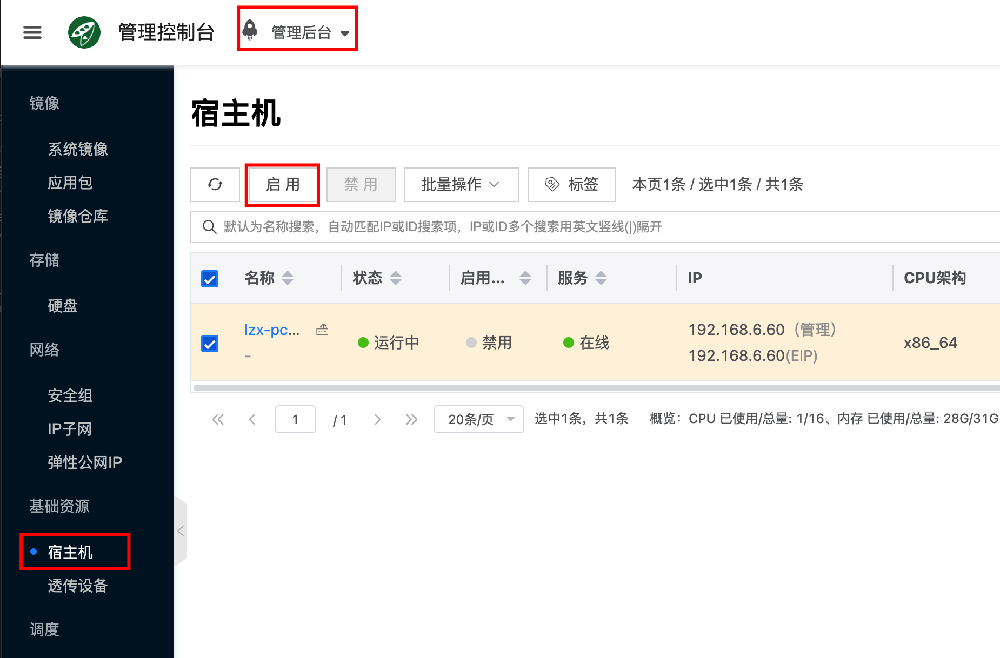

# Ocboot 快速安装 AI 云

使用 [ocboot](https://github.com/yunionio/ocboot) 部署工具快速部署 Cloudpods AI 云环境。

:::tip 注意
本章通过部署工具快速搭建 AI 云环境。若需在生产环境部署高可用集群，请参考相关高可用文档：[高可用安装](./ha-ce) 。
:::

## 环境准备

:::tip 注意事项：

- 关于 GPU
  - 如果目标机器上有 Nvidia GPU，可以选择使用 ocboot 工具来自动部署驱动和cuda，详细操作见后文
  - 如果没有 Nvidia GPU，部署后的环境就无法运行 ollama 和 vllm 这种推理 AI 容器应用，但可以运行 OpenClaw 和 dify 这种不依赖 GPU 的 AI 容器应用。
- 操作系统需要是干净的版本，因为部署工具会重头搭建指定版本的 k3s 集群，所以确保系统没有安装 kubernetes, docker 等容器管理工具，否则会出现冲突导致安装异常。
- 最低配置要求: CPU 8核, 内存 8GiB, 存储 200GiB。
- 虚拟机和服务使用的存储路径都在 **/opt** 目录下，所以理想环境下建议单独给 **/opt** 目录设置挂载点。
    - 比如把 /dev/sdb1 单独分区做 ext4 然后通过 /etc/fstab 挂载到 /opt 目录。
- 在Debian家族的操作系统上（例如 Debian 和 Ubuntu）首次部署 ocboot 的过程中，会检测并更新 GRUB 启动选项，以便 k3s 能够正常运行，因此部署过程操作系统会重启。重启之后，请重新执行ocboot的部署即可。
:::

根据 CPU 架构不同，支持的发行版也不一样，目前支持的发行版情况如下：

注：4.0，表示发行版 Release/4.0。

| 操作系统和架构                           | 4.0  |
| -------------------------------------- | ---- | 
| OpenEuler 22.03 LTS Sp3 x86_64+aarch64 | ✅   |

## 安装 Cloudpods AI 云

import OcbootReleaseDownload from '../../shared/getting-started/_parts/_quickstart-ocboot-release-download.mdx';

<OcbootReleaseDownload />

### 运行部署工具

接下来执行 `ocboot.sh run.py` 部署服务。其中 **host_ip** 为部署节点的 IP 地址，该参数为可选项。如果不指定则选择默认路由出去的那张网卡部署服务。如果你的节点有多张网卡，可以通过指定 **host_ip** 选择对应网卡监听服务。

import OcbootRun from '@site/src/components/OcbootK3sRun';

<OcbootRun productVersion='ai' />

`./ocboot.sh run.py` 脚本会调用 ansible 部署服务，如果部署过程中遇到问题导致脚本退出，可以重复执行该脚本进行重试。

### 配置 NVIDIA 驱动和 CUDA（可选）

若需在节点上安装或配置 NVIDIA 驱动与 CUDA 以运行 Ollama、vLLM 等依赖 GPU 的 AI 容器应用，请参考：[配置 NVIDIA 与 CUDA 环境](./setup-nvidia-cuda)。

## 开始使用 Cloudpods AI 云

```bash
....
# 部署完成后会有如下输出，表示运行成功
# 浏览器打开 https://10.168.26.216 ，该 ip 为之前设置 <host_ip>
# 使用 admin/admin@123 用户密码登录就能访问前端界面
Initialized successfully!
Web page: https://10.168.26.216
User: admin
Password: admin@123
```

部署完成后，使用浏览器访问 ocboot 输出的 Web 地址（如 `https://<host_ip>`），使用提示的账号密码登录即可进入 Cloudpods 控制台。

### 启用宿主机

新创建的环境会作为宿主机节点加入到平台，默认是没有启用的，需要点击 **计算->基础资源->宿主机** 查看宿主机列表，启用对应的宿主机。


### 快速创建 AI 实例

进入 **"人工智能"** 菜单快速创建 AI 应用的操作如下，请根据自己的需求参考对应的文档。

:::tip
- 创建**依赖GPU**的应用前请先完成：[配置 NVIDIA 与 CUDA 环境](./setup-nvidia-cuda)。
:::

| 应用 | 类型 | 定位 | GPU 依赖 | 快速开始 |
|---|---|---|---|---|
| OpenClaw | AI应用 | 开源自托管的个人智能体助手 | 不需要 | [OpenClaw 快速开始](../guides/llm-app/openclaw#quickstart) |
| Dify | AI应用 | LLM 应用开发与工作流编排平台（可对接推理服务） | 不需要 | [Dify 快速开始](../guides/llm-app/dify#quickstart) |
| ComfyUI | AI应用 | 图像生成与节点式工作流应用 | 需要 | [ComfyUI 快速开始](../guides/llm-app/comfyui#quickstart) |
| Ollama | AI推理 | 轻量本地推理服务 | 需要 | [Ollama 快速开始](../guides/llm-inference/ollama#quickstart) |
| vLLM | AI推理 | 高吞吐、低延迟推理服务 | 需要 | [vLLM 快速开始](../guides/llm-inference/vllm#quickstart) |

## FAQ

### 1. 如何添加更多 AI 节点？

在已有集群上对新增节点（尤其是 GPU 节点），如需运行依赖 GPU 的 AI 应用，建议先配置 NVIDIA/CUDA，参考：[配置 NVIDIA 与 CUDA 环境](./setup-nvidia-cuda)。随后再完成宿主机加入与启用，参考：[添加计算节点](./host)。

### 2. 如何升级？

参考文档 [通过 ocboot 升级](/docs/onpremise/operations/upgrading/ocboot-upgrade)（若 AI 云与私有云共用 ocboot 升级流程）。

### 3. 其它问题？

欢迎在 Cloudpods GitHub Issues 提交：[https://github.com/yunionio/cloudpods/issues](https://github.com/yunionio/cloudpods/issues)，我们会尽快回复。
