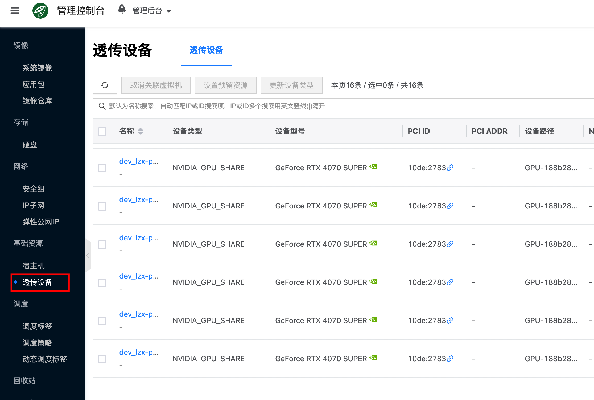

# 配置 NVIDIA 与 CUDA 环境

本文介绍如何在已有集群或单机上使用 ocboot 的 `setup-ai-env` 配置 NVIDIA 驱动、CUDA、containerd 等 AI 运行环境，不部署或修改 Cloudpods 云管服务。适用于需要运行 Ollama 等依赖 GPU 的 AI 容器应用的场景。<!-- 适用于需要运行 Ollama、vLLM 等依赖 GPU 的 AI 容器应用的场景。 -->

:::tip 注意事项
- 如果待部署环境没有 Nvidia GPU，或不需要运行 Ollama 这类需要 GPU 的容器 AI 应用，可以跳过本文。<!-- 如果待部署环境没有 Nvidia GPU，或不需要运行 Ollama 和 vLLM 这类需要 GPU 的容器 AI 应用，可以跳过本文。 -->
- 没有配置 Nvidia 运行环境的情况下，仍然可以运行 OpenClaw 和 Dify 等不依赖 GPU 的 AI 容器应用。
:::

## 下载驱动文件

请先下载并准备好 NVIDIA 驱动与 CUDA 安装包（如 CUDA 12.8），注意是下载 **.run** 的安装包：
- NVIDIA 驱动：可从 [NVIDIA Driver Downloads](https://www.nvidia.com/en-us/drivers/unix/) 获取。
- CUDA 安装包：可从 [NVIDIA CUDA Toolkit Downloads](https://developer.nvidia.com/cuda-downloads?target_os=Linux&target_arch=x86_64) 获取。

下载后将安装包传输到执行 ocboot.sh 的机器上 ocboot 代码所在的路径。

:::warning
nvidia driver文件和cuda安装文件都要放到 ocboot 代码所在目录下，因为 ocboot.sh 会启动 buildah 容器来运行部署代码，宿主机上其它路径没有映射到容器里面。
:::

```bash
# 使用 rsync（推荐）
rsync -avP /path/to/nvidia/NVIDIA-Linux-x86_64-570.133.07.run target_host:/root/ocboot-master-v4.0.2-3
rsync -avP /path/to/cuda/cuda_12.8.1_570.124.06_linux.run target_host:/root/ocboot-master-v4.0.2-3
```

## 命令形式

运行 `ocboot.sh setup-ai-env` 设置目标机器 nvidia 容器运行环境。

```bash
./ocboot.sh setup-ai-env <target_host1> [target_host2 ...] \
  --nvidia-driver-installer-path /ocboot/<driver_file>.run \
  --cuda-installer-path /ocboot/<cuda_file>.run \
  [--gpu-device-virtual-number 2] [--user USER] [--key-file KEY] [--port PORT]
```

## 示例

```bash
# 基本用法
./ocboot.sh setup-ai-env 10.127.222.247 \
  --nvidia-driver-installer-path /ocboot/NVIDIA-Linux-x86_64-570.133.07.run \
  --cuda-installer-path /ocboot/cuda_12.8.1_570.124.06_linux.run

# 指定 GPU 虚拟编号与 SSH
./ocboot.sh setup-ai-env 10.127.222.247 \
  --nvidia-driver-installer-path /ocboot/NVIDIA-Linux-x86_64-570.133.07.run \
  --cuda-installer-path /ocboot/cuda_12.8.1_570.124.06_linux.run \
  --gpu-device-virtual-number 2 \
  --user admin \
  --port 2222
```

## 参数说明

| 参数 | 必填 | 默认值 | 说明 |
|------|------|--------|------|
| `--nvidia-driver-installer-path` | 是 | - | NVIDIA 驱动安装包完整路径。 |
| `--cuda-installer-path` | 是 | - | CUDA 安装包完整路径。 |
| `--gpu-device-virtual-number` | 否 | 2 | NVIDIA GPU 共享设备的虚拟编号。 |
| `--user` / `-u` | 否 | root | SSH 用户名。 |
| `--key-file` / `-k` | 否 | - | SSH 私钥文件路径。 |
| `--port` / `-p` | 否 | 22 | SSH 端口。 |

## 安装内容与流程

ocboot 会在目标主机上执行包括但不限于以下步骤：

1. 检查操作系统支持与本地安装文件（若指定路径）
2. 安装内核头文件与开发包
3. 清理 vfio 相关配置（若存在）
4. 安装 NVIDIA 驱动（若提供 `--nvidia-driver-installer-path`）
5. 安装 CUDA 环境（若提供 `--cuda-installer-path`）
6. 配置 GRUB（添加 nvidia-drm.modeset=1）
7. 安装 NVIDIA Container Toolkit
8. 配置 containerd runtime
9. 配置主机设备映射（自动发现 NVIDIA 对应 `/dev/dri/renderD*` 并生成配置）
10. 验证安装结果

## 注意事项

- 安装过程中可能会在安装内核包或更新 GRUB 后**自动重启**目标主机，请提前知悉。
- 确保目标主机磁盘空间与网络正常，能下载 NVIDIA Container Toolkit 等依赖。
- 需在**执行 ocboot 的机器**上准备好安装包，并确保**在运行 playbook 前已将安装包传输到目标机**。传输方法可参考快速开始中的 [FAQ：如何将安装包传输到目标机？](./quickstart#3-如何将安装包传输到目标机)。
- 确保执行 ocboot 的机器与目标主机之间可 SSH 免密登录（或使用 `--key-file` 等参数）。

## FAQ

### 部署完成后宿主机列表没有 GPU 或未识别到 GPU？

确认目标机已安装 NVIDIA 驱动与 CUDA，且驱动版本与 CUDA 版本匹配。若使用 `run.py ai` 且未传 `--nvidia-driver-installer-path` / `--cuda-installer-path`，需事先在目标机上手动安装驱动与 CUDA。安装完成后可执行 `nvidia-smi` 验证。

### 安装过程中目标主机自动重启是否正常？

是。安装内核相关包或更新 GRUB 后，ocboot 可能会触发重启以加载新驱动或配置，请勿中断。重启后若部署未完成，可重新执行原部署命令继续。

### 怎么查看平台是否有 GPU 可用？

如果配置成功，通过访问**计算->基础资源->透传设备**，可以看到探测上报的 GPU 。

