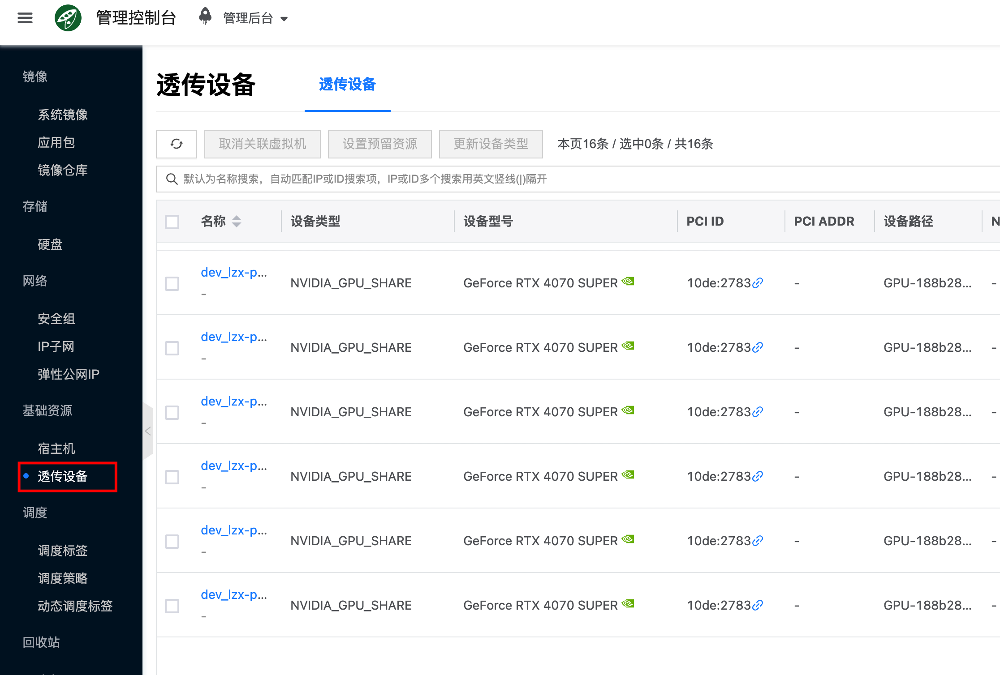

# 配置 NVIDIA 与 CUDA 环境

本文介绍如何在已有集群或单机上使用 ocboot 的 `setup-ai-env` 配置 NVIDIA 驱动、CUDA、containerd 等 AI 运行环境，不部署或修改 Cloudpods 云管服务。适用于需要运行 Ollama、vLLM 等依赖 GPU 的 AI 容器应用的场景。

:::tip 注意事项
- 如果待部署环境没有 Nvidia GPU，或不需要运行 Ollama、vLLM 这类需要 GPU 的容器 AI 应用，可以跳过本文。
- 没有配置 Nvidia 运行环境的情况下，仍然可以运行 OpenClaw 和 Dify 等不依赖 GPU 的 AI 容器应用。
:::

## 下载驱动文件

请先下载并准备好 NVIDIA 驱动与 CUDA 安装包（示例为 **CUDA 13.0.3**，可按实际 GPU 与兼容性调整），须为 **.run** 格式：

- NVIDIA 驱动：可从 [NVIDIA Driver Downloads](https://www.nvidia.com/en-us/drivers/unix/) 获取（示例文件名：`NVIDIA-Linux-x86_64-580.173.02.run`）。
- CUDA 安装包：可从 [NVIDIA CUDA Toolkit Downloads](https://developer.nvidia.com/cuda-downloads?target_os=Linux&target_arch=x86_64) 获取（示例文件名：`cuda_13.0.3_580.126.20_linux.run`）。

下载后将安装包传输到执行 `ocboot.sh` 的机器上 **ocboot 代码所在目录**。

:::warning
NVIDIA 驱动与 CUDA 安装包必须放在 **ocboot 代码所在目录**。`ocboot.sh` 通过 buildah 容器执行部署，宿主机其它路径不会映射进容器，容器内对应路径为 `/ocboot/<文件名>`。
:::

若安装包在其它机器，可先传到目标机的 ocboot 代码目录（将路径换成实际目录）：

```bash
# 使用 rsync（推荐）
rsync -avP /path/to/nvidia/NVIDIA-Linux-x86_64-580.173.02.run target_host:/path/to/ocboot/
rsync -avP /path/to/cuda/cuda_13.0.3_580.126.20_linux.run target_host:/path/to/ocboot/
```

## 命令形式

运行 `ocboot.sh setup-ai-env` 设置目标机器 nvidia 容器运行环境。

```bash
./ocboot.sh setup-ai-env <target_host1> [target_host2 ...] \
  --nvidia-driver-installer-path ./<driver_file>.run \
  --cuda-installer-path ./<cuda_file>.run \
  [--gpu-device-virtual-number 2] [--user USER] [--key-file KEY] [--port PORT]
```

## 示例

在 ocboot 代码目录下执行（`<target_host>` 为目标机 IP；单机部署可填本机 IP）：

:::warning 目标机会自动重启
- 安装完成后目标机通常会**自动重启一次**，以加载新驱动和 GRUB 配置，属正常现象。
- 若 nouveau 仍占用 GPU，安装 NVIDIA 驱动前可能**提前重启一次**。
- 重启期间**请勿中断**部署流程；重启后若安装尚未完成，请**重新执行同一条** `setup-ai-env` 命令继续，直至全部步骤执行完毕。
:::

```bash
# 基本用法
./ocboot.sh setup-ai-env <target_host> \
  --nvidia-driver-installer-path ./NVIDIA-Linux-x86_64-580.173.02.run \
  --cuda-installer-path ./cuda_13.0.3_580.126.20_linux.run

# 指定 GPU 软共享虚拟编号（NVIDIA_GPU_SHARE）与 SSH；不指定则默认使用 HAMi
./ocboot.sh setup-ai-env <target_host> \
  --nvidia-driver-installer-path ./NVIDIA-Linux-x86_64-580.173.02.run \
  --cuda-installer-path ./cuda_13.0.3_580.126.20_linux.run \
  --gpu-device-virtual-number 2 \
  --user admin \
  --port 2222
```

## 参数说明

| 参数 | 必填 | 默认值 | 说明 |
|------|------|--------|------|
| `--nvidia-driver-installer-path` | 是 | - | NVIDIA 驱动安装包完整路径。 |
| `--cuda-installer-path` | 是 | - | CUDA 安装包完整路径。 |
| `--gpu-device-virtual-number` | 否 | 无（默认 HAMi） | 指定后按 `NVIDIA_GPU_SHARE` 生成虚拟设备；未指定则使用 HAMi。 |
| `--user` / `-u` | 否 | root | SSH 用户名。 |
| `--key-file` / `-k` | 否 | - | SSH 私钥文件路径。 |
| `--port` / `-p` | 否 | 22 | SSH 端口。 |

## 安装内容与流程

ocboot 会在目标主机上执行包括但不限于以下步骤：

1. 检查操作系统支持与本地安装文件（若指定路径）
2. 配置 GRUB（添加 nvidia-drm.modeset=1）
3. 安装内核头文件与开发包
4. 清理 vfio 相关配置（若存在）
5. 安装 NVIDIA 驱动（若提供 `--nvidia-driver-installer-path`）
6. 安装 CUDA 环境（若提供 `--cuda-installer-path`）
7. 安装 NVIDIA Container Toolkit
8. 配置 containerd runtime
9. 配置主机设备映射（仅在指定 `--gpu-device-virtual-number` 时发现 `/dev/dri/renderD*` 并生成 `NVIDIA_GPU_SHARE` 配置；未指定则默认使用 HAMi）
10. 按需重启后验证安装结果

## 验证驱动

在目标机上执行：

```bash
nvidia-smi
```

应能正常显示 GPU 型号、驱动版本与显存信息。请确认驱动版本与 CUDA 版本匹配。

## 注意事项

- 确保目标主机磁盘空间与网络正常，能下载 NVIDIA Container Toolkit 等依赖。
- 需在**执行 ocboot 的机器**上准备好安装包，并确保**在运行 playbook 前已将安装包传输到目标机**的 ocboot 代码目录。
- 确保执行 ocboot 的机器与目标主机之间可 SSH 免密登录（或使用 `--key-file` 等参数）。

## FAQ

### 部署完成后宿主机列表没有 GPU 或控制台看不到 GPU？

1. 在节点上执行 `nvidia-smi`，确认驱动正常。
2. 确认驱动与 CUDA 版本匹配。
3. 确认宿主机已启用（**计算 → 基础资源 → 宿主机**）。
4. 在 **计算 → 基础资源 → 透传设备** 中查看是否已上报 GPU。
5. 必要时重新执行同一条 `setup-ai-env` 命令。

若使用 `run.py ai` 且未传 `--nvidia-driver-installer-path` / `--cuda-installer-path`，需事先在目标机上手动安装驱动与 CUDA，或按本文用 `setup-ai-env` 配置。

### 安装过程中目标主机自动重启是否正常？

是。ocboot 会在全部安装步骤完成后重启一次以加载新驱动或 GRUB 配置；若 nouveau 仍占用 GPU，安装驱动前也可能提前重启一次。请勿中断。重启后若部署未完成，请**重新执行同一条** `setup-ai-env` 命令继续。

### 怎么查看平台是否有 GPU 可用？

如果配置成功，通过访问 **计算 → 基础资源 → 透传设备**，可以看到探测上报的 GPU。未指定 `--gpu-device-virtual-number` 时，共享模式为 **HAMI**。


