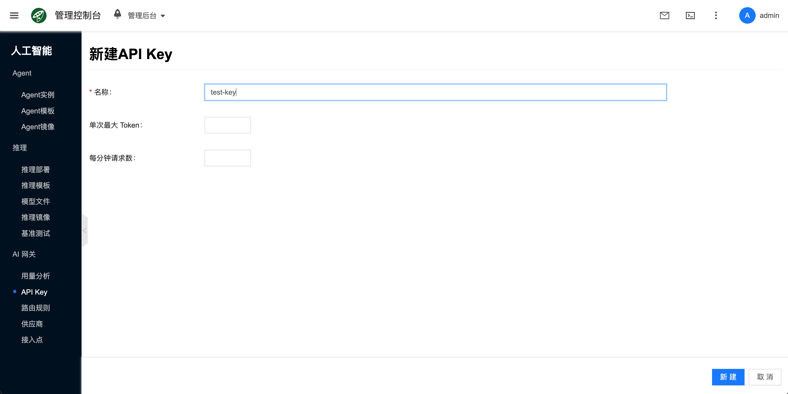

# API Key

## 概念介绍

API Key（虚拟密钥）用于调用 AI 网关时的鉴权。通过网关访问 [推理部署](../llm-inference/deployment) 的 **chat测试**、curl，或对接 Agent 时，均需提供有效的 API Key。可为 Key 配置单次 Token 与每分钟请求数上限；留空表示不限制。

控制台路径为 **人工智能 → AI 网关 → API Key**。

## 常用操作

### 新建

列表点击 **新建**，填写名称与可选限流后提交。提交后请妥善保存生成的 Key（后续调用与测试需要）。

- **名称**：API Key 条目名称。
- **单次最大 Token**：单次请求允许的最大 Token 数；留空表示不限制。
- **每分钟请求数**：每分钟允许的请求次数；留空表示不限制。

端到端创建与场景验证见 [AI 网关/快速开始](./quickstart#create-api-key)；按 API Key 查看多租户用量见 [快速开始/场景2](./quickstart#scenario-metering)；平台内推理侧 chat / curl 亦可参见 [AI 推理/快速开始](../llm-inference/quickstart#create-api-key)。

### 查看详情

打开某一 API Key 的侧栏详情，常见页签包括：

- **详情**：查看名称、限流与启用状态等。
- **操作日志**：排查创建、修改与相关任务事件。

### 其他操作

列表或详情操作（受状态与权限约束）包括：

- **编辑**：调整名称或限流。
- **启用 / 禁用**：控制该 Key 是否可用于调用。
- **删除**：删除后依赖该 Key 的调用将失败。

## 常见问题

### chat 测试提示鉴权失败

确认已选择正确的 API Key，且该 Key 处于启用状态；重新创建后需更新调用方配置。

### 调用被限流

检查该 Key 的 **单次最大 Token**、**每分钟请求数**；可调高或留空后重试。
