# 快速开始

AI 网关以 **OpenAI 兼容** / **Anthropic 兼容** 接口统一对外暴露模型调用：用 [API Key](./api-key) 鉴权，经 [路由规则](./routing) 将请求中的 `model` 转发到 [供应商](./provider)。

本章覆盖的使用场景：

- **[场景1](#scenario-claude)**：上游用 DeepSeek（LLM）+ Moonshot（识图）配置视觉增强；Claude Code 等客户端经网关 Anthropic 路径接入，获得多模态能力。
- **[场景2](#scenario-metering)**：在 [用量分析](./usage) 中选 **过去7天**，按 **API Key** 对比各租户的调用与 Token。

字段释义见各参考页。平台内推理注册网关与 chat / curl 见 [AI 推理/快速开始](../llm-inference/quickstart)。

## 创建 API Key {#create-api-key}

通过网关做 chat / curl、对接 Claude Code 或 Agent 前，需先有可用的 API Key（虚拟密钥）。

1. 进入 **人工智能 → AI 网关 → API Key**。
2. 点击 **新建**，填写 **名称**；**单次最大 Token**、**每分钟请求数** 可按需限制，留空表示不限制。
3. 提交后保存生成的 Key，供后续调用与测试使用。

详情与运维见 [API Key](./api-key)。

## 场景1：经 AI 网关使用 Claude {#scenario-claude}

目标：本地 Claude（如 Claude Code）不直连公有 Claude API，而是经 AI 网关访问；网关侧用 **DeepSeek** 作对话 LLM、**Moonshot** 识图，从而实现多模态。

角色分工：

- **DeepSeek**：对话 LLM（主模型，如 V4）。
- **Moonshot**：识图（视觉上游）。
- **Claude**（如 Claude Code）：客户端，经网关 Anthropic 兼容路径接入。

### 1. 新建供应商

进入 **人工智能 → AI 网关 → 供应商**。DeepSeek 与 Moonshot 需**分别新建**（字段说明见 [供应商](./provider)）。

#### 例：新建 DeepSeek（LLM）

1. 点击 **新建**，**供应商类型** 选 **内置供应商**。
2. **供应商标识** 选 **DeepSeek**。
3. 填写上游 **API Key**（DeepSeek 控制台申请的密钥，不是网关虚拟密钥）。
4. 按页面选择 **API 访问模式**（OpenAI 兼容或 Anthropic 兼容）；Anthropic 模式下 Base URL 以控制台提示为准。
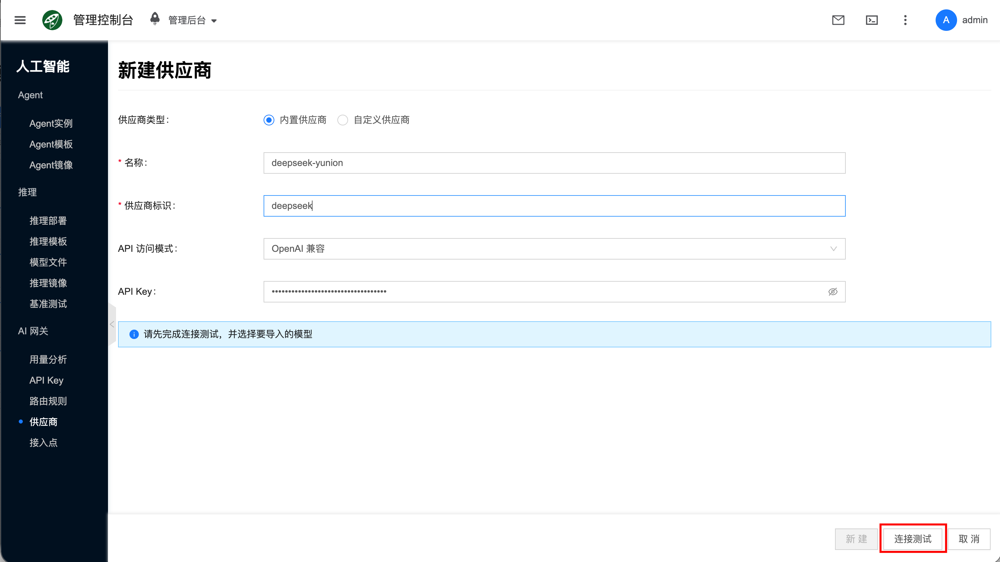
5. 执行连接测试，在发现的模型列表中勾选要导入的模型（含 DeepSeek V4 等相关条目），提交。
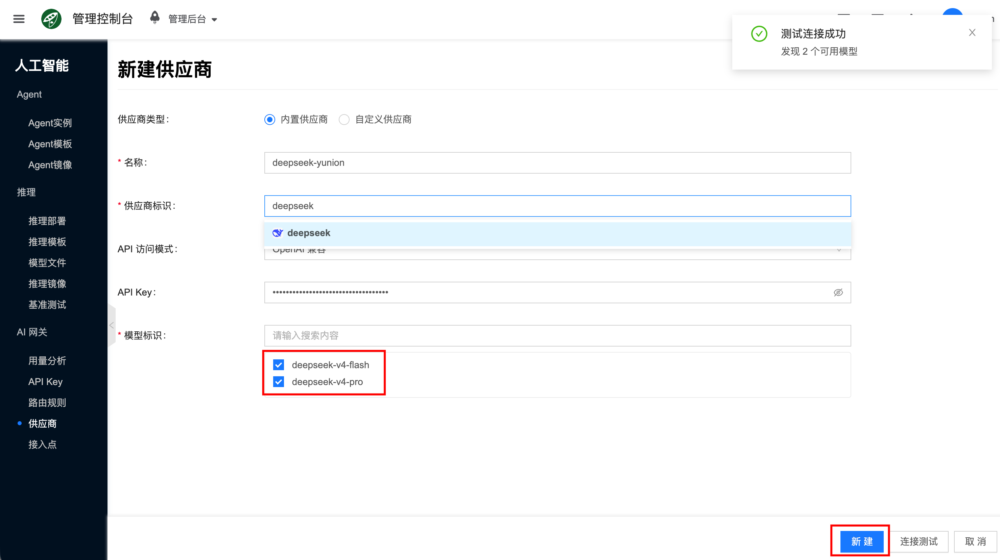

#### 例：新建 Moonshot（识图）

1. 再次点击 **新建**，**供应商类型** 选 **内置供应商**。
2. **供应商标识** 选 **Moonshot**。
3. 按表单选择 **区域** 等字段，并填入上游 **API Key**（Moonshot / 月之暗面控制台申请的密钥）。
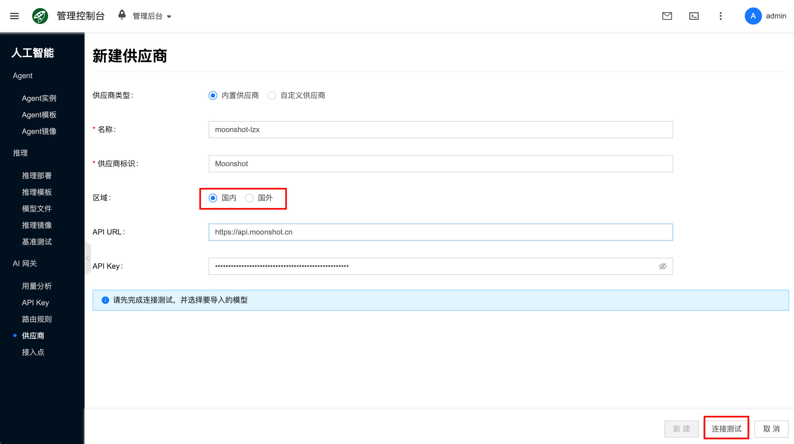
4. 执行连接测试，勾选具备视觉能力的模型后提交。
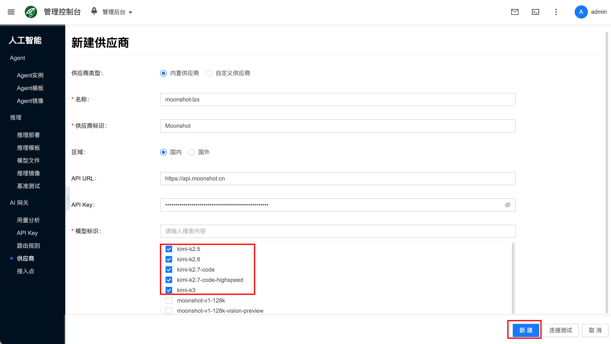

### 2. 为 DeepSeek 启用视觉增强（Moonshot 识图）

1. 打开刚才创建的 DeepSeek 供应商详情，进入 **模型**，编辑目标 LLM 模型。
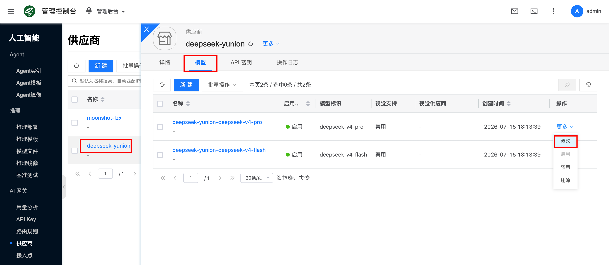
2. 开启 **启用视觉**。
3. **视觉供应商** 选择 Moonshot；**视觉模型标识** 选择具备视觉能力的 Moonshot 模型。
4. 按需填写 **视觉最大轮数**、**视觉最大 Tokens** 后保存。
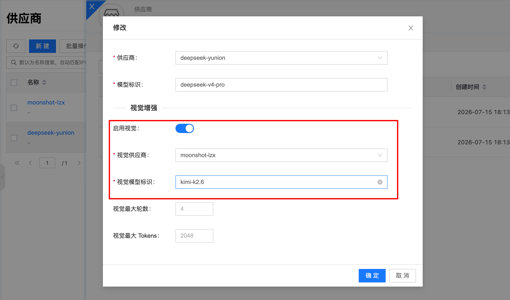
5. 可以重复相同的操作，给 v4-flash 模型也开启视觉支持，操作完成后，可以在列表看到视觉支持已启用的字段：
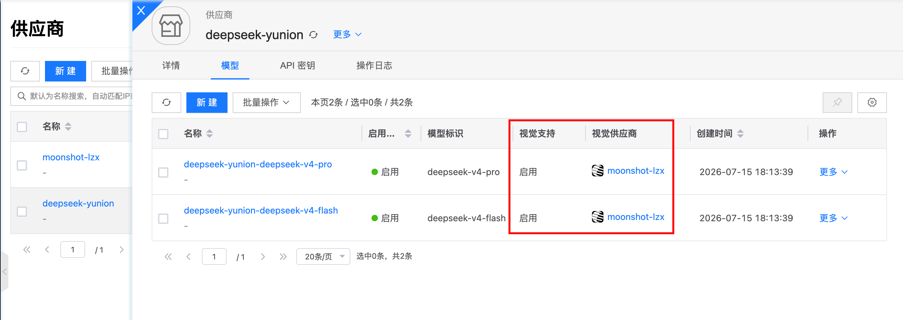

此后经网关调用该 DeepSeek 模型时：文本由 DeepSeek 处理，含图内容由 Moonshot 识别。

### 3. 新建路由规则

进入 **人工智能 → AI 网关 → 路由规则**，点击 **新建**（字段见 [路由规则](./routing)）：

1. 填写 **名称**、对外 **模型标识**（须与 Claude / 客户端请求中的 `model` 一致）。
2. 添加 **路由模型**：接入类型选公有供应商，选择 DeepSeek 及目标 LLM 模型。
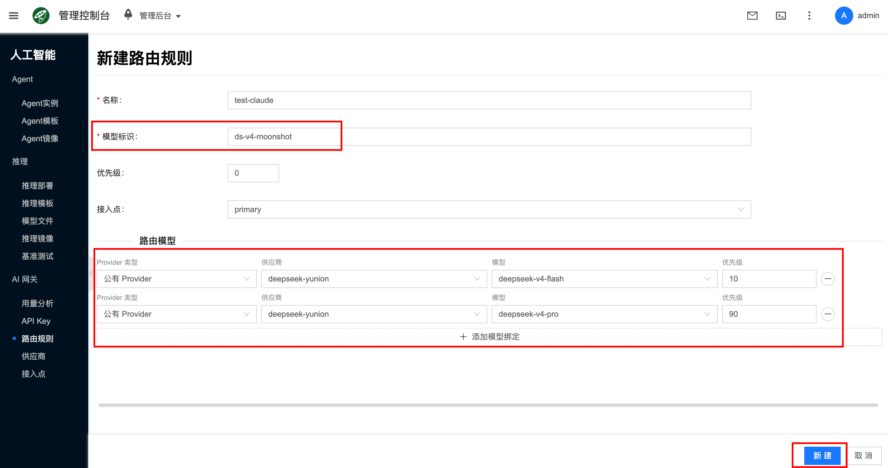
3. 提交后确认路由已启用。
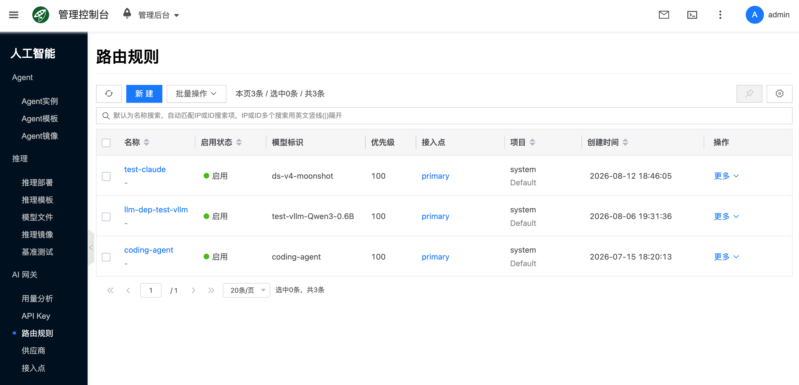

### 4. 配置 Claude 客户端

在路由规则详情的 **接入信息** 中生成 Claude Code 所需配置（勿手写臆造环境变量表）。

1. 打开已创建的路由（如 `test-claude`）详情，切换到 **接入信息**。
2. **客户端协议** 选 **Anthropic 兼容**。
3. **选择 API Key 生成调用示例**：选择已创建的网关虚拟密钥（见 [创建 API Key](#create-api-key)）。
4. **调用 Model**：选择已启用视觉增强的 DeepSeek 路由 model。
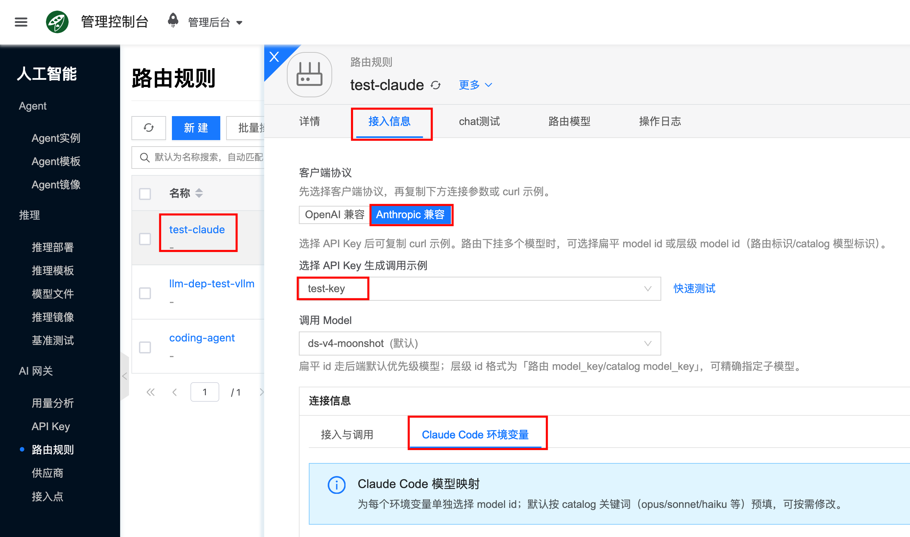
5. 在「连接信息」点击 **Claude Code 环境变量** 页签。
6. 在 **Claude Code 模型映射** 中为各环境变量选择 model id（默认可按 catalog 关键词如 opus / sonnet / haiku 预填，可按需修改），例如：
   - `ANTHROPIC_MODEL`
   - `ANTHROPIC_DEFAULT_OPUS_MODEL`
   - `ANTHROPIC_DEFAULT_SONNET_MODEL`
   - `ANTHROPIC_DEFAULT_HAIKU_MODEL`
   - `CLAUDE_CODE_SUBAGENT_MODEL`
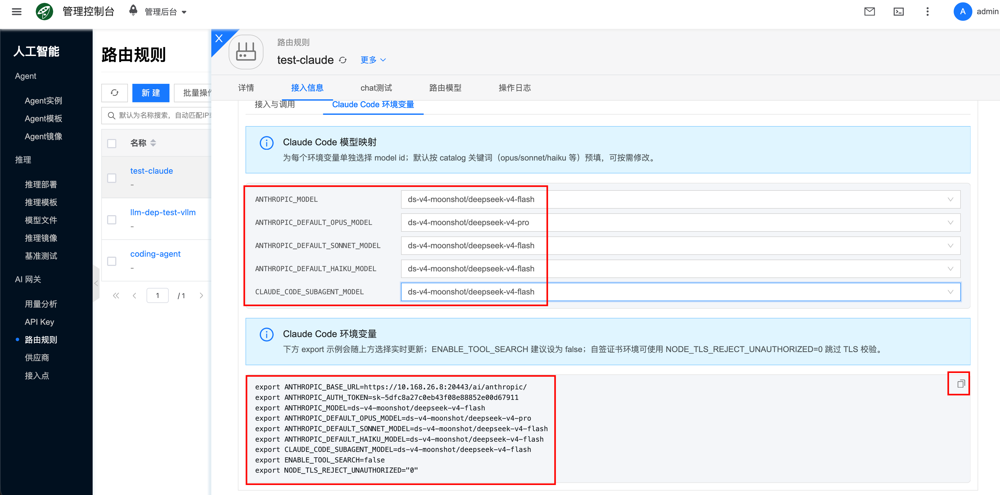
7. 复制界面给出的 `export` shell 环境变量，然后启动 claude 命令行。
   - `ANTHROPIC_BASE_URL`：网关访问地址 + `/ai/anthropic/`（以界面为准，一般不要再追加 `/v1`）
   - `ANTHROPIC_AUTH_TOKEN`：所选 API Key 的虚拟密钥（从界面复制，勿使用文档示例中的假值）
   - 上述各 `ANTHROPIC_*_MODEL` / `CLAUDE_CODE_SUBAGENT_MODEL`（与映射一致）
   - `ENABLE_TOOL_SEARCH`：建议设为 `false`
   - `NODE_TLS_REJECT_UNAUTHORIZED="0"`：跳过 Node TLS 证书校验（自签 / 内网 HTTPS 常见需要）

### 5. 验证

1. 将上一步复制的环境变量应用到 shell，然后启动 claude:
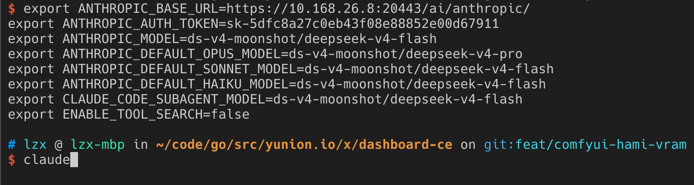
2. 发起文本或含图对话。请求经网关由 DeepSeek 作答、Moonshot 识图。
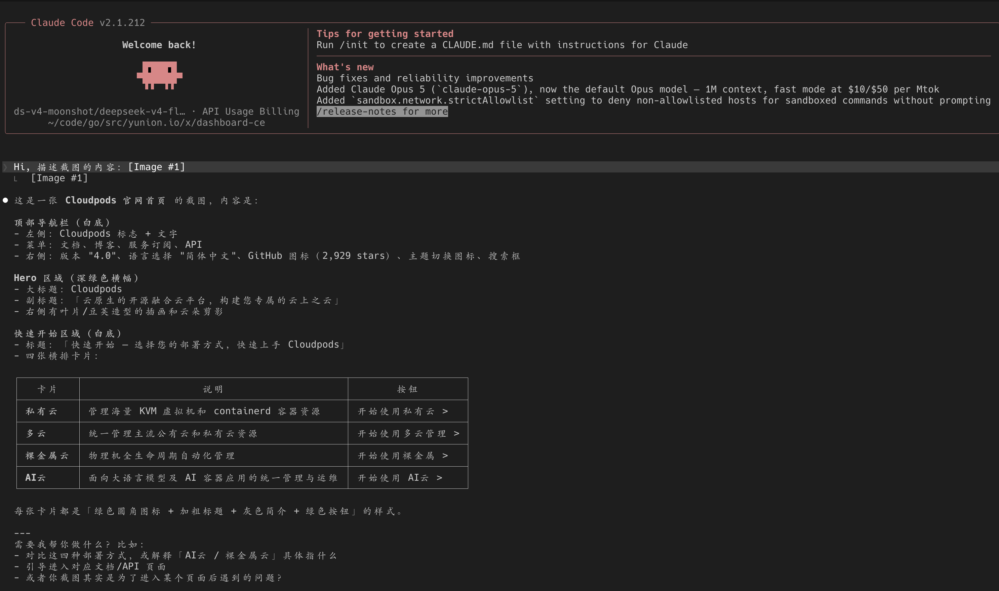

## 场景2：查看多租户用量统计 {#scenario-metering}

目标：各租户使用**不同**虚拟密钥经网关调用同一模型 / 路由后，在 **用量分析** 中按 **API Key** 查看近 7 天的调用与 Token 统计，便于分账与对比。

### 1. 前提

各租户已使用各自的 API Key（虚拟密钥）经网关产生过调用。发 Key 见上文 [创建 API Key](#create-api-key)；字段说明见 [API Key](./api-key)。供应商与路由可复用 [场景1](#scenario-claude) 中的配置，或见 [供应商](./provider)、[路由规则](./routing)。

### 2. 在概览中查看近 7 天用量

1. 进入 **人工智能 → AI 网关 → 用量分析**。
2. 时间范围选择 **过去7天**，停留在 **概览** 页签。
3. 查看汇总卡片与趋势；在 **API Key 用量** 表中对比各租户密钥的请求数、成功 / 失败次数与 Token。

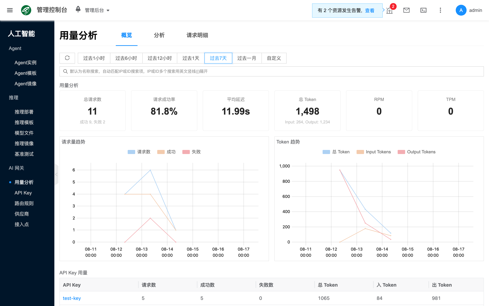

### 3. 在分析中对比 API Key 构成

1. 切换到 **分析** 页签（保持时间范围为 **过去7天**）。
2. 在 **构成分析** 中查看 **API Key 构成**（可切换请求数、Token 等指标），对比各租户占比。

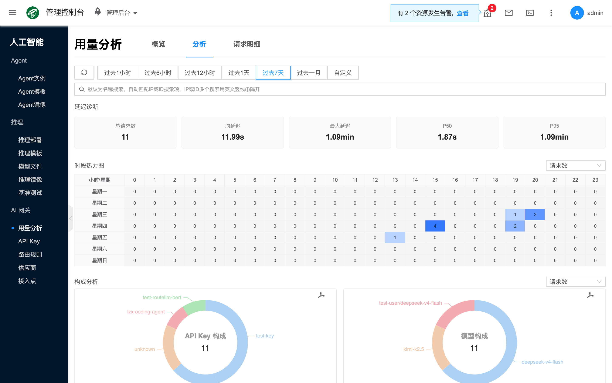

### 4. 查看请求明细

切换到 **请求明细** 页签（保持 **过去7天**），按列表核对各次调用；可按 **API Key** 等条件筛选。更多说明见 [用量分析](./usage)。

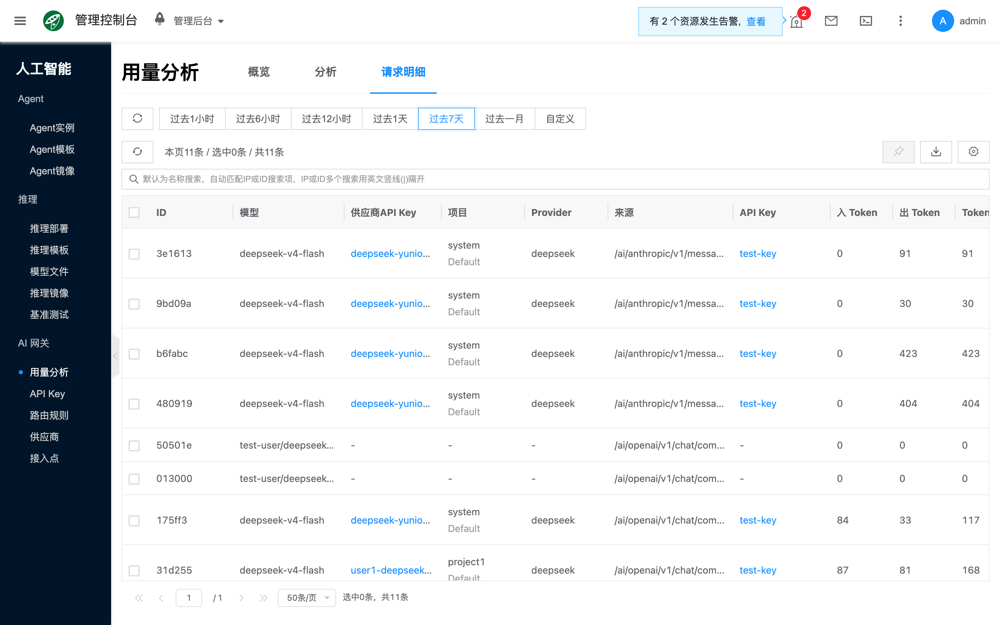

## 接下来

- [API Key](./api-key)、[供应商](./provider)、[路由规则](./routing)、[接入点](./proxy-node)、[用量分析](./usage)
- 平台内推理部署注册网关、chat / curl：[AI 推理/快速开始](../llm-inference/quickstart)

## 常见问题 {#faq}

### chat / curl 鉴权失败

确认已选择正确的 API Key，且 Key 处于启用状态；重新创建后需更新调用方配置。

### 调用的 Model 无效或落到错误上游

确认请求中的 `model` 与路由上的 **模型标识**（或接入信息中的扁平 / 层级 model id）一致，且路由、供应商均已启用。

### 视觉增强未生效（含图无视觉结果）

- 确认 DeepSeek 目标模型已 **启用视觉**，且 **视觉供应商** 为 Moonshot、**视觉模型标识** 正确。
- 确认 Moonshot 供应商可达、视觉模型已导入且启用。
- 确认客户端（含 Claude Code）请求的 model 为已绑定视觉增强的 DeepSeek 路由，且请求携带了图像内容。

### Claude Code 连接失败

- 确认路由 **接入信息** 中协议为 **Anthropic 兼容**，且已选择正确的 API Key 与调用 Model。
- `ANTHROPIC_BASE_URL`、`ANTHROPIC_AUTH_TOKEN` 及各 MODEL 变量须与界面 **Claude Code 环境变量** 导出一致；Base URL 一般不要误加 `/v1`。
- 若提示证书 / TLS 错误，确认已导出并生效 `NODE_TLS_REJECT_UNAUTHORIZED="0"`（仅用于可信内网或自签证书环境）。

### 用量里无法按用户区分

- 确认各用户使用的是**不同**的虚拟密钥，且已有经网关的成功调用。
- 在用量分析页筛选正确的 **API Key** 与时间范围；密钥名称（label）应与创建时一致。
- 若仍为空，见 [用量分析](./usage) 常见问题。
