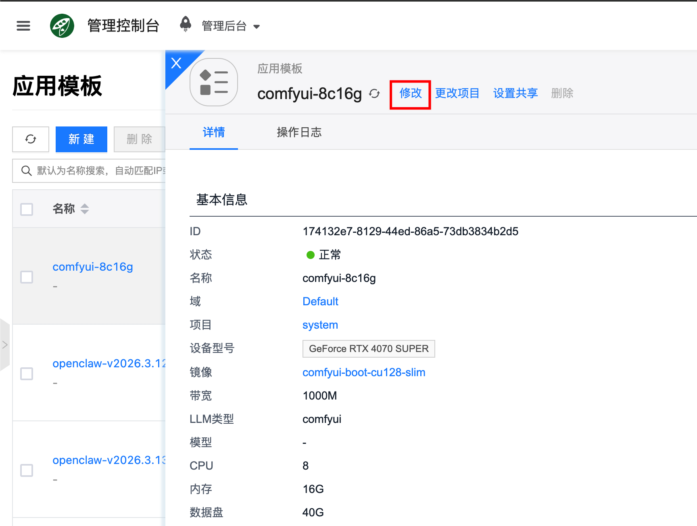
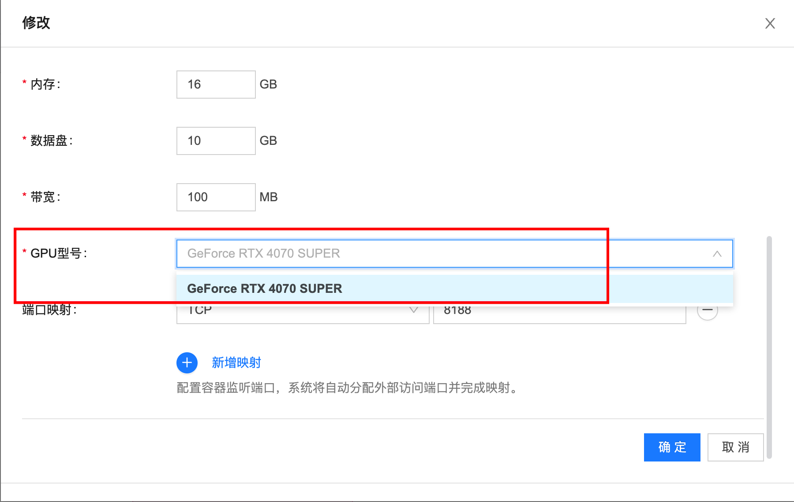
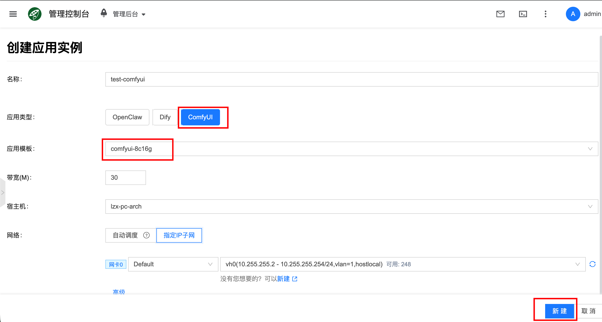
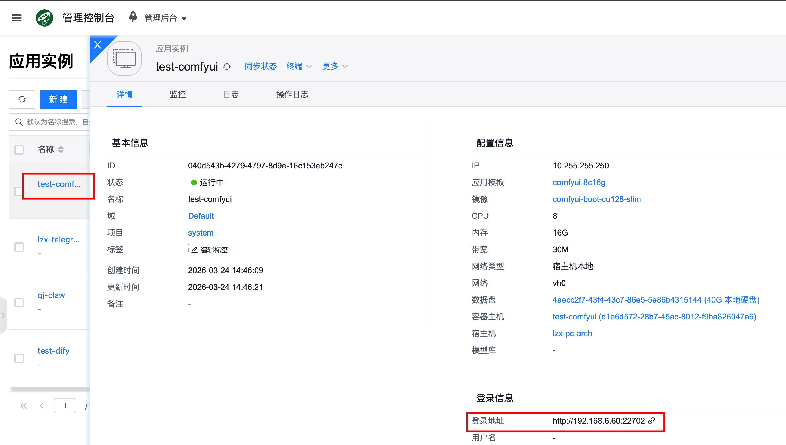
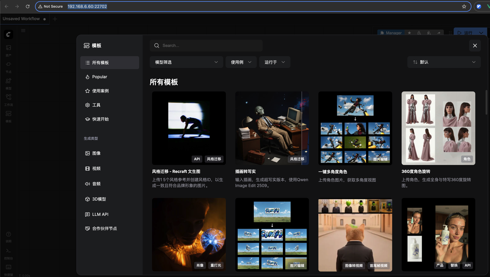
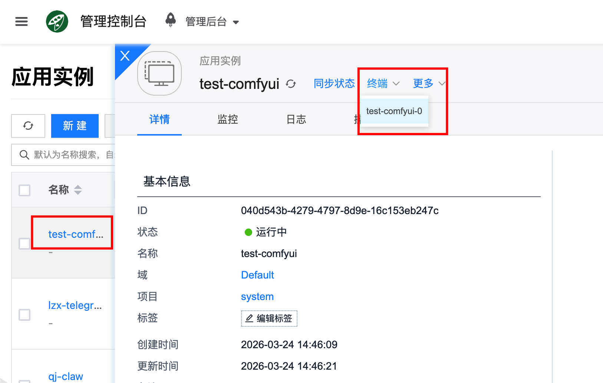
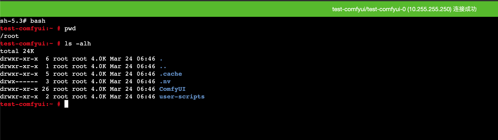
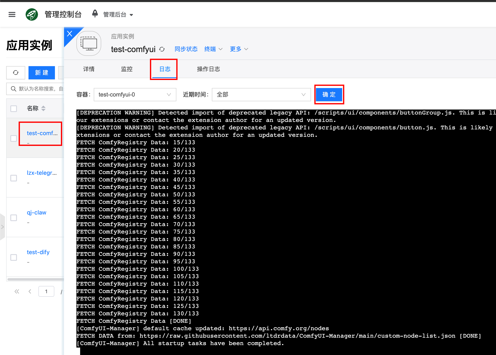

# ComfyUI

[ComfyUI](https://www.comfy.org/) 是图像生成与可视化工作流应用，支持基于节点的工作流编排，适用于图像生成、工作流复用与可视化调试。

## 快速开始 {#quickstart}

### 0. 前提环境配置

图像生成依赖 GPU 环境，请先完成 [配置 NVIDIA 与 CUDA 环境](../../getting-started/setup-nvidia-cuda)。

### 1. 配置模板

配置完 GPU 环境后，直接更新平台默认创建的 ComfyUI 模板 `comfyui-8c16g` 的 GPU 型号即可，流程如下：

1. 进入控制台 **人工智能 → 应用 → 应用模板**，找到默认模板 `comfyui-8c16g`，点击修改。

2. 在模板配置中，将 GPU 型号改成你当前要使用的型号；


### 2. 创建实例

更新默认模板 GPU 型号后，进入 **人工智能 → 应用 → 应用实例** 新建实例，选择更新后的 `comfyui-8c16g` 模板。



- 带宽：对容器网络进行限速，根据实际需要填写
- 宿主机(可选)：可选择指定的宿主机运行 OpenClaw 容器实例，不选则会自动调度
- 网络：可选择自动调度，或者指定IP子网

### 3. 访问 ComfyUI web 界面

创建完成后，进入实例详情页面，即可获取登录信息，通过浏览器打开对应地址，就能打开 ComfyUI Web 界面。




## 模型与数据

### 持久化路径

ComfyUI 容器里面的这些目录是持久化的，容器重启后数据也不会丢失，用于存放模型以及其它数据状态文件，路径如下：

- `/root/ComfyUI/models`: 存放模型文件
- `/root/ComfyUI/input`: 存放输入数据
- `/root/ComfyUI/output`: 存放输出数据
- `/root/ComfyUI/user/default/workflows`: 存放工作流状态文件
- `/root`: root 用户家目录
- `/root/.cache/huggingface/hub`: huggingface 相关持久化数据
- `/root/.cache/torch/hub`: torch 相关持久化数据

### 下载模型

推荐[进入容器终端](#tty)后，直接使用 Hugging Face Hub 的命令行工具。

#### 使用 hf 下载模型

Hugging Face Hub 汇集了大量预训练模型，`hf` 是官方命令行工具，可直接下载指定模型文件。

下载命令：

```bash
hf download <model_id> <filename> --local-dir <local_directory>
```

参数说明：

- `<model_id>`：模型在 Hugging Face 的完整标识，例如 `black-forest-labs/FLUX.1-dev`。
- `<filename>`：要下载的具体文件名，例如 `ae.safetensors`。
- `--local-dir`：模型文件保存路径，请确保目录存在且有写权限。

参考链接：[`hf download` 官方文档](https://huggingface.co/docs/huggingface_hub/guides/cli#download-to-a-local-folder)。

示例：

以模型链接 `https://huggingface.co/black-forest-labs/FLUX.1-dev/blob/main/ae.safetensors` 为例，下载 `ae.safetensors` 到 `~/Comfyui/models/vae/`：

```bash
hf download black-forest-labs/FLUX.1-dev ae.safetensors --local-dir ~/ComfyUI/models/vae/
```

## 常见问题

### 怎么进入容器？{#tty}

通过在详情页面里面的“终端”可以直接进入容器：



### 怎么查看服务日志？

通过前端界面：点击对应的应用实例，进入详情页面，再点击日志，就能查看到服务输出的日志了，方便用于错误排查。
