# Dify

Dify 是一个 LLM 应用开发与编排平台，支持构建对话、Agent 与工作流等应用。Dify 自身不依赖 GPU，可以运行在未配置 NVIDIA 环境的节点上。只有下游推理服务需要 GPU 时，才要求对应的推理实例满足 GPU 条件。

## 快速开始 {#quickstart}

创建 Dify 应用实例大致分为以下几步：

1. **创建应用实例**：控制台 **人工智能 → 应用 → 应用实例**，新建并选择 **Dify** 模板创建实例。
   - 平台通常会预置模板；若需自定义镜像、规格或高级环境变量，再到 **人工智能 → 应用 → 应用模板** 新建或编辑。
2. **访问并完成初始化**：进入实例详情页「连接信息」获取访问地址，用浏览器打开 Dify 初始化页面，完成管理员账号与工作空间初始化。
3. **安装模型插件并配置模型供应商**：如需对接 OpenAI、OpenAI 兼容服务，或平台内的 Ollama 等下游推理服务，先在 Dify Web 后台的 **插件 → Marketplace** 安装对应插件，再配置模型供应商与下游推理服务。<!-- 如需对接 OpenAI、OpenAI 兼容服务，或平台内的 Ollama、vLLM 等下游推理服务，先在 Dify Web 后台的 **插件 → Marketplace** 安装对应插件，再配置模型供应商与下游推理服务。 -->
4. **验证应用链路**：在 Dify 中创建一个最小对话应用或工作流，发起一次调用，确认应用、模型和工具链路都正常。

### 1. 创建应用实例

控制台入口为 **人工智能 → 应用 → 应用实例**。

1. 点击 **新建**。
2. 选择 `Dify` 对应的应用模板或应用类型。
3. 填写实例名称，并按页面要求选择项目、区域、网络等通用配置。
4. 确认模板、镜像、规格和高级配置后提交创建。


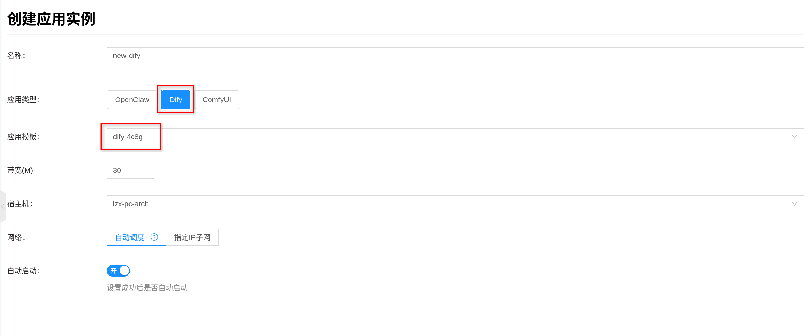

如果控制台里还没有可用的 Dify 模板，先去 **人工智能 → 应用 → 应用模板** 创建或编辑模板，再返回实例页面创建。

页面里的通用字段按实际场景选择即可：

- **带宽**：用于限制容器网络带宽，按业务访问量填写。
- **宿主机（可选）**：如需固定运行在某台节点上，可手动指定；否则由平台自动调度。
- **网络**：可使用自动分配，也可指定已有 IP 子网。

:::tip
Dify 是多容器应用。除了前端和 API，还会同时启动数据库、Redis、向量库、插件守护进程、代码执行沙箱等组件。它虽然不依赖 GPU，但 CPU、内存和数据盘仍要留出足够余量。
:::

### 2. 访问并完成初始化

实例创建成功后，进入实例详情页，打开 **连接信息**，即可获取 Dify 的访问地址。按当前平台实现，外部访问入口走 `nginx` 容器，对外默认暴露 `80` 端口。

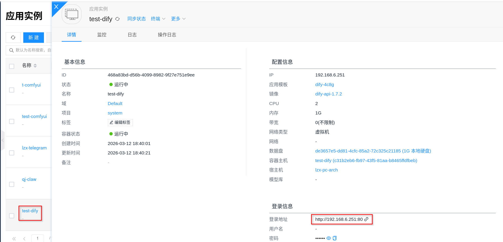

通过浏览器打开访问地址后，通常会看到 Dify 的首次初始化向导。你可以按页面提示完成以下动作：

1. 创建管理员账号。
2. 使用管理员账号登录

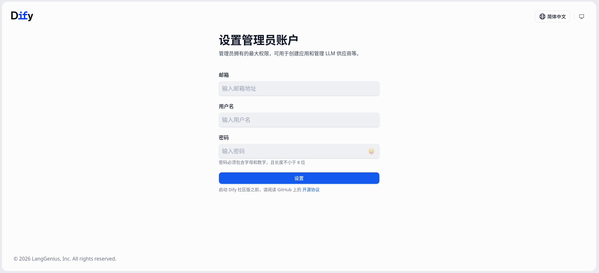
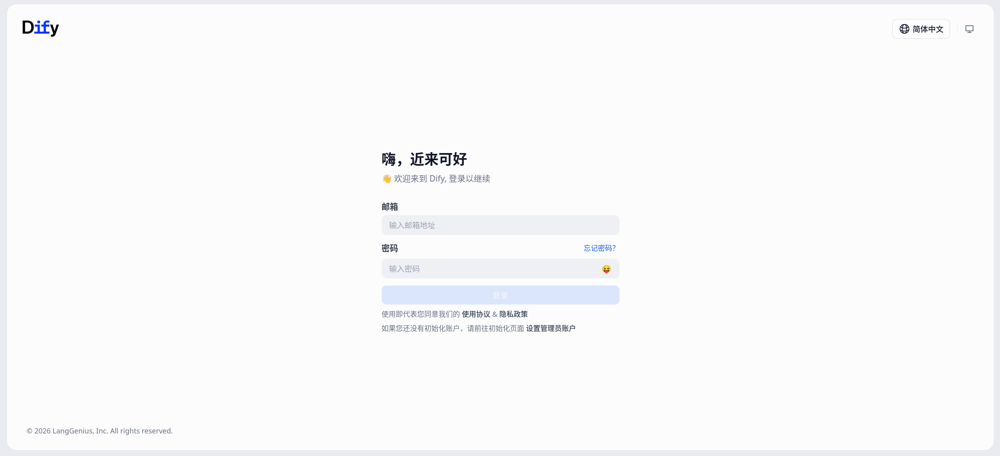

平台会自动为 Dify 内部组件生成所需的内部密钥，一般不需要手工填写。比如 `SECRET_KEY`、内部 API key、Plugin Server Key 和 Weaviate 的内部认证 key，都会在部署阶段准备好。

:::tip
Dify 的 Web 页面、API、文件访问等路径默认共用同一个外部入口地址。除了浏览器访问首页，后续调用 Dify API 时，通常也是在同一个地址下访问 `/api`、`/v1`、`/files` 等路径。
:::

### 3. 安装模型插件并配置模型供应商

Dify 本身不直接挂载模型目录，也不直接运行模型权重。它更像应用编排平台，真正的模型推理由外部模型供应商或平台内其它推理实例承担。

完成初始化后，建议先确认下游推理服务已经可用。无论你要对接外部 OpenAI、其它 OpenAI 兼容服务，还是平台内的 [Ollama](../llm-inference/ollama) 实例，通常都需要先在 Dify Web 后台安装对应的模型插件，再进入模型供应商页面完成接入。<!-- 无论你要对接外部 OpenAI、其它 OpenAI 兼容服务，还是平台内的 [Ollama](../llm-inference/ollama) / [vLLM](../llm-inference/vllm) 实例，通常都需要先在 Dify Web 后台安装对应的模型插件，再进入模型供应商页面完成接入。 -->常见方式包括：

- 通过 `OpenAI` 或 `OpenAI-API-compatible` 插件，对接外部模型服务，如 OpenAI 或其它兼容 OpenAI API 的服务。
- 对接平台内的 [Ollama](../llm-inference/ollama) 推理实例。<!-- 对接平台内的 [Ollama](../llm-inference/ollama) 或 [vLLM](../llm-inference/vllm) 推理实例。 -->

推荐操作流程：

1. 登录 Dify 控制台。
2. 进入 **插件 → Marketplace**。
3. 在 Marketplace 中搜索并安装对应插件，例如 `OpenAI`、`OpenAI-API-compatible`、`Ollama`。<!-- 在 Marketplace 中搜索并安装对应插件，例如 `OpenAI`、`OpenAI-API-compatible`、`Ollama` 或 `vLLM`。 -->
4. 插件安装完成后，进入模型供应商的模型配置页面。
5. 选择要接入的供应商类型。
6. 按页面提示填写 `Base URL`、模型名称、API Key 或其它鉴权字段。
7. 先执行一次连接测试，再保存。

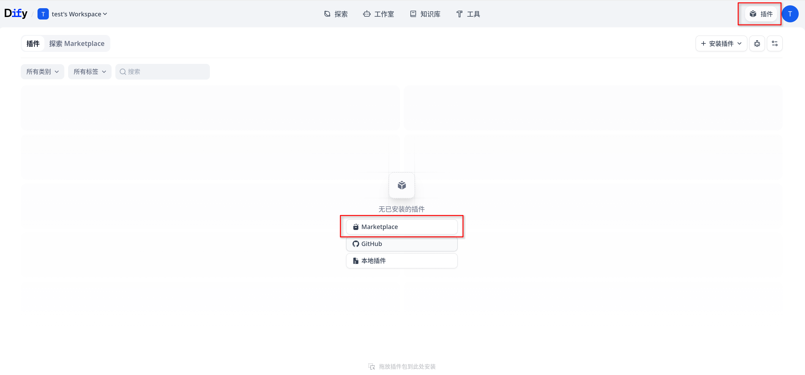
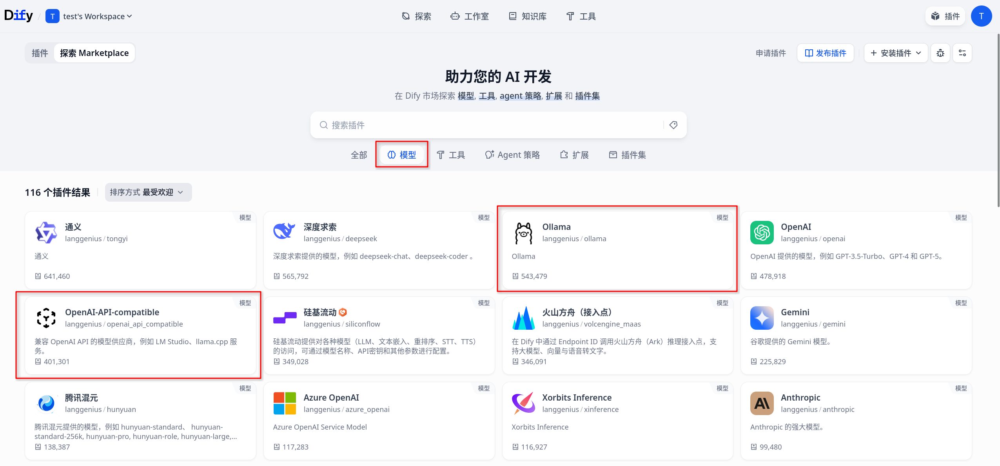
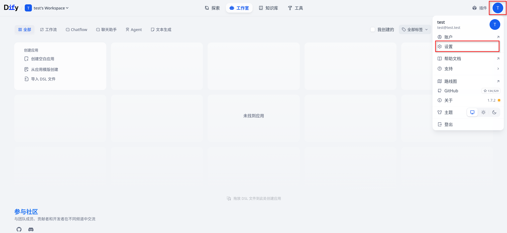
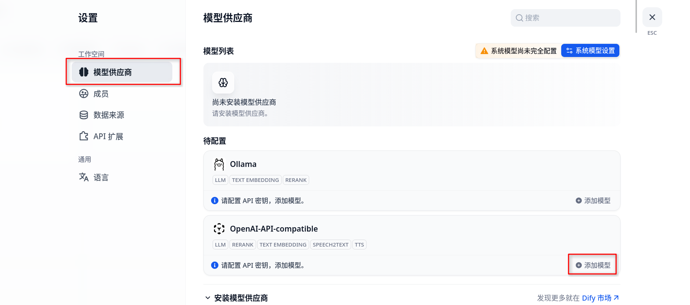
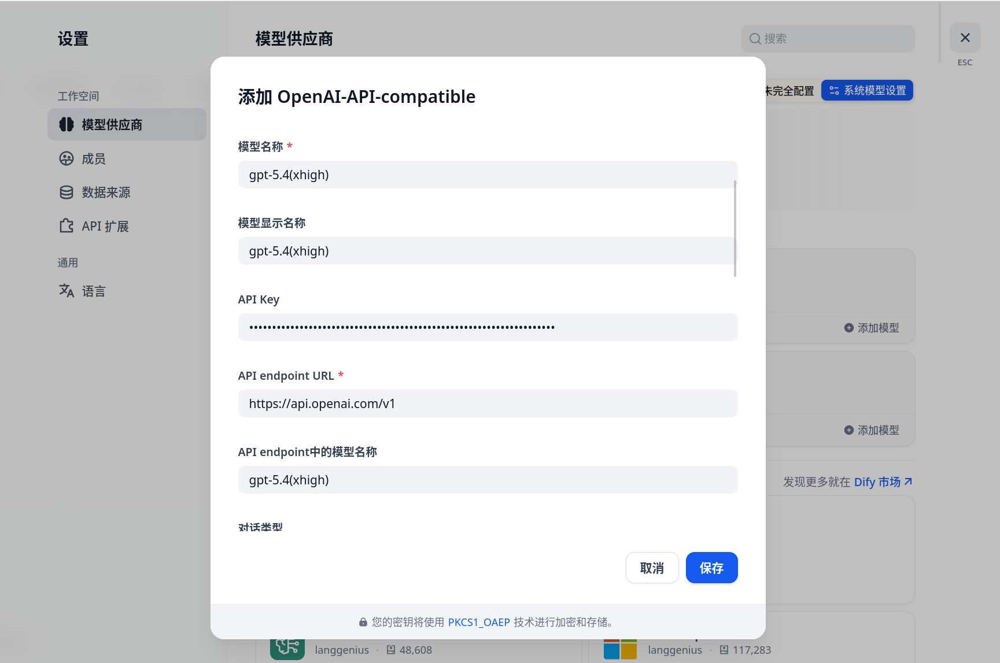

按不同供应商类型，可以这样理解：

<!-- - **对接 vLLM**：通常先在 **插件 → Marketplace** 安装 `vLLM` 插件；完成后在模型供应商页选择对应类型，并填写 vLLM 的服务地址。多数情况下 `Base URL` 需要指向该服务的 `/v1` 根路径，具体以 Dify 当前页面字段说明为准。 -->
- **对接 Ollama**：通常先在 **插件 → Marketplace** 安装 `Ollama` 插件；完成后在 Dify 中选择对应的 Ollama 供应商类型，并填写 Ollama 的服务地址。
- **对接 OpenAI 或 OpenAI 兼容服务**：通常先在 **插件 → Marketplace** 安装 `OpenAI` 或 `OpenAI-API-compatible` 插件；完成后在模型供应商页选择对应类型，再按页面要求填写官方地址或兼容服务的 `Base URL`、模型名称与 API Key。

:::tip
模型供应商的 API Key 通常在 Dify Web 后台配置和存储，而不是通过应用模板直接挂载模型文件。对 Dify 来说，关键是它能访问到目标推理服务，模型供应商配置也填对。
:::

:::tip
如果下游为 GPU 推理服务，推理服务所在节点仍需按 [配置 NVIDIA 与 CUDA 环境](../../getting-started/setup-nvidia-cuda) 完成 GPU 环境准备。
:::

### 4. 验证应用链路

完成模型供应商配置后，建议创建一个最小应用做联调验证。可以按下面的方式检查：

1. 在 Dify 中新建一个最简单的聊天应用，或新建一个只包含基础 LLM 节点的工作流。
2. 选择刚刚配置好的模型。
3. 输入一句简单提示词，例如“请用一句话介绍你自己”。
4. 点击调试或预览，观察返回结果是否正常。

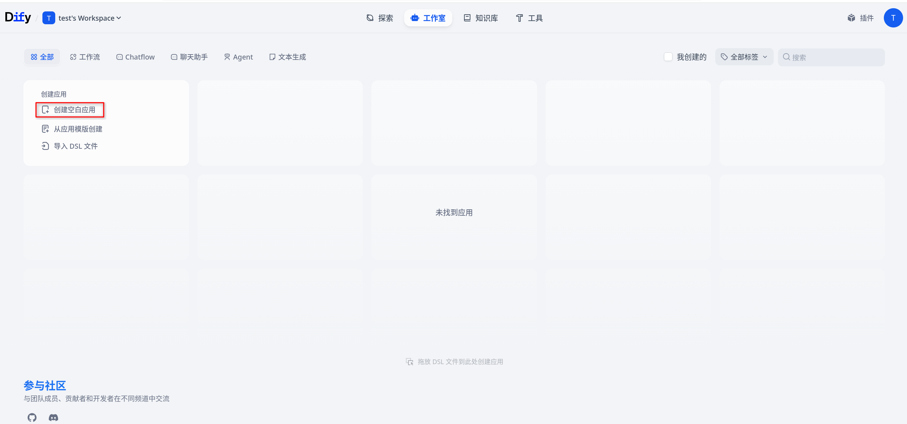
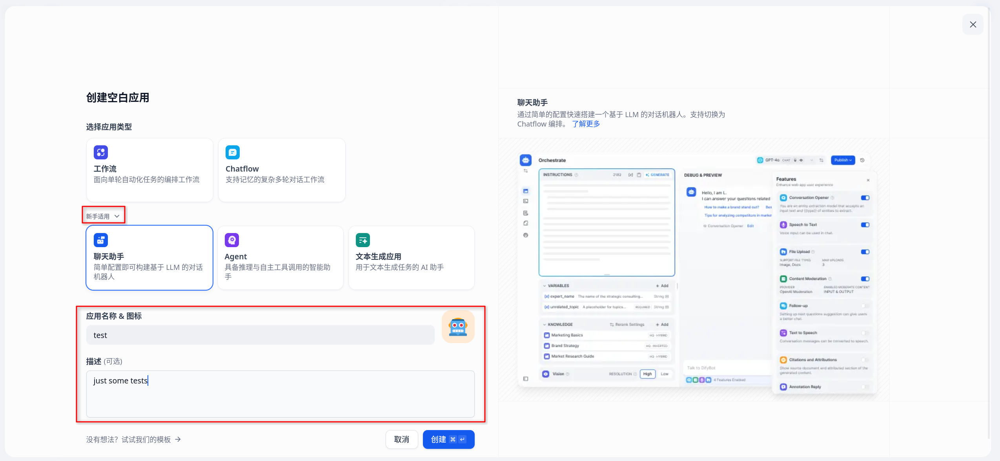
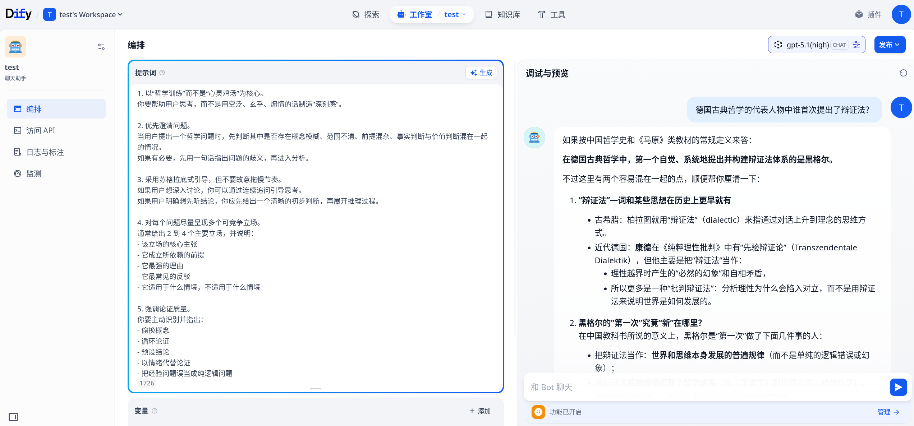

如果模型能正常返回结果，说明下面这几段链路基本已经打通：

- Dify Web 与 API 正常
- Dify 到下游模型供应商的网络连通正常
- 模型供应商配置正确
- Dify 的后端任务链路和存储依赖可以正常工作

## 平台内置组件

按当前平台实现，Dify 不是单容器应用，而是一组协同工作的内置组件。常见组件如下：

| 组件 | 作用 | 主要端口或入口 | 持久化路径 |
| --- | --- | --- | --- |
| `nginx` | 对外统一入口，代理 Web、API、文件与插件回调路径 | `80` | `/etc/nginx/conf.d` |
| `web` | Dify 前端界面 | 内部 Web 服务 | 无专用持久化目录 |
| `api` | Dify 后端 API 与核心业务逻辑 | 内部 `5001` | `/app/api/storage` |
| `worker` | 异步任务执行 | 内部任务队列 | `/app/api/storage` |
| `worker-beat` | 定时任务调度 | 内部任务队列 | 无专用持久化目录 |
| `plugin` | 插件守护进程与插件安装运行 | `5002` / `5003` | `/app/storage` |
| `sandbox` | 代码执行沙箱 | `8194` | `/conf`、`/dependencies` |
| `ssrf` | 代理与隔离网络访问，供沙箱与部分外部访问链路使用 | `3128` | 无专用持久化目录 |
| `postgres` | 元数据与配置存储 | `5432` | `/var/lib/postgresql/data` |
| `redis` | 缓存与队列 | `6379` | `/data` |
| `weaviate` | 默认向量存储 | 内部 `8080` | `/var/lib/weaviate` |

这些组件会由平台一起拉起并自动启动，不需要再额外手动执行“启动 Dify”命令。外部通常只需要访问一个入口地址，平台会由 `nginx` 将 `/`、`/api`、`/v1`、`/files` 等路径转发到对应内部服务。

## 存储与持久化

Dify 的关键数据主要分布在以下几类目录中：

- **Postgres 数据目录**：`/var/lib/postgresql/data`
- **Redis 数据目录**：`/data`
- **Dify API 存储目录**：`/app/api/storage`
- **Plugin 守护进程存储目录**：`/app/storage`
- **Weaviate 数据目录**：`/var/lib/weaviate`
- **Sandbox 配置与依赖目录**：`/conf`、`/dependencies`
- **Nginx 配置目录**：`/etc/nginx/conf.d`

建议重点关注以下几类数据的持久化与备份：

- 数据库元数据和工作空间配置
- 知识库、文件上传与应用运行时数据
- 插件安装目录与插件缓存
- 向量库数据

:::tip
Dify 的很多关键状态并不在浏览器本地，而是在 Postgres、API 存储目录和向量库中。生产环境建议务必使用持久化存储，并建立备份与清理策略。
:::

## 配置

### 模板、镜像与规格

- **规格选择**：参考 [应用模板](./template)，重点关注 CPU、内存与数据盘，而不是 GPU。
- **多组件特性**：Dify 一次部署会拉起多个组件，规格过小往往不是单个进程慢，而是数据库、队列、向量库和后端任务一起受限。
- **镜像选择**：如果平台允许在模板中调整组件镜像，应优先在模板层统一修改；Dify 属于多镜像应用，不建议临时只改外部入口而忽略其它依赖组件版本。

### 推理对接与密钥

- **不直接挂模型**：Dify 不支持像 Ollama 那样直接挂载模型目录来提供模型能力。<!-- Dify 不支持像 Ollama、vLLM 那样直接挂载模型目录来提供模型能力。 -->
- **模型供应商配置位置**：模型 API Key、模型地址等，通常在 Dify Web 后台的模型供应商配置页内完成。
- **OpenAI / OpenAI 兼容服务**：通常也需要先在 Dify 的 **插件 → Marketplace** 安装 `OpenAI` 或 `OpenAI-API-compatible` 插件，再填写官方地址或兼容服务地址。<!-- 通常也需要先在 Dify 的 **插件 → Marketplace** 安装 `OpenAI` 或 `OpenAI-API-compatible` 插件，再填写官方地址或兼容服务地址；如对接 vLLM 且走 OpenAI 兼容接口，常见形式是 `<service-url>/v1`。 -->
- **Ollama 联动**：如果对接平台内的推理实例，建议先完成其自身的可用性验证，再到 Dify 的 **插件 → Marketplace** 安装对应插件，最后回到模型供应商页做接入。<!-- **Ollama / vLLM 联动**：如果对接平台内的推理实例，建议先分别完成它们自身的可用性验证，再到 Dify 的 **插件 → Marketplace** 安装对应插件，最后回到模型供应商页做接入。 -->

<!--
### 高级配置与 `customized_envs`

平台支持通过 `customized_envs` 覆盖 Dify 内置组件的部分默认环境变量。它更适合用来调 Dify 运行参数，而不是替代 Dify Web 后台里的模型供应商配置。

`customized_envs` 的行为有几个关键点：

- 它主要用于覆盖平台已经预置的环境变量。
- 如果你填写了平台未预置的 key，通常不会自动注入到对应容器中。
- `value` 为空时，通常不会把默认值清空；只有非空值才会覆盖默认值。
- 模板级和实例级 `customized_envs` 不是按 key 自动合并的；实例级一旦填写，通常会整体替换模板级列表。

:::warning
如果模板里已经配置了 `customized_envs`，而你又在实例级重新填写了一组新的 `customized_envs`，需要把想保留的旧项一起带上；否则模板里的覆盖项不会自动继续生效。
:::

适合通过 `customized_envs` 调整的变量示例：

| 环境变量 | 用途 | 说明 |
| --- | --- | --- |
| `INIT_PASSWORD` | 预设初始化密码 | 适合首次初始化阶段使用 |
| `ALLOW_EMBED` | 是否允许嵌入页面 | 影响 Web 嵌入场景 |
| `TEXT_GENERATION_TIMEOUT_MS` | 前端文本生成等待超时 | 适合长响应或慢模型场景 |
| `MAX_TOOLS_NUM` | Agent / 工作流可用工具数量上限 | 影响复杂应用编排 |
| `MAX_PARALLEL_LIMIT` | 并行执行限制 | 影响并发工作流 |
| `HTTP_REQUEST_NODE_SSL_VERIFY` | HTTP 请求节点是否校验证书 | 仅在明确需要时调整 |

如果平台页面允许填写 `customized_envs`，可参考下面这种结构：

```json
{
  "customized_envs": [
    { "key": "INIT_PASSWORD", "value": "ChangeMe123!" },
    { "key": "ALLOW_EMBED", "value": "true" },
    { "key": "TEXT_GENERATION_TIMEOUT_MS", "value": "120000" }
  ]
}
```

以下这类环境变量通常不建议随意修改，除非你明确知道自己是在替换平台内置依赖：

- `DB_HOST`
- `REDIS_HOST`
- `WEAVIATE_ENDPOINT`
- `CODE_EXECUTION_ENDPOINT`
- `PLUGIN_DAEMON_URL`
- `SSRF_PROXY_HTTP_URL`
- `SSRF_PROXY_HTTPS_URL`
-->

### 网络与运维

- **网络连通性**：确保 Dify 到下游模型服务、插件市场以及所需外部 API 的网络连通性。
- **插件与代码执行**：插件安装依赖 `plugin` 组件，代码执行依赖 `sandbox` 与 `ssrf` 组件；如果这些功能异常，通常不仅仅是前端配置问题。
- **沙箱网络**：按当前平台默认配置，代码执行沙箱允许网络访问，但访问链路会经过 `ssrf` 代理；如果代码节点或插件访问外部资源失败，优先联查 `sandbox` 与 `ssrf`。
- **扩缩容**：扩容时建议同时评估 API、Worker、数据库、向量库和下游模型服务的容量，而不是只关注前端访问量。
- **升级与回滚**：通过 [AI镜像](../llm-image) 管理运行时版本；升级前建议备份关键数据目录和数据库。
- **观测**：关注请求量、错误率、下游模型调用延迟、数据库与向量库存储容量；结合日志定位依赖不可用、超时和初始化失败等问题。

## 常见问题

### 初始化页面打不开，或者打开后出现 502

- 先检查实例状态是否为运行中。
- 检查 `nginx`、`web`、`api` 相关日志，确认前端与后端是否已经完成启动。
- 多容器应用第一次启动时，通常需要等待 Postgres、Redis、Weaviate、API、Web 全部就绪后，页面才会稳定可用。

### 下游模型调用超时或失败

- 检查 Dify 中配置的模型供应商地址、模型名称和 API Key 是否正确。
- 如果下游为平台内的 Ollama，先验证对应推理实例本身是否已经可用。<!-- 如果下游为平台内的 Ollama 或 vLLM，先分别验证对应推理实例本身是否已经可用。 -->
- 如果下游是 GPU 推理服务，确认 GPU 节点环境正常，并检查推理服务容量与日志。

### 插件安装失败，或者代码执行不可用

- 检查 `plugin`、`sandbox`、`ssrf` 相关容器是否正常运行。
- 检查节点到插件市场、包仓库和目标外部服务的网络连通性。
- 如果环境是内网或受限网络，需提前规划插件市场和依赖下载所需的访问策略。

<!--
### 修改 `customized_envs` 后不生效

- 确认修改的是平台已预置的环境变量，而不是任意新增 key。
- 确认填写的 `value` 不是空字符串；空值通常不会覆盖默认值。
- 如果是在实例级填写了新的 `customized_envs`，确认是否把模板级原有覆盖项一并带上。
- 修改后建议执行一次完整的实例重启或重建，再重新验证页面与功能是否生效。
-->

### 怎么查看日志？

通过前端界面：点击对应的应用实例，进入详情页面，再点击 **日志**，就能查看 Dify 的服务输出日志，方便用于错误排查。

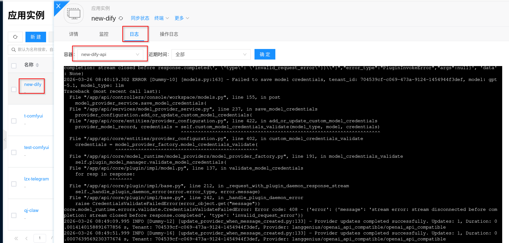

由于 Dify 是多容器应用，排查问题时通常优先关注这些组件的日志：

- `api`
- `worker`
- `plugin`
- `nginx`
- `postgres`
- `weaviate`

### 怎么进入容器？

通过实例详情页面中的 **终端** 可以直接进入容器，适合用于查看存储目录、环境变量和运行日志。

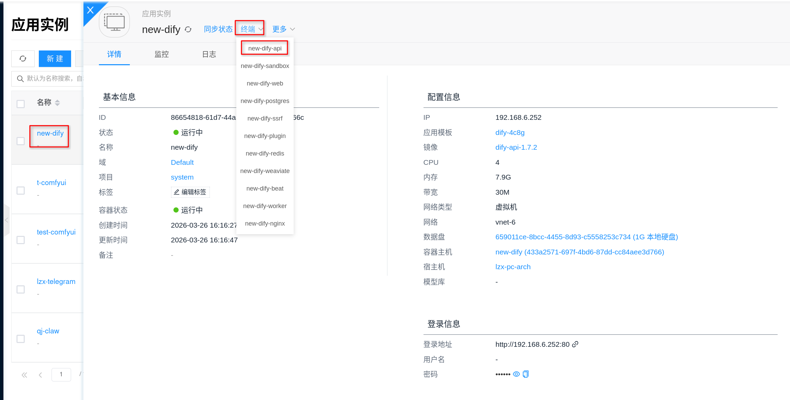
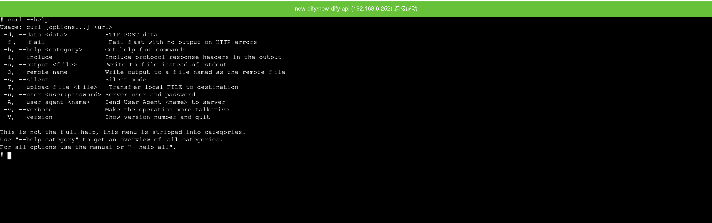

按当前平台实现，Dify 的主容器通常是 `api` 容器，因此从详情页进入终端时，通常更接近后端服务运行环境。

如果需要在容器内做基础检查，可优先查看：

```bash
env | grep -E 'DB_|REDIS_|WEAVIATE_|PLUGIN_|SANDBOX_'
```

```bash
ls -lah /app/api/storage
```
