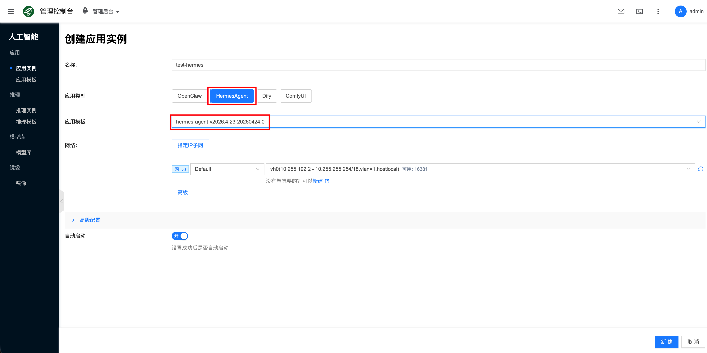
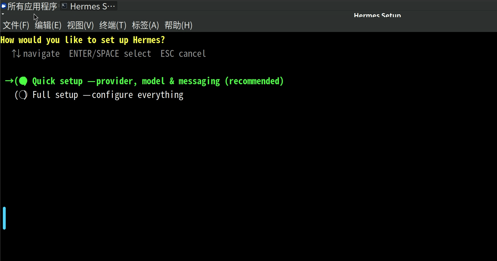
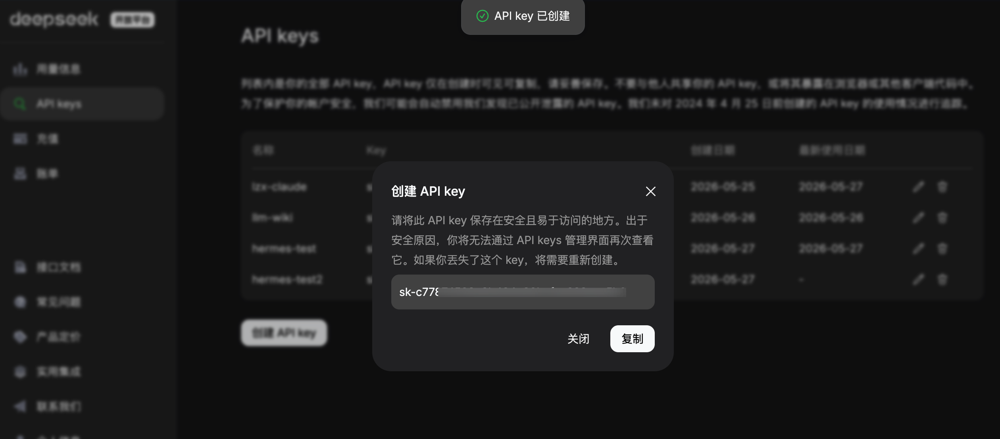
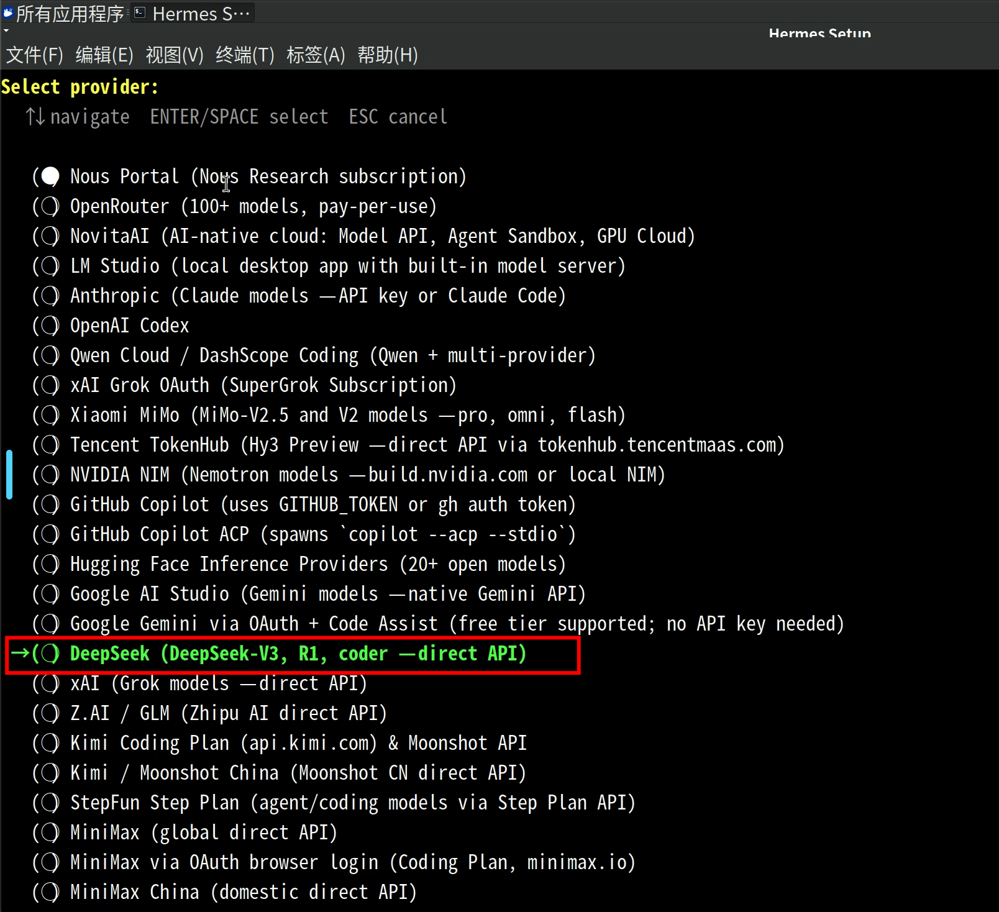
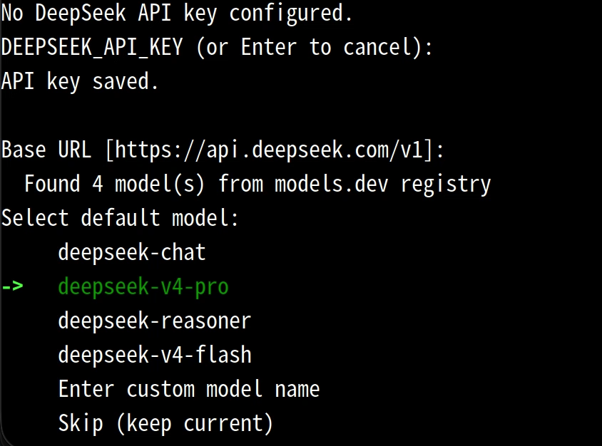
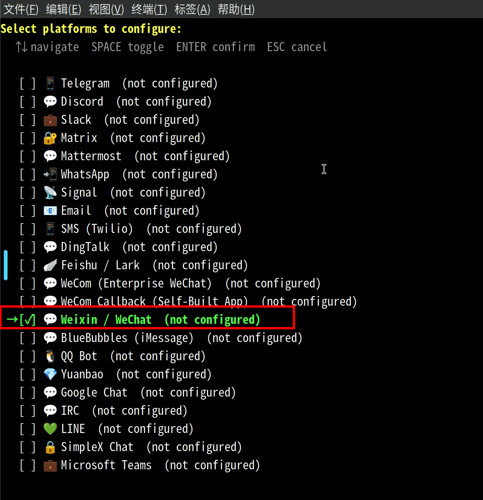
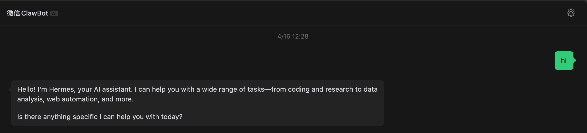
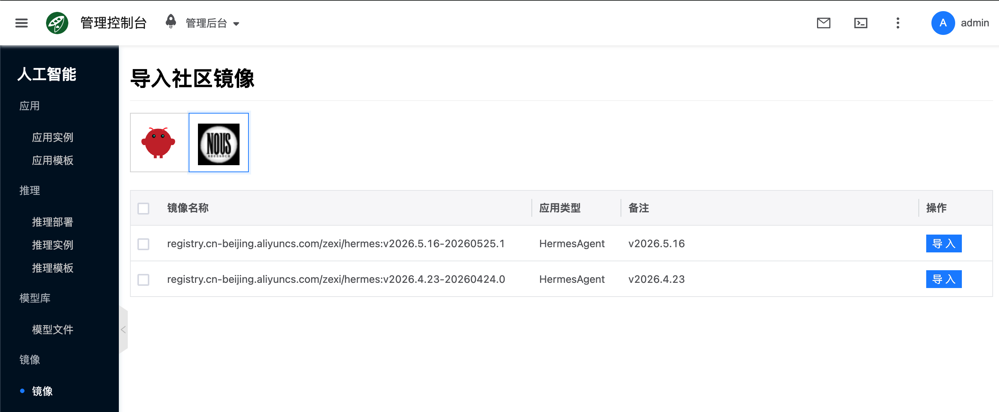

# HermesAgent

[Hermes Agent](https://github.com/NousResearch/hermes-agent) 是 Nous Research 开源的自主 AI Agent，支持持久记忆、工具调用，以及通过 微信、QQ、Telegram、Discord等渠道接入。在 Cloudpods 中，Hermes 以应用类型 **`hermes-agent`** 部署：平台负责拉起带 Web 桌面的容器，并运行 Hermes Agent 服务。

## 快速开始 {#quickstart}

### 1. 创建应用实例

- 进入 **人工智能 → 应用 → 应用实例**，点击 **新建**，类型选择 **HermesAgent**。
- 应用模板: 平台会预置 HermesAgent 的应用模板，创建实例时直接选择对应的默认模板即可。

:::tip
如需自定义镜像/资源配置/参数，再到 **人工智能 → 应用 → 应用模板** 中新建或编辑。
:::

:::tip
创建页与 OpenClaw 等应用共用同一套入口；类型下拉中选择 **HermesAgent** 即可。若需自定义镜像或规格，请先在 **应用模板** 中调整。
:::

### 2. 访问 Web 桌面 {#hermes-gui}

实例运行后，进入详情页 **登录信息**：

- **访问地址**：`https://<节点或映射地址>:3001`
- **用户名**：`admin`
- **密码**：由实例 ID 派生的 9 位固定规则（与 OpenClaw 桌面栈相同）

浏览器打开后按提示完成 HTTP 认证：

进入桌面后，默认会打开配置 hermes 的窗口，按照需求手动配置模型供应商，通知渠道等参数：

## 配置举例

下面以配置 deepseek-v4-pro 作为模型供应商，然后通过微信作为消息渠道的方式作为例子：

### 1. 获取 deepseek apikey

创建[DeepSeek API Key: https://platform.deepseek.com/api_keys](https://platform.deepseek.com/api_keys)，然后保存下来：

### 2. 配置 hermes agent

- 选择 Quick Setup
- 当提示选择模型提供商时，选择 DeepSeek，填入 apikey，并选择 deepseek-v4-pro 模型

- 配置通知渠道，按空格键选择 `Weixin/WeChat`，然后会显示二维码，用微信扫码绑定

- 之后再按需求完成设置后，hermes gateway 会自动启动
- 最后直接在微信的 `ClawBot` 聊天窗口发送消息即可

## 平台行为说明

### 容器内持久化目录

- `/config`: 默认用户的 home 目录
- `/opt/data`: hermes agent 配置目录
  - `/opt/data/config.yaml`: hermes 默认配置文件

### 社区镜像

可通过 **镜像 → 导入社区镜像** 导入平台提供的不同版本 hermes 镜像。

平台社区镜像列表见 [llmimages.yaml](https://www.cloudpods.org/llmimages.yaml)，其中包含 `llm_type: hermes-agent` 条目。

## 常见问题

### 怎么重新配置？

打开容器桌面里的终端模拟器，然后输入 `hermes setup` 就会重新进入配置界面。

### 怎么查看日志？{#hermes-log}

- **控制台**：实例详情 → **日志**。
- **容器内**：桌面终端执行 Hermes 自带日志命令: `hermes logs --follow`。

### 怎么进入容器终端？

实例详情 → **终端**（与 OpenClaw 相同入口）。

:::warning
从前端打开的终端默认为高权限环境，执行命令前请确认影响范围。
:::