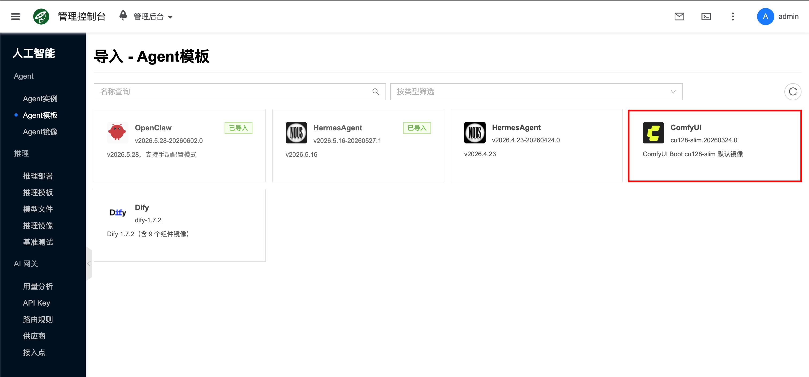
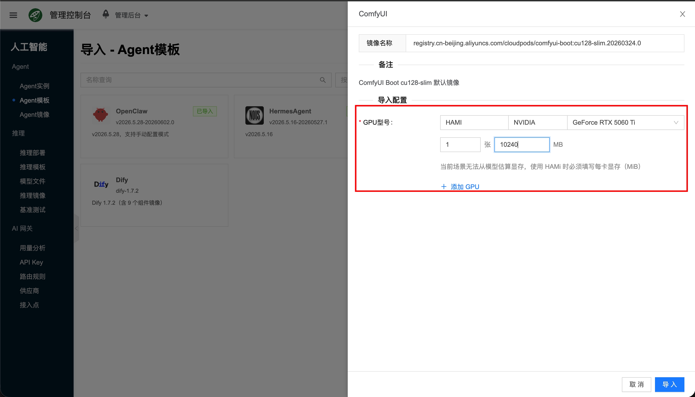
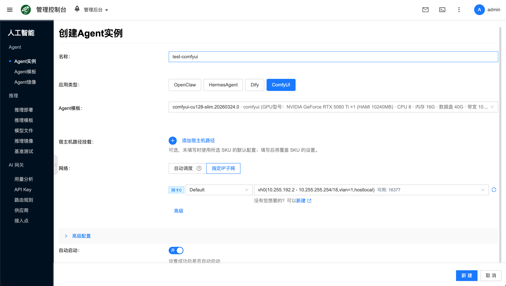
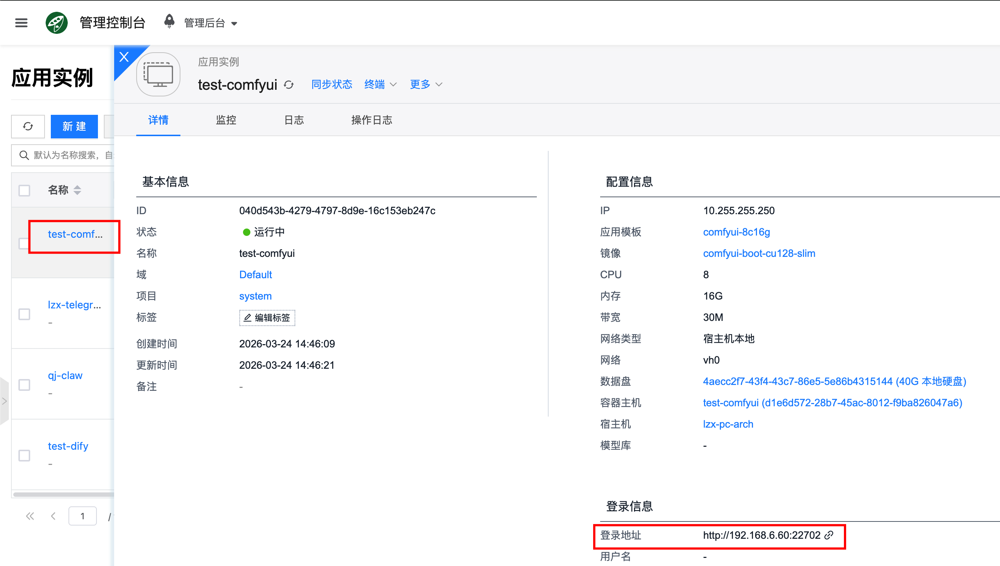
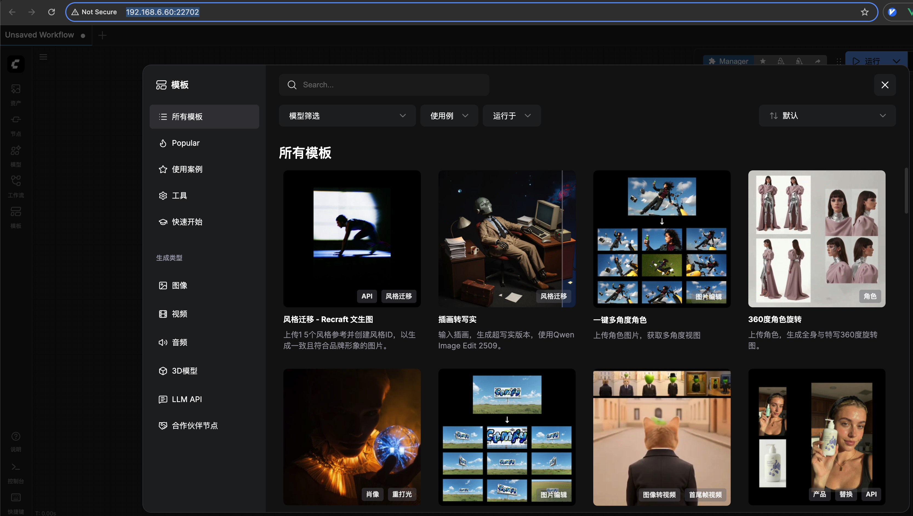
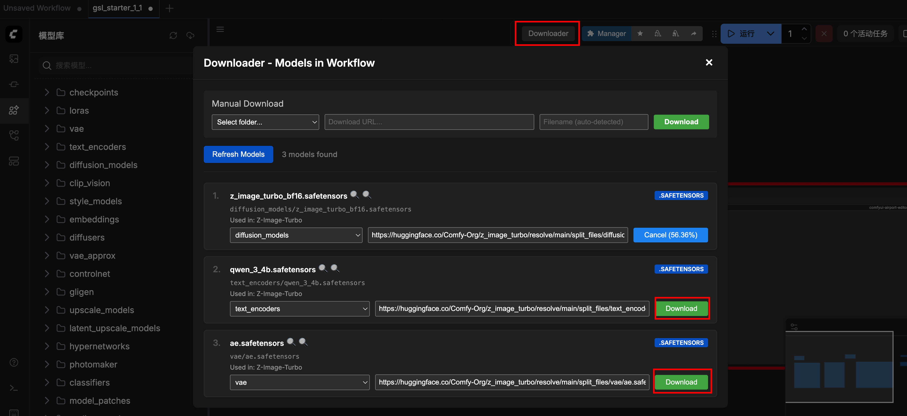
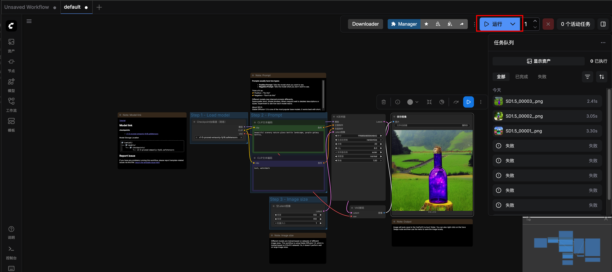
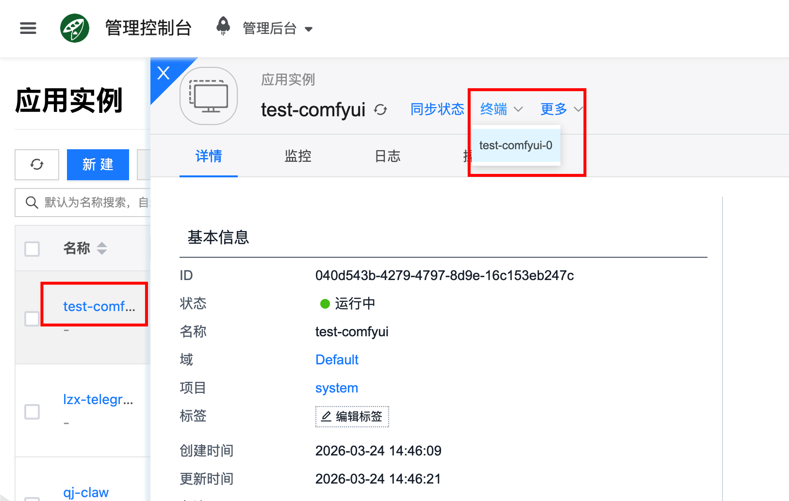
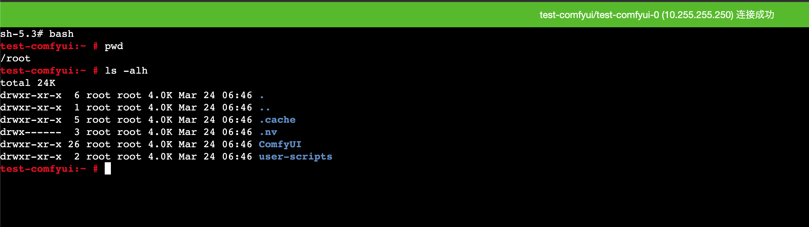
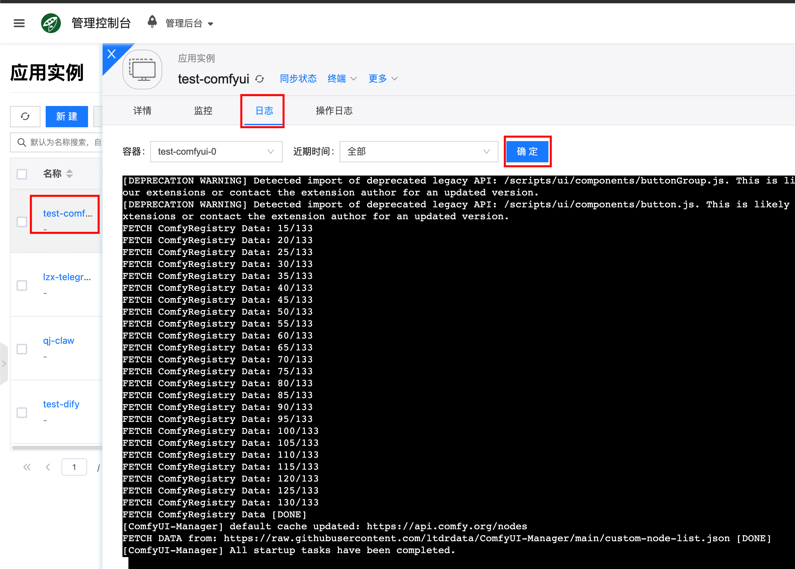

# ComfyUI

[ComfyUI](https://www.comfy.org/) 是图像生成与可视化工作流应用，支持基于节点的工作流编排，适用于图像生成、工作流复用与可视化调试。

## 快速开始 {#quickstart}

### 1. 前提环境配置

图像生成依赖 GPU 环境，请先完成 [配置 NVIDIA 与 CUDA 环境](/docs/aicloud/getting-started/setup-nvidia-cuda)。

### 2. 导入 Agent模板

1. 进入 **人工智能 → Agent → Agent模板**，点击 **导入**。

2. 在社区目录中选择 **ComfyUI** 对应条目。

3. 在导入抽屉中选择 **GPU 型号**（须与节点可用 GPU 一致）。若 GPU 调度为 **HAMI**，还须填写每卡限制的显存大小（MiB）；当前场景无法从模型估算显存时，HAMI 模式下该字段为必填。

4. 确认镜像与规格后提交 **导入**。导入成功后，平台会生成对应的 [Agent镜像](../agent-image) 与默认 [Agent模板](../template)。

:::tip
导入后若 GPU 型号或 HAMI 显存限制与节点不一致，可对模板执行 **修改** 后再创建实例。
:::

### 3. 创建 Agent实例

进入 **人工智能 → Agent → Agent实例**，点击 **新建**，选择刚导入的 ComfyUI 模板后提交。

### 4. 访问 ComfyUI web 界面

创建完成后，进入实例详情页面，即可获取登录信息，通过浏览器打开对应地址，就能打开 ComfyUI Web 界面。

### 5. 下载模型

ComfyUI 容器镜像默认安装了 [ComfyUI-Downloader](https://github.com/romandev-codex/ComfyUI-Downloader) 插件，可以很方便的直接在 UI 下载组件。
选择一个模板后，点击 **Downloader** ，就会自动识别这个模板依赖的模型，然后点击下载即可。

### 6. 生成图片

模型导入完成后，点击`运行`，便可以开始生成图片，生成图片完成后，可以通过浏览器直接下载到本地。

## 模型与数据

### 持久化路径

ComfyUI 容器里面的这些目录是持久化的，容器重启后数据也不会丢失，用于存放模型以及其它数据状态文件，路径如下：

- `/root/ComfyUI/models`: 存放模型文件
- `/root/ComfyUI/input`: 存放输入数据
- `/root/ComfyUI/output`: 存放输出数据
- `/root/ComfyUI/user/default/workflows`: 存放工作流状态文件
- `/root`: root 用户家目录
- `/root/.cache/huggingface/hub`: huggingface 相关持久化数据
- `/root/.cache/torch/hub`: torch 相关持久化数据

## 常见问题

### 怎么进入容器？{#tty}

通过在详情页面里面的“终端”可以直接进入容器：

### 怎么查看服务日志？

通过前端界面：点击对应的 Agent实例，进入详情页面，再点击日志，就能查看到服务输出的日志了，方便用于错误排查。

