# OpenClaw

[OpenClaw 小龙虾🦞](https://docs.openclaw.ai/) 是开源自托管的个人智能体助手，不依赖 GPU，部署完成后即可在控制台快速创建并使用。

## 快速开始 {#quickstart}

### 1. 导入 Agent模板

1. 进入 **人工智能 → Agent → Agent模板**，点击 **导入**。

2. 在社区目录中选择 **OpenClaw** 对应条目，选择导入。

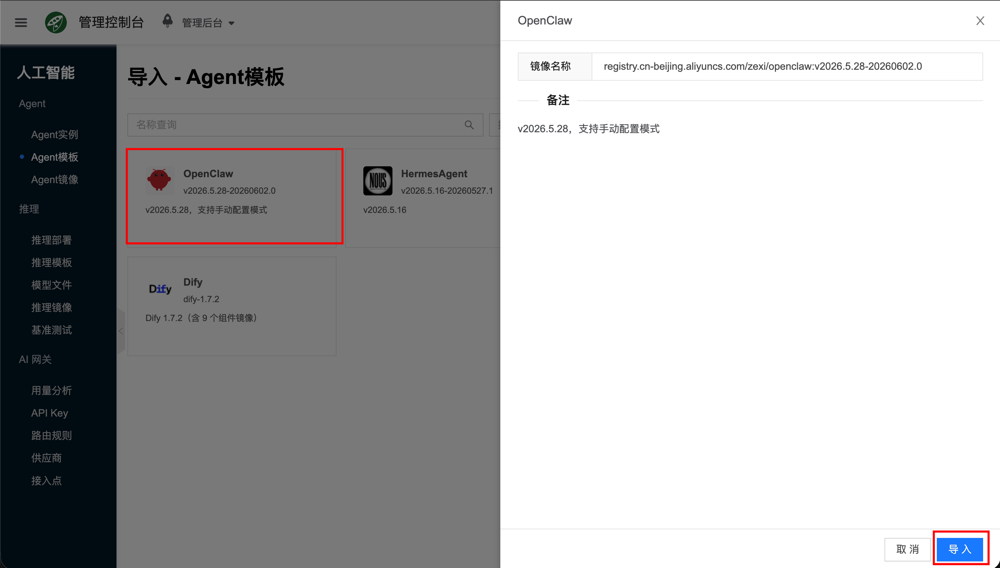

3. 导入成功后，平台会生成对应的 [Agent镜像](../agent-image) 与默认 [Agent模板](../template)。

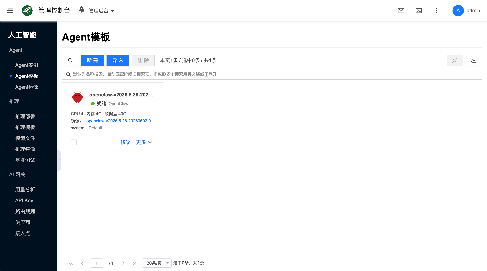

:::tip
导入后如需调整 CPU、内存、镜像或参数，可对模板执行 **修改**；字段说明见 [Agent模板](../template)。
:::

### 2. 创建 Agent实例

1. 进入 **人工智能 → Agent → Agent实例**，点击 **新建**。
2. 选择刚导入的 OpenClaw 模板，填写实例名称与调度相关配置后提交。

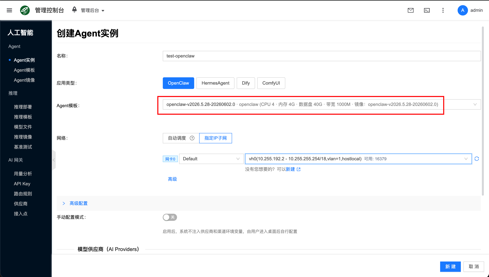

- 网络：可选择自动调度，或者指定IP子网
- 高级配置：
    - 宿主机(可选)：可选择指定的宿主机运行 OpenClaw 容器实例，不选则会自动调度
- **手动配置模式**（开关）：启用后不在控制台填写供应商与渠道；详见 [手动配置模式](#manual-config)。

### 3. 配置模型供应商

若已启用 [手动配置模式](#manual-config)，可跳过本节，改为登录桌面后自行配置。

在创建/编辑实例时，为至少一个供应商配置 API Key（例如 Moonshot）。

选择对应的供应商，并填入相关的 API Key，下图以 Moonshot(月之暗面) 为例：

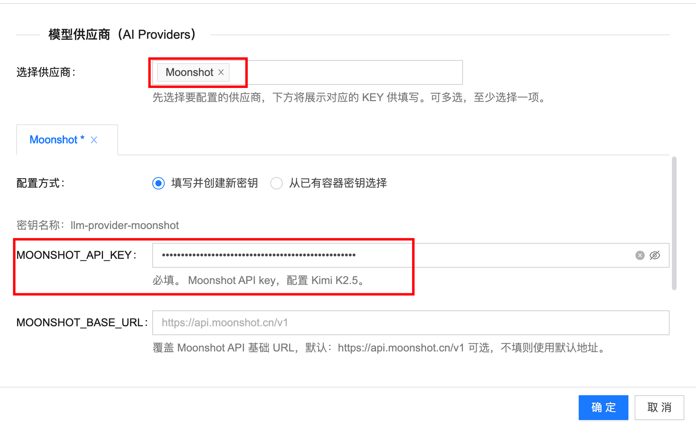

### 4. 配置聊天沟通渠道

若已启用 [手动配置模式](#manual-config)，可跳过本节，改为登录桌面后自行配置。

按需配置聊天沟通渠道（QQ、飞书、Telegram、Discord 等），填入对应的认证信息，用于通过聊天与 OpenClaw 交互。每个渠道配置获取认证信息的方式不一样，如何配置请参考：[聊天沟通渠道配置](#config-channel)。

选择对应的通知渠道，填入相关的认证信息，下图以 QQ 机器人为例：

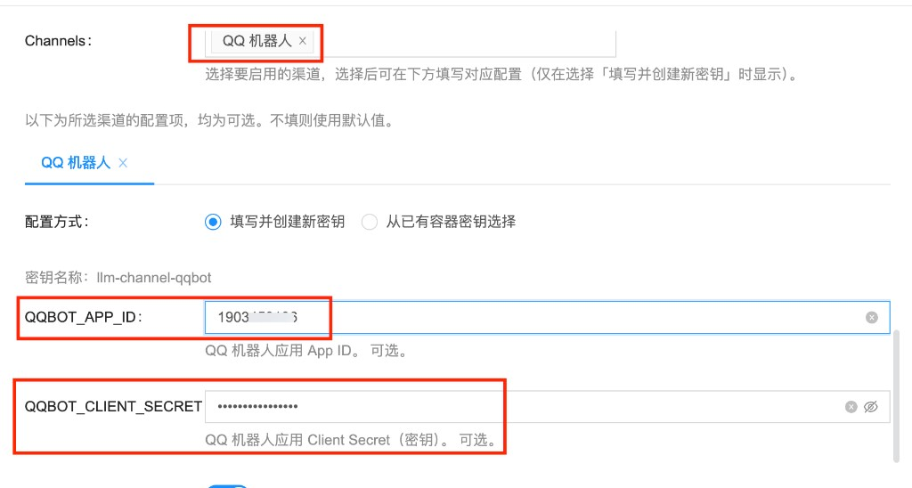

### 5. 访问与登录 {#openclaw-gui}

进入实例详情页，查看登录信息，获取访问地址和用户密码，用浏览器打开。

其中的用户名和密码，是 http auth 的认证信息，用浏览器打开时，会提示输入：

输入完成后，就能看到运行了 OpenClaw 的容器桌面，可以在这个桌面里面进行一些调试和额外的操作：

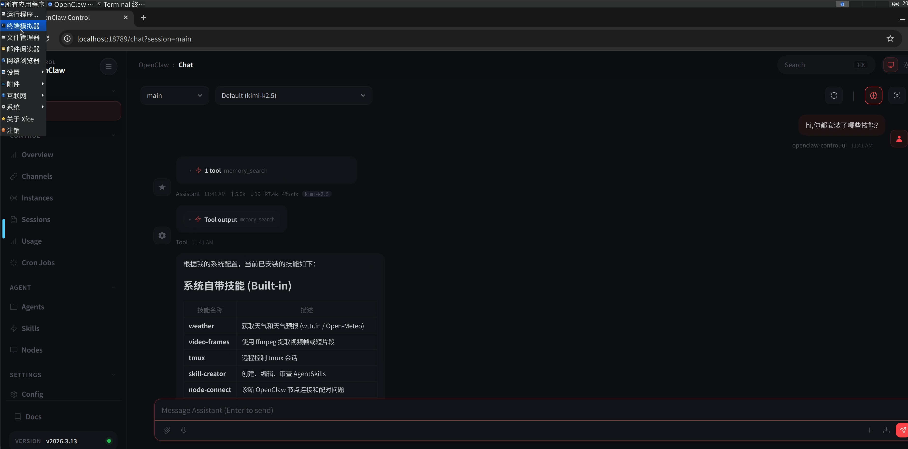

### 6. 聊天沟通

如果正确配置了 QQ 机器人聊天渠道，就可以在 QQ 里面和这个机器人发消息调用 OpenClaw 作为 AI 助手了，比如让他总结 pdf 文档：

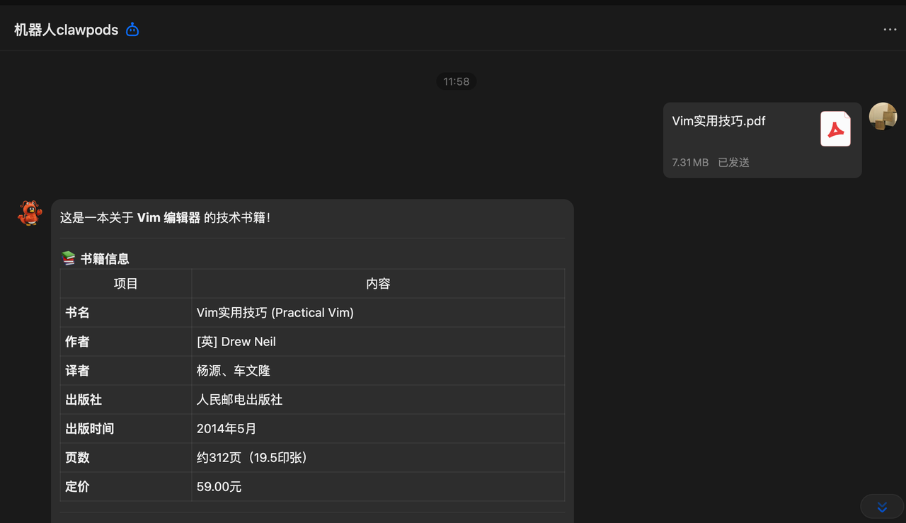

## 配置

### 手动配置模式 {#manual-config}

创建或更新 OpenClaw 实例时可开启 **手动配置模式**。控制台提示为：启用后，系统不注入供应商和渠道环境变量，由用户进入桌面后自行配置。

- **何时开启**：希望在桌面 / 应用内按 [OpenClaw](https://docs.openclaw.ai/) 官方方式配置供应商与渠道，或不想在控制台集中填写凭证。
- **开启后**：创建页不再展示模型供应商与聊天渠道表单；可跳过快速开始中的「配置模型供应商」「配置聊天沟通渠道」。[访问与登录](#openclaw-gui) 进入容器桌面后，系统会自动打开终端并进入 **setup** 流程；按提示完成配置后，OpenClaw 服务会随之启动。
- **关闭（默认）**：在创建或编辑页填写模型供应商与聊天渠道；平台会将凭证作为环境变量注入容器。
- **已有实例**：在实例操作中选择 **更新规格**，可切换该开关；开启后同样不再展示控制台侧的供应商 / 渠道表单，行为与创建时一致。

进入桌面后的典型行为：

1. 自动打开终端并进入 setup（界面标题多为 OpenClaw Setup），需先完成安全确认等提示。
2. 按终端向导配置供应商、渠道等。
3. setup 完成后，OpenClaw 服务启动，可继续在桌面内使用。

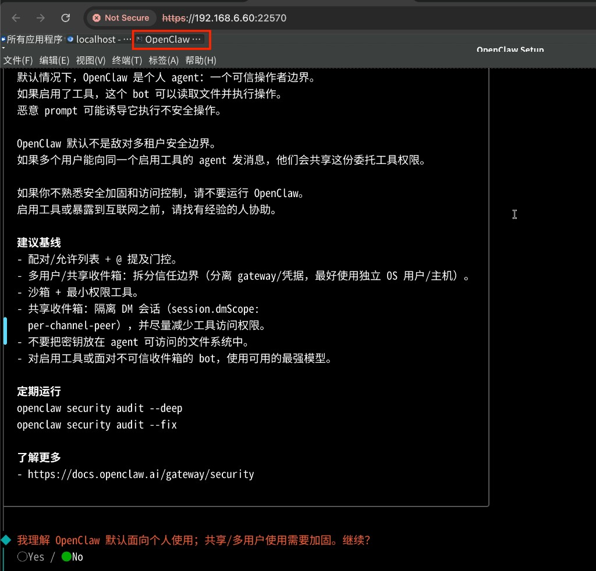

### 模型供应商 {#config-providers}

#### 月之暗面(MOONSHOT) {#config-moonshot}

##### 登录控制台

访问 [https://platform.moonshot.cn/](https://platform.moonshot.cn/)，注册用户，登录控制台，然后点击用户中心：

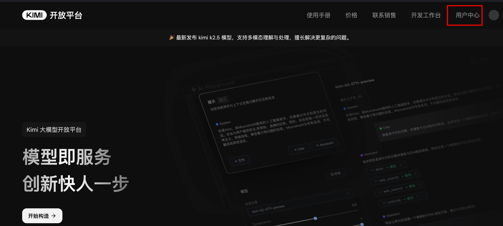

##### 新建 API key

新建 API key：

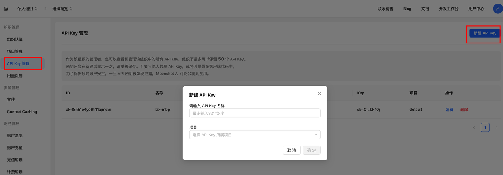

复制创建的密钥：

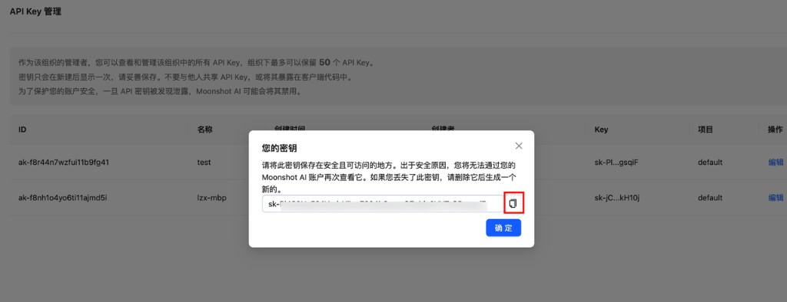

#### 智谱(ZHIPU) {#config-zhipu}

访问智谱 [API Keys 管理页面](https://bigmodel.cn/usercenter/proj-mgmt/apikeys)，注册用户并登录，创建 API Key 并复制保存。

#### MiniMax {#config-minimax}

访问 MiniMax [接口密钥管理页面](https://platform.minimaxi.com/user-center/basic-information/interface-key)，注册用户并登录，创建 API Key 并复制保存。

### 聊天沟通渠道 {#config-channel}

#### QQ机器人 {#config-qqbot}

##### 注册QQ开放平台

前往腾讯[QQ开放平台](https://q.qq.com/qqbot/openclaw/login.html)官网，用手机QQ扫描图中二维码进行注册/登录。

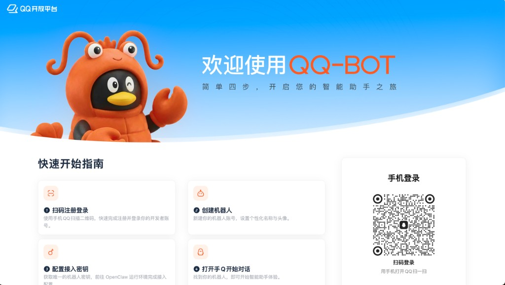

> 说明：若您当前尚未注册QQ开放平台，执行扫码操作后，系统将自动完成QQ开放平台注册流程，并将您扫码所用的QQ账号与该平台账号进行绑定。

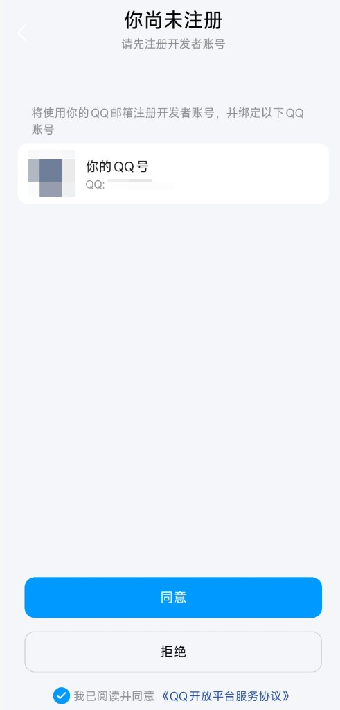

在手机QQ扫码后选择同意，即完成注册，进入QQ机器人配置页。

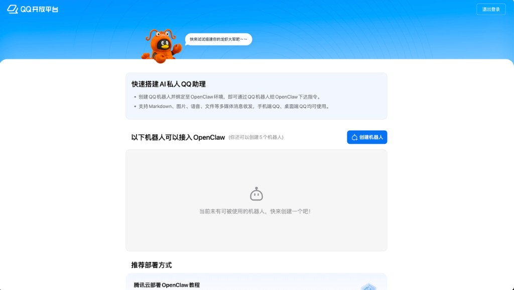

##### 创建一个QQBot机器人

在QQ开放平台的QQ机器人页面，可以单击创建机器人，即可直接新建一个QQ机器人。

机器人创建完成后，在页面中找到 “AppID” 和 “AppSecret” 两个参数，分别点击右侧 “复制” 按钮，将其保存到个人记事本或备忘录中（请妥善保存勿泄露，注意数据安全），后续步骤中需要使用。

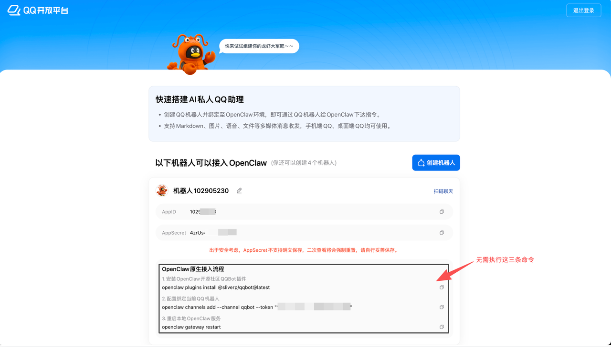

##### 使用 AppID 和 AppSecret

创建 OpenClaw 应用的时候，通知渠道选择QQ机器人时，填入以下信息：

- AppID: 对应 QQBOT_APP_ID
- AppSecret: 对应 QQBOT_CLIENT_SECRET

#### 飞书 {#config-feishu}

##### 配置机器人

飞书配置可参考 OpenClaw 官方文档：[https://docs.openclaw.ai/channels/feishu#step-1-create-a-feishu-app](https://docs.openclaw.ai/channels/feishu#step-1-create-a-feishu-app)。

##### 使用 AppID 和 AppSecret

- AppID: 对应 FEISHU_APP_ID
- AppSecret: 对应 FEISHU_APP_SECRET

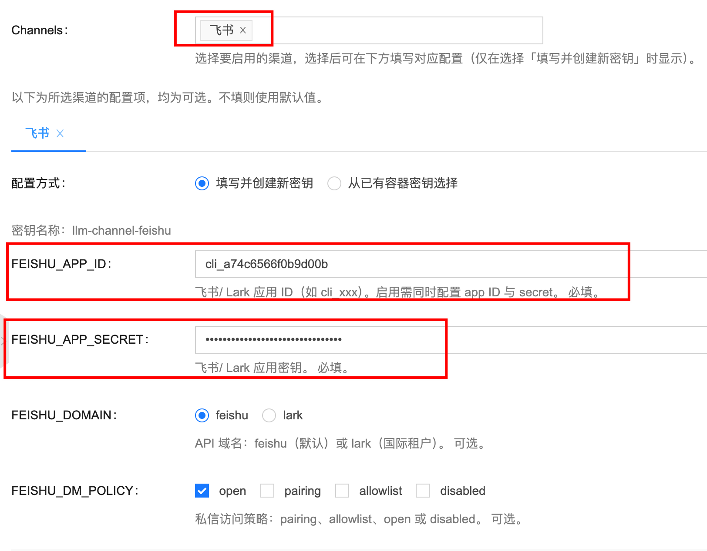

#### Telegram {#config-telegram}

##### 配置机器人

Telegram 机器人配置可参考 OpenClaw 官方文档：[https://docs.openclaw.ai/channels/telegram#quick-setup](https://docs.openclaw.ai/channels/telegram#quick-setup)。

##### 使用 BotToken

- 拷贝 BotFather 回复的机器人 Token，填入 TELEGRAM_BOT_TOKEN：

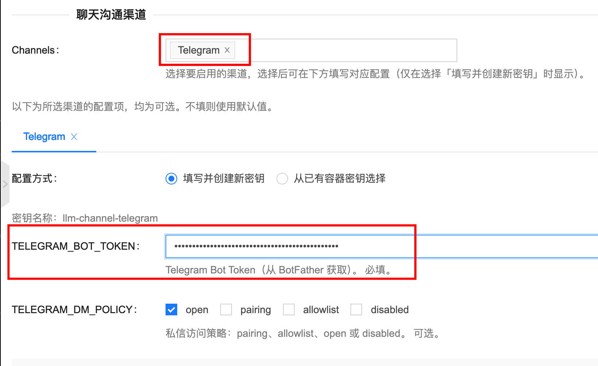

#### Discord {#config-discord}

##### 配置机器人

Discord 机器人配置可参考 OpenClaw 官方文档：[https://docs.openclaw.ai/channels/discord#quick-setup](https://docs.openclaw.ai/channels/discord#quick-setup)。

##### 使用 BotToken

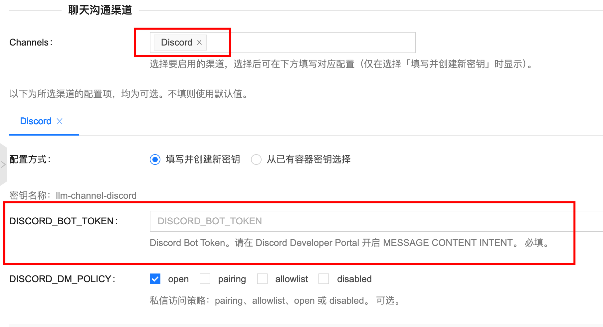

## 常见问题

### 怎么查看 OpenClaw 日志？{#openclaw-log}

有以下几种方式查看 OpenClaw 服务日志：
- 通过前端界面：点击对应的 Agent实例，进入详情页面，再点击日志，就能查看到 OpenClaw 服务输出的日志了，方便用于错误排查。
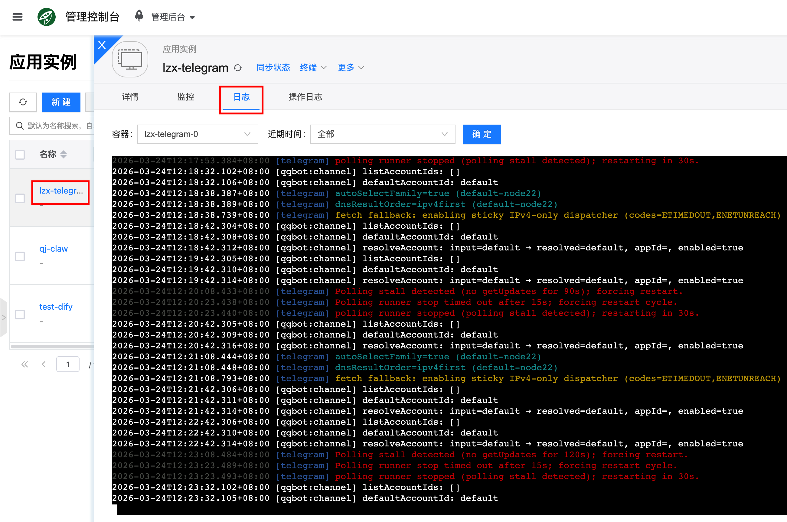

- 通过[进入容器桌面](#openclaw-gui)，打开终端后，输入 `openclaw logs --follow` 命令查看日志。
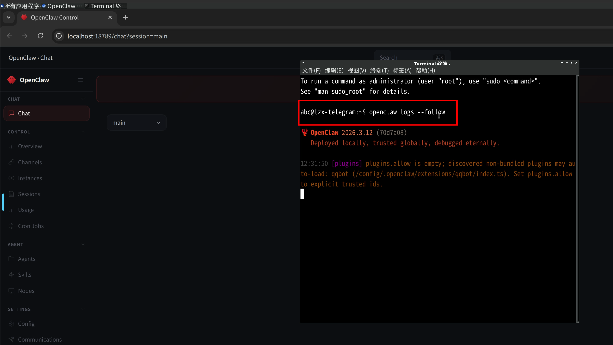

### 如何登录到 OpenClaw 容器里面？

- 除了[进入容器桌面](#openclaw-gui)这种方式，还可以通过在详情页面里面的“终端”进入，

:::warning
从前端打开的终端页面默认是 root 用户，随意执行命令可能会导致未知的问题，执行命令需要清楚可能带来的副作用。
:::
