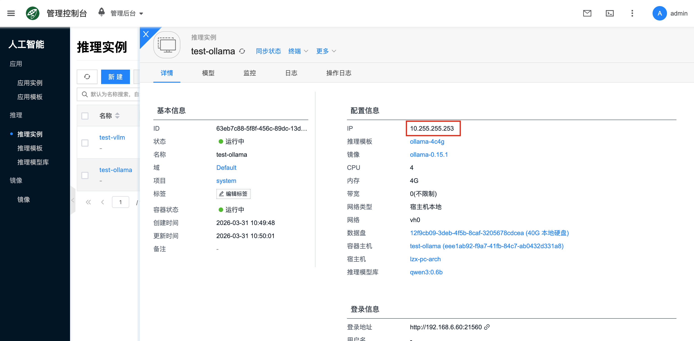
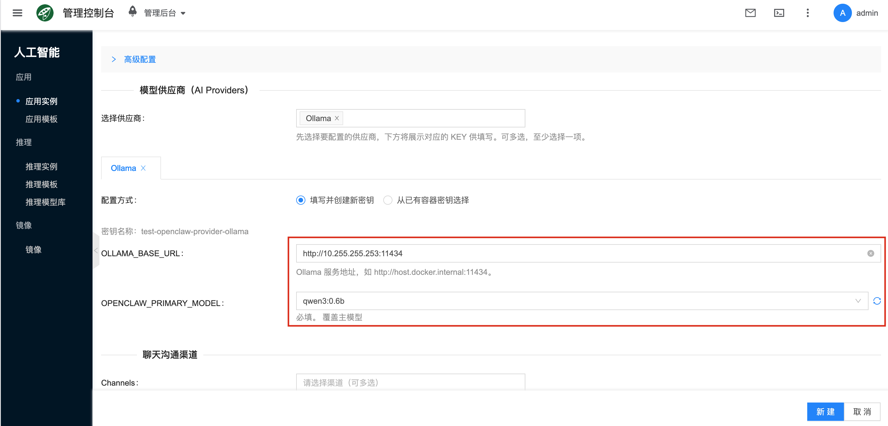

# OpenClaw

[OpenClaw 小龙虾🦞](https://docs.openclaw.ai/) 是开源自托管的个人智能体助手，不依赖 GPU，部署完成后即可在控制台快速创建并使用。

## 快速开始 {#quickstart}

### 1. 创建应用实例

- 控制台 **人工智能 → 应用 → 应用实例**，点击新建，类型选择 **OpenClaw**。
- 应用模板: 平台通常会预置 OpenClaw 的应用模板，创建实例时直接选择对应的默认模板即可。
:::tip
如需自定义镜像/资源配置/参数，再到 **人工智能 → 应用 → 应用模板** 中新建或编辑。
:::


- 带宽：对容器网络进行限速，根据实际需要填写
- 宿主机(可选)：可选择指定的宿主机运行 OpenClaw 容器实例，不选则会自动调度
- 网络：可选择自动调度，或者指定IP子网

### 2. 配置模型供应商

在创建/编辑实例时，为至少一个供应商配置模型访问参数。常见的接入方式有两类：

- 直接配置公有云或 SaaS 模型供应商的 API Key，例如 Moonshot。
- 接入平台内部已经运行好的 [Ollama 推理实例](../llm-inference/ollama)，把 OpenClaw 的模型请求转发到该实例。

如果你准备让 OpenClaw 使用平台里的 Ollama 实例，建议先阅读下文的 [Ollama 推理实例](#config-ollama) 小节，再回到实例页面完成配置。

选择对应的供应商，并填入相关的 API Key，下图以 Moonshot(月之暗面) 为例：


### 3. 配置聊天沟通渠道

按需配置聊天沟通渠道（QQ、飞书、Telegram、Discord 等），填入对应的认证信息，用于通过聊天与 OpenClaw 交互。每个渠道配置获取认证信息的方式不一样，如何配置请参考：[聊天沟通渠道配置](#config-channel)。

选择对应的通知渠道，填入相关的认证信息，下图以 QQ 机器人为例：


### 4. 访问与登录 {#openclaw-gui}

进入实例详情页，查看登录信息，获取访问地址和用户密码，用浏览器打开。


其中的用户名和密码，是 http auth 的认证信息，用浏览器打开时，会提示输入：


输入完成后，就能看到运行了 OpenClaw 的容器桌面，可以在这个桌面里面进行一些调试和额外的操作：


### 5. 聊天沟通

如果正确配置了 QQ 机器人聊天渠道，就可以在 QQ 里面和这个机器人发消息调用 OpenClaw 作为 AI 助手了，比如让他总结 pdf 文档：


## 配置

### 模型供应商 {#config-providers}

#### Ollama 推理实例 {#config-ollama}

如果你希望 OpenClaw 使用平台里已经运行好的 Ollama 推理实例，可以按下面的流程配置。

##### 1. 准备 Ollama 推理实例

先在平台中准备一个可用的 Ollama 推理实例，具体创建方式参考 [Ollama](../llm-inference/ollama)。

至少确认以下几点：

- Ollama 推理实例状态为“运行中”。
- 已经有可用模型，执行 `ollama list` 时能看到目标模型。
- 从 OpenClaw 实例所在网络到 Ollama 服务地址可达。

:::tip
OpenClaw 本身不依赖 GPU，但它接入的 Ollama 推理实例通常需要 GPU。建议先把 Ollama 侧验证通过，再回来配置 OpenClaw。
:::

##### 2. 获取 Ollama 服务地址

进入 Ollama 推理实例详情页，打开 **连接信息**，获取服务地址。按当前平台实现，Ollama 通常监听 `11434` 端口，常见形式类似：

```text
http://<实例IP>:11434
```

如果你的环境通过网关、端口映射或其他代理暴露 Ollama，请以详情页中的实际连接信息为准。



##### 3. 确认要使用的模型名

OpenClaw 中填写的模型名应与 Ollama 实例中真实存在的模型名保持一致。可在 Ollama 实例终端执行：

```bash
ollama list
```

常见示例：

- `qwen3:0.6b`
- `qwen3:8b`
- `qwen2.5:7b`

如果目标模型还不存在，可以先在 Ollama 实例中拉取：

```bash
ollama pull qwen3:0.6b
```

##### 4. 在 OpenClaw 中配置 Ollama Provider

回到 OpenClaw 应用实例的创建或编辑页面，在 **模型供应商** 中选择 **Ollama**。
  - Base URL 填入 Ollama 服务地址，例如 `http://10.255.255.253:21560`
  - Model 填入模型名，例如 `qwen3:0.6b`



##### 5. 验证 OpenClaw 是否已使用该 Ollama 实例

配置完成后，可以通过以下方式验证：

1. 进入 OpenClaw 容器桌面或终端。
2. 执行：

```bash
openclaw models
```

正常情况下，应能看到类似下面的输出：

```text
Default       : ollama/qwen3:0.6b
```

如果这里仍然显示为其他默认模型，说明当前实例的 Ollama provider 配置还未生效，建议回到实例详情页检查：

- OpenClaw provider 是否选择了正确的 Ollama 地址
- 模型名是否与 `ollama list` 一致
- 实例是否已重启并加载最新配置

#### 月之暗面(MOONSHOT) {#config-moonshot}

##### 登录控制台

访问 [https://platform.moonshot.cn/](https://platform.moonshot.cn/)，注册用户，登录控制台，然后点击用户中心：


##### 新建 API key

新建 API key：


复制创建的密钥：


#### 智谱(ZHIPU) {#config-zhipu}

访问智谱 [API Keys 管理页面](https://bigmodel.cn/usercenter/proj-mgmt/apikeys)，注册用户并登录，创建 API Key 并复制保存。

#### MiniMax {#config-minimax}

访问 MiniMax [接口密钥管理页面](https://platform.minimaxi.com/user-center/basic-information/interface-key)，注册用户并登录，创建 API Key 并复制保存。

### 聊天沟通渠道 {#config-channel}

#### QQ机器人 {#config-qqbot}

##### 注册QQ开放平台

前往腾讯[QQ开放平台](https://q.qq.com/qqbot/openclaw/login.html)官网，用手机QQ扫描图中二维码进行注册/登录。


> 说明：若您当前尚未注册QQ开放平台，执行扫码操作后，系统将自动完成QQ开放平台注册流程，并将您扫码所用的QQ账号与该平台账号进行绑定。


在手机QQ扫码后选择同意，即完成注册，进入QQ机器人配置页。


##### 创建一个QQBot机器人

在QQ开放平台的QQ机器人页面，可以单击创建机器人，即可直接新建一个QQ机器人。


机器人创建完成后，在页面中找到 “AppID” 和 “AppSecret” 两个参数，分别点击右侧 “复制” 按钮，将其保存到个人记事本或备忘录中（请妥善保存勿泄露，注意数据安全），后续步骤中需要使用。


##### 使用 AppID 和 AppSecret

创建 OpenClaw 应用的时候，通知渠道选择QQ机器人时，填入以下信息：

- AppID: 对应 QQBOT_APP_ID
- AppSecret: 对应 QQBOT_CLIENT_SECRET


#### 飞书 {#config-feishu}

##### 配置机器人

飞书配置可参考 OpenClaw 官方文档：[https://docs.openclaw.ai/channels/feishu#step-1-create-a-feishu-app](https://docs.openclaw.ai/channels/feishu#step-1-create-a-feishu-app)。

##### 使用 AppID 和 AppSecret

- AppID: 对应 FEISHU_APP_ID
- AppSecret: 对应 FEISHU_APP_SECRET


#### Telegram {#config-telegram}

##### 配置机器人

Telegram 机器人配置可参考 OpenClaw 官方文档：[https://docs.openclaw.ai/channels/telegram#quick-setup](https://docs.openclaw.ai/channels/telegram#quick-setup)。

##### 使用 BotToken

- 拷贝 BotFather 回复的机器人 Token，填入 TELEGRAM_BOT_TOKEN：


#### Discord {#config-discord}

##### 配置机器人

Discord 机器人配置可参考 OpenClaw 官方文档：[https://docs.openclaw.ai/channels/discord#quick-setup](https://docs.openclaw.ai/channels/discord#quick-setup)。

##### 使用 BotToken


## 常见问题

### 怎么查看 OpenClaw 日志？{#openclaw-log}

有以下几种方式查看 OpenClaw 服务日志：
- 通过前端界面：点击对应的应用实例，进入详情页面，再点击日志，就能查看到 OpenClaw 服务输出的日志了，方便用于错误排查。


- 通过[进入容器桌面](#openclaw-gui)，打开终端后，输入 `openclaw logs --follow` 命令查看日志。


### 如何确认 OpenClaw 当前使用的是哪个 Ollama 模型？

进入 OpenClaw 容器桌面或终端，执行：

```bash
openclaw models
```

重点查看输出中的 `Default` 字段。若配置正确，通常会显示为：

```text
Default       : ollama/<model>
```

如果默认模型不是你预期的值，请回到实例配置页重新检查 Ollama provider 对应的地址与模型名，并在保存后重启实例。

### 如何登录到 OpenClaw 容器里面？

- 除了[进入容器桌面](#openclaw-gui)这种方式，还可以通过在详情页面里面的“终端”进入，


:::warning
从前端打开的终端页面默认是 root 用户，随意执行命令可能会导致未知的问题，执行命令需要清楚可能带来的副作用。
:::
