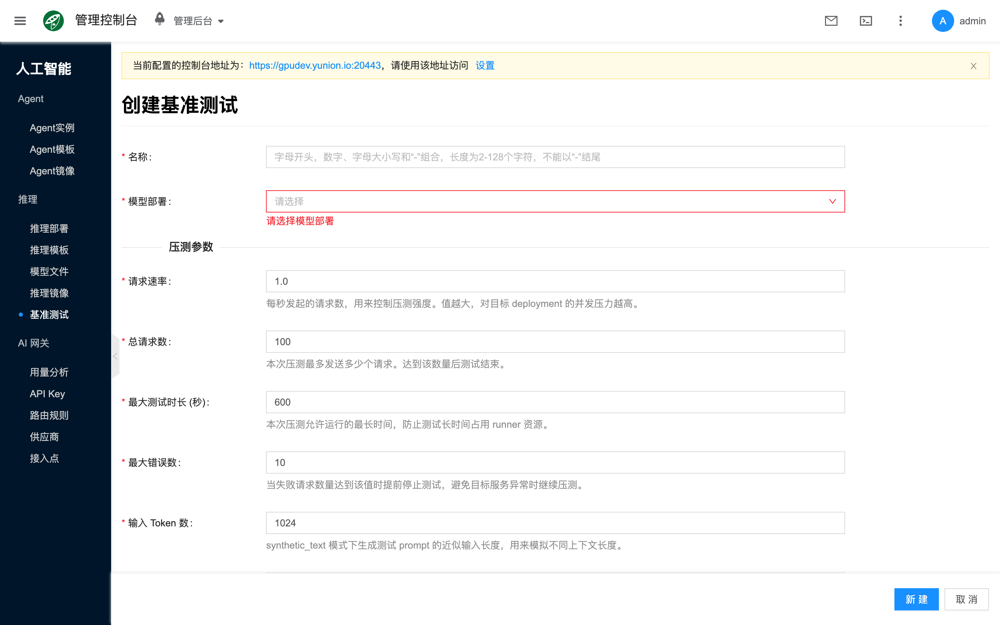
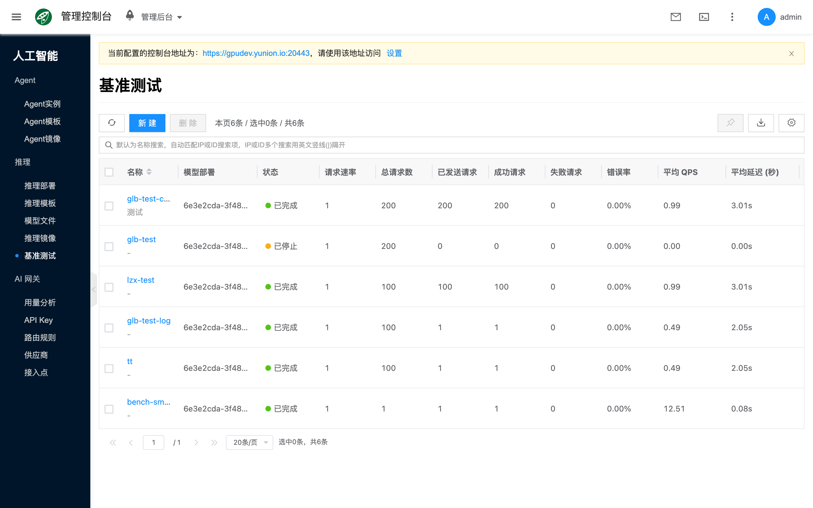

# 基准测试

## 概念介绍

基准测试对已有 [推理部署](./deployment) 发起受控压测，并查看 QPS、延迟、成功率等结果与报告。压测会真实打到目标部署，请避开生产高峰或使用专用测试部署；建议先用较低请求速率与较小总请求数做冒烟，再逐步加码。

控制台路径为 **人工智能 → 推理 → 基准测试**。创建压测前请确认目标部署已就绪且可对外提供推理接口。部署与验证流程见 [快速开始](./quickstart)。

## 常用操作

### 新建

列表点击 **新建**，填写名称，选择 **模型部署**（目标推理部署），按需调整压测参数后提交。

- **名称**：压测任务名称。
- **模型部署**：目标 [推理部署](./deployment)；仅满足可压测条件的部署会出现在选择器中。
- **请求速率**：每秒发起的请求数，控制压测强度。
- **总请求数**：最多发送多少个请求，达到后结束。
- **最大测试时长 (秒)**：允许运行的最长时间，防止长时间占用 runner。
- **最大错误数**：失败请求达到该值时提前停止。
- **输入 Token 数**：`synthetic_text` 模式下生成 prompt 的近似输入长度。
- **输出 Token 数**：`synthetic_text` 模式下期望输出的近似长度。

### 查看详情

打开某一压测任务的侧栏或详情，可查看状态与结果。常见状态包括：等待中、排队中、运行中、已完成、已停止、错误。排查性能问题时，可结合目标部署侧栏的 **实例** 状态与事件，区分引擎性能与调度 / 资源不足。

### 其他操作

任务操作（受状态与权限约束）包括：

- **停止压测**：仅运行中的任务可用。
- **查看日志** / **下载日志**：排查压测过程。
- **下载 JSON 报告** / **下载 CSV 报告**：导出结果数据。
- **删除**：删除任务记录。

## 常见问题

### 列表里选不到部署

只有满足可压测条件的部署会出现在选择器中；确认部署已就绪且类型受支持。

### 压测一直处于排队或运行中

检查 runner / 平台组件是否正常，以及目标部署是否仍可访问；必要时停止任务后缩小参数重试。
