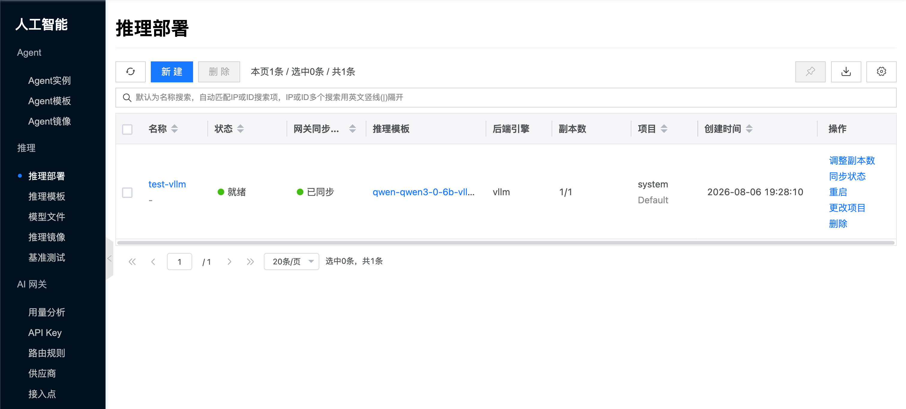

import FaqImagePullFailed from './_parts/_faq-image-pull-failed.mdx';

# 推理部署

## 概念介绍

推理部署是控制台 **人工智能 → 推理** 下管理 LLM 推理服务的主入口。一个部署对应一组可扩缩的推理副本（**实例**），基于 [推理模板](./template) 创建。

与模板、模型、镜像的关系如下：

- **推理模板**：提供创建时的默认规格。修改模板后，对已关联的已有部署执行 **重启**，新配置即可生效；新建部署会直接使用最新模板。
- **模型文件**：可在模板中预挂载；经 ModelScope / Hugging Face 等导入模板时通常会一并处理模型相关资源。
- **推理镜像**：须与模板类型一致。

控制台路径为 **人工智能 → 推理 → 推理部署**。快速创建与验证可参考 [快速开始](./quickstart)。

## 常用操作 {#operations}

### 查看详情

打开某一部署的侧栏详情，常见页签包括：

- **详情**：查看规格、状态、关联模板与资源配置。
- **AI 网关接入**：接入地址、同步状态、调用示例。
- **chat测试**：控制台内对话验证。
- **实例**：部署下的实例副本；可进入实例侧栏做进一步操作。
- **操作日志**：排查创建、调度与运行事件。

### 其他操作

行操作与详情操作（受状态与权限约束）包括：

- **调整副本数**：扩缩期望副本；界面会展示当前就绪数 / 期望数。
- **同步状态**：向平台拉取最新部署状态。
- **重启**：重启该部署下全部副本，期间服务可能短暂不可用。若已修改关联的 [推理模板](./template)，重启后新配置才会生效。
- **更改项目** / **删除**：按项目管理与生命周期需要使用。
- **注册 / 取消注册 AI 网关**：将部署注册为网关上游，统一对外暴露 OpenAPI 风格接入；概念见 [AI 网关/供应商](../ai-proxy/provider) 与 [路由规则](../ai-proxy/routing)。

## 常见问题

### 找不到「推理实例」菜单

请使用 **推理部署**。实例列表在部署侧栏详情的 **实例** 页签中。

<FaqImagePullFailed />

导入、创建与 chat 排障见 [快速开始/常见问题](./quickstart#faq)。
