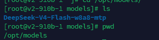
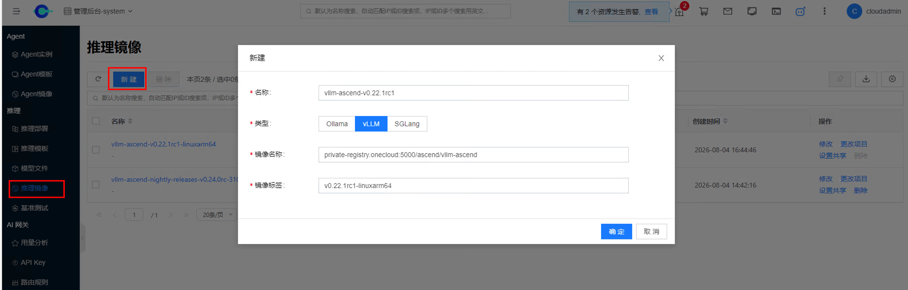
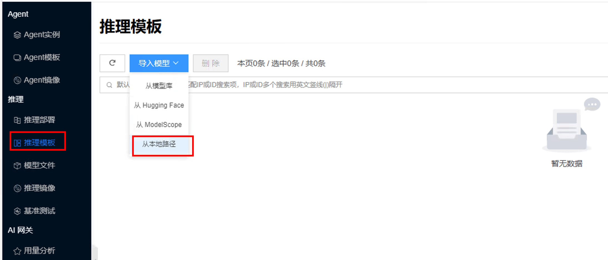
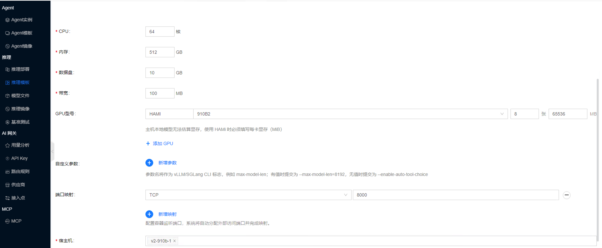
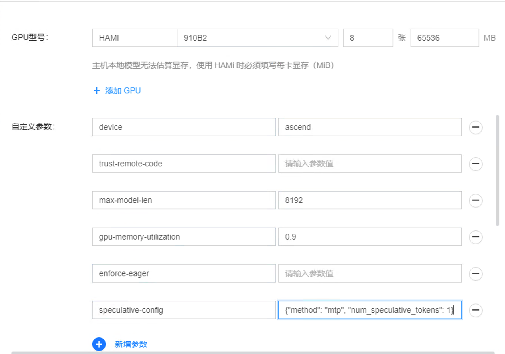
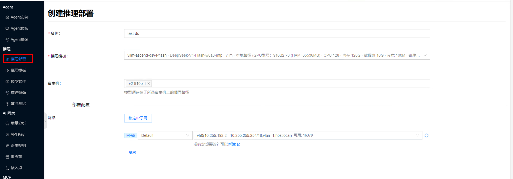
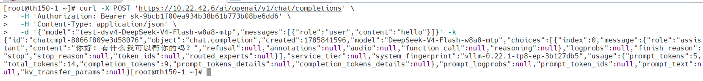

# 昇腾NPU运行DeepSeek V4 Flash

## 概念介绍

本文说明如何在 **华为昇腾 NPU** 节点上，使用 **vLLM Ascend** 镜像部署 **DeepSeek-V4-Flash**（示例权重目录名 `DeepSeek-V4-Flash-w8a8-mtp`）。与 NVIDIA CUDA 路径不同，昇腾侧依赖 Ascend 驱动、NPU 设备（如 `/dev/davinci*`）及配套工具（如 `npu-smi`）。

平台落地路径为：**推理镜像** → **推理模板**（从本地路径导入）→ **推理部署**。字段与通用操作见 [推理镜像](../image)、[推理模板/从本地路径导入](../template#import-local-path)、[推理部署](../deployment)；chat / curl 验证见 [AI 推理/快速开始](../quickstart)。

## 前提

- 目标宿主机已安装 Ascend 驱动，`npu-smi` 可正常查询 NPU；平台已将该节点纳管为容器计算节点。
- DeepSeek-V4-Flash 权重已落盘到宿主机绝对路径（示例：`/opt/models/DeepSeek-V4-Flash-w8a8-mtp`，以实际环境为准）。



- 可从镜像仓库拉取或已同步 **vLLM Ascend** 镜像（示例 tag：`v0.22.1rc1-linuxarm64`）。

## 参考：裸机 Docker 启动 {#bare-metal-docker}

下列命令用于对照理解裸机侧如何挂载昇腾设备与驱动目录，以及 `vllm serve` 的启动参数。

在平台上创建推理部署时，示例中的 `--device …`（NPU 等设备）与 `-v …`（Ascend 驱动、工具与配置目录挂载）**由平台运行时自动传入**，无需在模板或自定义参数中手写。用户只需登记推理镜像、指定模型本地路径，并在模板 **自定义参数** 中配置与下方 `vllm serve` 等价的启动参数即可。

```bash
# docker运行命令
docker run --rm \
  --name vllm-ascend \
  --net=host \
  --shm-size=512g \
  --device /dev/davinci0 \
  --device /dev/davinci1 \
  --device /dev/davinci2 \
  --device /dev/davinci3 \
  --device /dev/davinci4 \
  --device /dev/davinci5 \
  --device /dev/davinci6 \
  --device /dev/davinci7 \
  --device /dev/davinci_manager \
  --device /dev/devmm_svm \
  --device /dev/hisi_hdc \
  -v /usr/local/dcmi:/usr/local/dcmi \
  -v /usr/local/Ascend/driver/tools/hccn_tool:/usr/local/Ascend/driver/tools/hccn_tool \
  -v /usr/local/bin/npu-smi:/usr/local/bin/npu-smi \
  -v /usr/local/Ascend/driver/lib64/:/usr/local/Ascend/driver/lib64/ \
  -v /usr/local/Ascend/driver/version.info:/usr/local/Ascend/driver/version.info \
  -v /etc/ascend_install.info:/etc/ascend_install.info \
  -v /etc/hccn.conf:/etc/hccn.conf \
  -v /opt/models/DeepSeek-V4-Flash-w8a8-mtp:/model \
  docker.io/ascendai/vllm-ascend:v0.22.1rc1-linuxarm64 \

# vllm 启动命令
vllm serve /model \
    --tensor-parallel-size 8 \
    --served-model-name DeepSeek-V4-Flash \
    --port 8000 \
    --host 0.0.0.0 \
    --trust-remote-code \
    --max-model-len 8192 \
    --gpu-memory-utilization 0.9 \
    --enforce-eager \
    --speculative-config '{"method": "mtp", "num_speculative_tokens": 1}'
```

说明：

- `--device` 与 `-v` 仅在裸机对照中列出；平台部署时自动注入，勿再填入自定义参数。
- 示例使用 8 张 NPU（`davinci0`～`davinci7`）与 `--tensor-parallel-size 8`；卡数与参数须一致。
- 镜像与权重路径请按实际仓库、节点路径替换。
- 部分环境还会设置 `HCCL_*`、`VLLM_ASCEND_*`、`quantization ascend`、更长 `max-model-len` 等；以所用 vLLM Ascend 版本说明为准。

## 平台操作

### 1. 新建推理镜像

1. 进入 **人工智能 → 推理 → 推理镜像**，点击 **新建**。
2. **类型** 选 **vLLM**。
3. 填写 **名称**、**镜像名**、**标签**。示例：
   - 镜像名：`private-registry.onecloud:5000/ascend/vllm-ascend`（或公有 `docker.io/ascendai/vllm-ascend`）
   - 标签：`v0.22.1rc1-linuxarm64`
4. 提交保存。



字段说明见 [推理镜像/新建](../image)。

### 2. 从本地路径导入推理模板

1. 进入 **人工智能 → 推理 → 推理模板**，打开 **导入模型**，选择 **从本地路径**。



2. 填写宿主机模型路径（示例：`/opt/models/DeepSeek-V4-Flash-w8a8-mtp`），引擎选 **vLLM**，**镜像** 选择上一步登记的 vLLM Ascend 镜像。
3. 按节点资源填写 CPU、内存等；**GPU 型号** 选择昇腾相关规格（示例：HAMI / `910B2` × 8，每卡显存按界面要求填写，如 `65536` MiB）。本地路径导入在 HAMI 场景下须手动填写每卡显存。




4. 在 **自定义参数** 中补充与上方 `vllm serve` 等价的关键项（示例）。设备与驱动挂载（`--device` / `-v`）无需手写，见 [参考：裸机 Docker 启动](#bare-metal-docker)。

| 参数 | 示例值 |
| --- | --- |
| `device` | `ascend` |
| `trust-remote-code` | （开关类可留空，按界面约定） |
| `max-model-len` | `8192` |
| `gpu-memory-utilization` | `0.9` |
| `enforce-eager` | （开关类可留空，按界面约定） |
| `speculative-config` | `{"method": "mtp", "num_speculative_tokens": 1}` |

`tensor-parallel-size` 一般由平台按 GPU/NPU 数量自动设置；勿与卡数冲突。



5. 提交导入，等待模板就绪（如 **就绪 vLLM**）。更多字段见 [推理模板/从本地路径导入](../template#import-local-path)。

### 3. 创建推理部署

1. 在模板卡片点击 **部署**，或进入 **人工智能 → 推理 → 推理部署 → 新建** 并选择该模板。
2. 填写名称；**宿主机** 指定已落盘模型的昇腾节点（模型须存在于所选宿主机上的相同路径）。
3. 在 **部署配置 → 网络** 中指定可连通推理服务的网卡/子网（示例环境为 `vh0`，以实际网络为准），然后提交。



运维与详情页签见 [推理部署](../deployment)。

### 4. 验证

1. 等待部署 **状态** 为 **就绪**、**网关同步状态** 为 **已同步**。


2. 创建 [API Key](../../ai-proxy/api-key) 后，在部署详情进行 [chat 测试](../quickstart#chat-test)。调用时的 `model` 须与界面展示的模型名（或启动时的 `served-model-name`）一致。

与 DeepSeek V4 Flash 对话示例如下：


3. 在 **AI 网关接入** 中选择 API Key，复制调用示例中的 curl。步骤说明见 [AI 推理/快速开始/curl](../quickstart#aiproxy-curl)。


4. 在终端执行该 curl，确认返回正常响应。



## 常见问题

### NPU 不可用或调度失败

在宿主机确认 Ascend 驱动与 `npu-smi`；检查平台节点是否在线、是否识别到 NPU/昇腾设备型号；模板卡数与节点可分配卡数是否匹配。

### 导入或启动提示模型路径无效

确认所选宿主机上存在相同绝对路径，且目录含权重与配置文件；部署时若指定了宿主机，勿换到未同步模型的节点。

### 自定义参数不生效或启动失败

核对参数名与所用 vLLM Ascend 版本是否支持；布尔开关与 JSON 类参数（如 `speculative-config`）格式是否正确；查看部署/实例 **日志** 中的引擎报错。镜像版本变更后，建议同步复查自定义参数。
