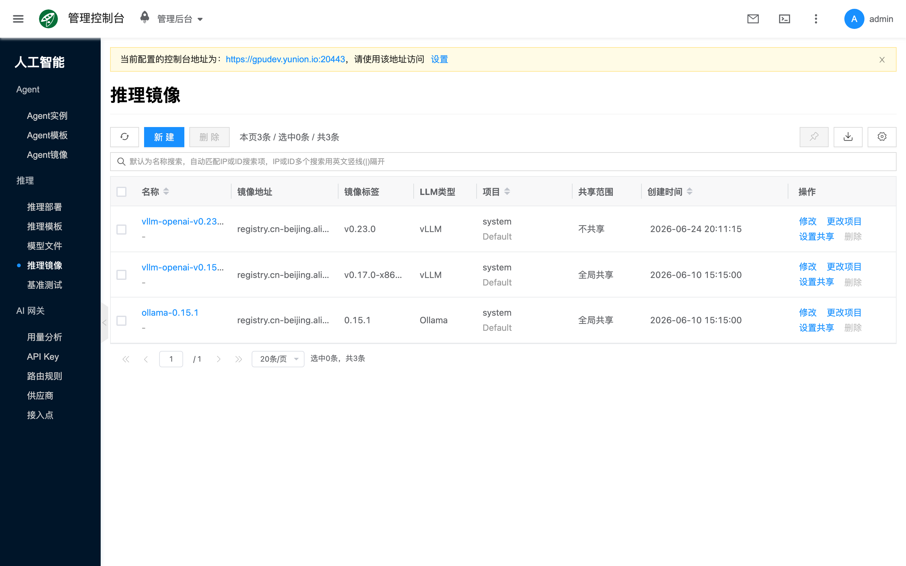
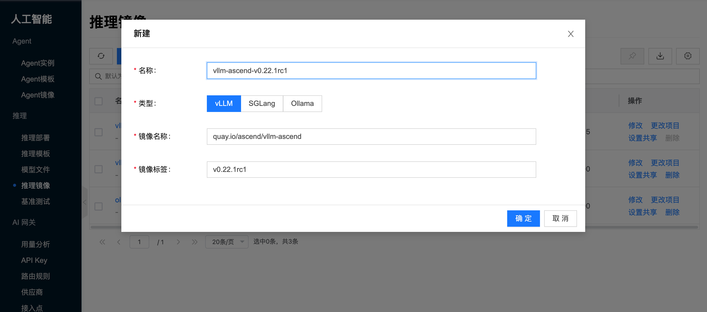

# 推理镜像

## 概念介绍

推理镜像是运行 vLLM / SGLang / Ollama 等推理引擎的容器镜像，决定部署「用什么引擎运行」。创建 [推理模板](./template) 时须选择与模板类型一致的镜像；[推理部署](./deployment) 按所选模板使用该镜像。

与模板、部署、模型的关系如下：

- **推理模板**：须选用类型一致的推理镜像，并组合规格与挂载模型。
- **推理部署**：基于模板启动服务，按模板中的镜像拉取并运行容器。
- **模型文件**：须与镜像、模板的引擎类型一致。

控制台路径为 **人工智能 → 推理 → 推理镜像**。

## 常用操作

### 新建

点击 **新建**，填写名称、类型、镜像地址与标签等并保存。类型须与后续模板、[模型文件](./model-library) 一致；镜像需与节点 GPU / CUDA 环境匹配（见 [配置 NVIDIA 与 CUDA 环境](/docs/aicloud/getting-started/setup-nvidia-cuda)）。更换镜像版本前，建议先在测试模板或部署中验证兼容性。

- **名称**：镜像条目在平台中的显示名称；编辑时通常只读。
- **类型**：推理引擎类型（如 vLLM / SGLang / Ollama）；须与模板、模型一致；编辑时通常只读。
- **镜像名**：容器镜像仓库地址（含路径）。
- **标签**：镜像 tag。

:::tip
从[推理模板/导入模型](./template) 选择 **社区镜像** 时，若本地尚无对应镜像，提交导入时会自动创建镜像，无需在本页先手工新建。
:::

### 查看详情

打开某一推理镜像的侧栏详情，常见页签包括：

- **详情**：查看类型、镜像地址、标签与状态等信息。
- **操作日志**：排查创建、修改与相关任务事件。

### 其他操作

列表或详情操作（受状态与权限约束）包括：

- **编辑**：调整镜像名、标签等（名称与类型通常不可改）。
- **更改项目** / **设置共享范围**：按项目管理与可见性需要使用。
- **删除**：确认无模板依赖后再删除。

## 常见问题

### 镜像拉取失败

检查节点网络与 DNS；私有仓库检查鉴权与权限；确认镜像地址与标签正确。

### 模板里选不到镜像

确认镜像类型与模板类型一致，且镜像已创建成功、处于可用状态。
