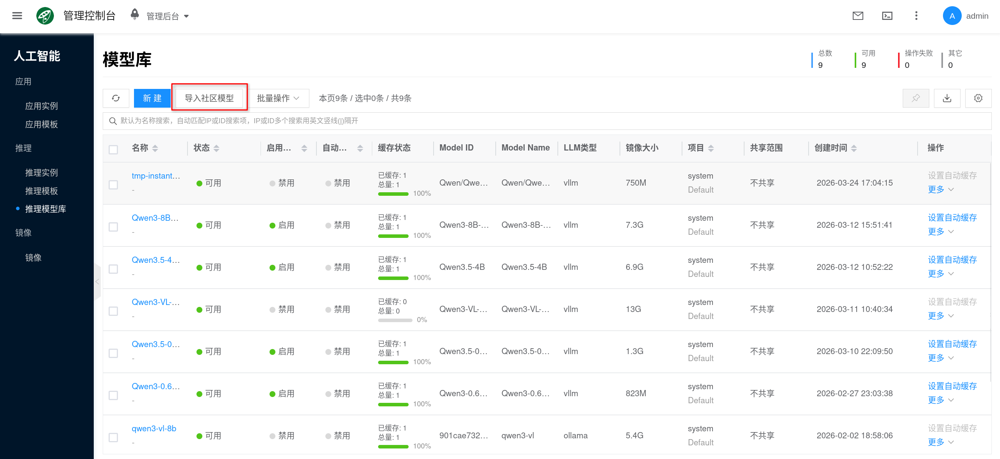
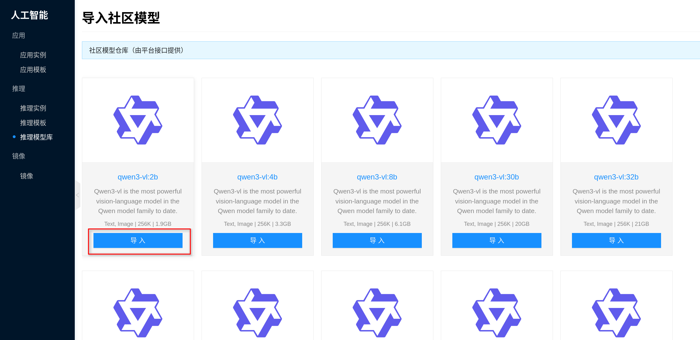
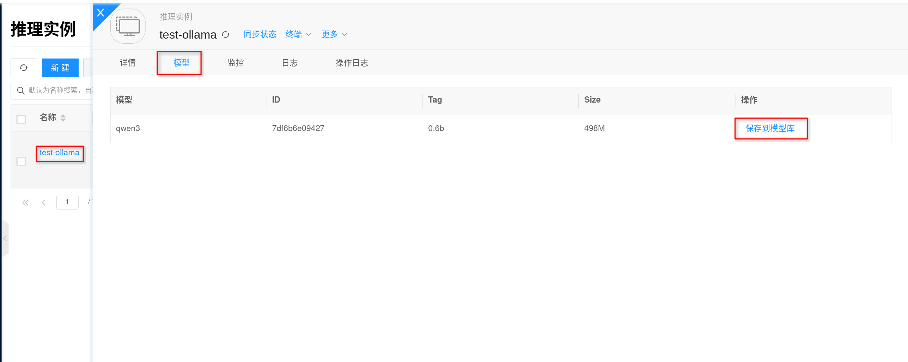
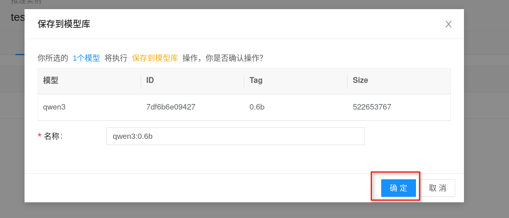

# 推理模型库

推理模型库用于把推理实例要用到的模型数据，沉淀为平台内可复用、可挂载、可缓存的模型条目。当前本文先以 `Ollama` 场景为主线说明。它负责统一管理模型来源、版本、模型数据镜像和挂载关系，本身不直接提供推理接口。

如果你希望多个推理模板或推理实例复用同一份模型，或者需要在内网、离线和受控环境中提前准备模型，优先使用推理模型库会更稳妥。控制台默认提供推理模型库入口；模板或实例页面里能否直接选到模型，关键在于模型库中是否已经有与当前类型匹配的可用模型条目。

## 快速开始 {#quickstart}

使用推理模型库通常分为以下几步：

1. 进入控制台 **人工智能 → 推理 → 推理模型库**。
2. 通过 **导入社区模型** 或 **从模型实例中保存**，创建目标模型条目。
3. 等待模型数据准备完成，并按需开启自动缓存。
4. 在 [推理模板](./template) 或 [Ollama](./ollama) 实例中选择要挂载的模型。
5. 创建实例后，通过 `ollama list` 或 `/api/tags` 验证模型是否已经成功加载。

## 什么时候使用模型库

下面这些场景都适合优先通过模型库准备模型：

- **模板预挂载**：在创建 [推理模板](./template) 前先准备好模型，后续新建实例时可以直接复用。
- **多实例复用**：同一模型会被多个 `Ollama` 实例反复使用，避免每个实例各自下载一遍。
- **版本治理**：希望把模型来源、版本和默认使用范围统一下来，减少“同名模型但版本不同”的排障成本。
- **离线或内网场景**：先把模型打包进平台，再分发到需要的节点上使用。
- **减少首次启动等待**：结合自动缓存能力，提前把常用模型同步到节点侧。

## 模型库解决的问题

推理模型库主要解决下面几类问题：

- **统一来源**：将社区模型、已有模型数据或平台内镜像统一收口到一个入口管理。
- **统一版本**：模型名称、tag、镜像和挂载关系可追踪，便于升级、回滚和对比差异。
- **复用与缓存**：模型导入一次后，可供多个模板和实例复用，并可结合节点缓存降低启动等待。
- **权限与合规**：模型条目和其关联的模型数据镜像一起受平台项目、共享和公开范围约束。

## 两种入库方式

控制台当前支持两种主要方式准备模型。

### 从社区模型导入

“导入社区模型”适合下面这些情况：

- 节点可以访问社区模型源，希望由平台自动下载并打包。
- 你希望平台帮你把社区模型转成可复用的模型库条目，而不是在每个实例里重复在线拉取。
- 你后续还希望对这些模型做自动缓存、模板预挂载和版本治理。

导入完成后，平台会先把社区模型下载到临时目录，再自动打包成模型数据镜像，并回填到模型库条目中。后续模板或实例挂载时，不再依赖实时联网下载。

:::tip
如果是生产环境、内网环境或需要频繁复用的模型，建议优先通过模型库导入，而不是让每个实例首次启动时再在线下载。
:::

### 从模型实例中保存

“从模型实例中保存”适合下面这些情况：

- 你已经在 `Ollama` 实例里通过 `ollama pull` 拉取并验证过模型。
- 你希望把实例里当前可用的模型沉淀为平台内可复用的模型条目。
- 你希望先在单个实例里调试模型，再复用到其它模板和实例。

可参考以下流程：

1. 进入 **人工智能 → 推理 → 推理实例**，打开目标 `test-ollama` 实例。
2. 在实例详情页切换到 **test-ollama → 模型**，确认目标模型已经出现在列表中。
3. 在目标模型右侧点击 **保存到模型库**，按页面提示填写名称、版本等信息并保存。

保存完成后，这个模型就可以在其它 Ollama 推理模板或推理实例里直接选择，无需再次手动 `ollama pull`。

## 与 Ollama、推理模板的关系

推理模型库和运行时之间的关系，可以理解为“模型资产层”和“推理运行层”的关系：

- **推理模型库**：负责准备、管理和分发模型数据。
- **推理模板**：负责把镜像、规格、模型组合成一套标准运行配置。
- **推理实例**：负责真正启动 Ollama 服务，并把模型加载进运行时。

因此：

- 模型库解决的是“模型从哪里来、怎么复用、怎么缓存”的问题。
- Ollama 解决的是“模型怎么被加载并对外提供推理服务”的问题。

如果你更关心运行时配置本身，请继续阅读：

- [Ollama](./ollama)
- [推理模板](./template)

## 运维要点

### 网络与离线准备

- `Ollama` 社区模型导入依赖访问对应模型源。
- 如果环境对外网访问受限，建议先在可访问模型源的 `Ollama` 实例中拉取模型，再通过“保存到模型库”沉淀为复用条目。

### 缓存与磁盘规划

- 模型库中的模型最终都会对应一份模型数据镜像。
- 开启自动缓存后，节点侧还会增加缓存副本占用。
- 如果同一模板挂载多个模型，或者一个模型会在多个节点间被重复调度，磁盘规划要比单实例在线下载更保守。

### 类型一致性

- 模型、模板、镜像三者的类型必须一致。
- 如果你看到“明明模型已经导入，但模板里选不了”这类问题，优先检查类型是否匹配。

### 版本管理

- 建议把模型名和 tag 管理清楚，避免同一模型被多个相近名称重复导入。
- 对 Ollama 来说，请求里使用的模型名仍建议和模型库中的版本保持一致。

### 删除与变更

- 已经被模板或实例引用的模型，不建议直接删除。
- 如果需要替换模型版本，通常更推荐新增一个新版本条目，再逐步切换模板或实例引用关系。
- 对长期复用的模型，建议结合模板和镜像版本一起管理，而不是频繁修改同一个条目。

## 常见问题

### 社区模型导入慢或失败

优先检查下面几项：

- 节点到模型源的网络是否连通。
- 带宽是否足够，是否存在代理或防火墙限制。
- 目标模型本身体积是否过大，导致下载和打包时间很长。
- 数据盘空间是否足够容纳临时下载、模型镜像和后续缓存。

如果环境不方便直接从模型库联网导入，建议先在可联网的 `Ollama` 实例中完成 `ollama pull`，再通过“保存到模型库”沉淀复用。

### 模板或实例页面里为什么没有可选模型

通常先检查这几类问题：

- 当前模型库里还没有与模板或实例类型匹配的模型条目。
- 模型数据镜像还没有完全准备好，条目暂时不可用。
- 模型类型和模板类型不一致。

### 模型已经导入成功，为什么模板里不能正常使用

通常先检查这几类问题：

- 模型类型和模板类型不一致。
- 模型数据镜像还没有完全准备好。
- 模型已经被替换、停用或引用关系没有刷新。
- 你创建实例时没有真正选择到包含该模型的模板。

### 从模型库挂载后，为什么实例里还是看不到模型

优先检查挂载关系是否已经生效，以及实例是否已经完成启动和预热。

如果仍然异常，可进入实例内执行 `ollama list`，并结合日志确认是否存在挂载失败、显存不足或启动异常。

### 从模型库启动后为什么还是很慢

即使模型已经在模型库中，也仍可能出现首次启动较慢，常见原因包括：

- 节点本地还没有缓存这份模型数据镜像。
- 模型体积大，首次挂载和解压需要时间。
- 数据盘或节点存储性能较慢。
- 实例启动时还伴随模型探测、服务初始化和 GPU 预热。

如果这是一个高频使用模型，建议结合自动缓存和模板预挂载一起使用。

### 磁盘占用为什么持续增长

磁盘增长通常不只来自模型文件本身，还可能来自：

- 模型数据镜像
- 节点侧缓存
- 推理引擎自己的缓存目录
- 新版本模型持续累积但旧版本没有清理

建议定期梳理不再使用的模型版本，并同步检查模板和实例是否还在引用对应条目。

<!--
以下为暂时注释保留的 vLLM 相关内容，后续需要恢复时可再整理启用。

- 推理模型库用于把 `Ollama`、`vLLM` 等推理实例要用到的模型数据，沉淀为平台内可复用、可挂载、可缓存的模型条目。
- 创建实例后，按 [Ollama](./ollama) 或 [vLLM](./vllm) 的方式验证模型是否已成功加载。
- 同一模型会被多个 `Ollama` 或 `vLLM` 实例反复使用，避免每个实例各自下载一遍。

### vLLM 模型

按当前平台实现，`vLLM` 社区模型会按 Hugging Face 仓库目录下载，并落成一个完整模型目录，再挂载到实例内的 `/data/models/huggingface/<模型目录>`。

这意味着：

- `model_name` 通常对应 Hugging Face 仓库名，例如 `Qwen/Qwen2.5-7B-Instruct`。
- `model_tag` 更适合理解为 revision、branch 或 tag。
- 当同一个模板或实例挂载了多个 vLLM 模型目录时，建议在 [推理模板](./template) 或实例高级配置中显式设置 `preferred_model`，避免平台按目录扫描顺序加载到错误模型。

vLLM 当前默认将 Hugging Face 访问地址指向 `https://hf-mirror.com`。如果社区模型导入失败，除了权限问题，也要优先检查节点到该模型源的网络连通性。

- 选择正确的模型类型，例如 `vLLM`。
- `vLLM` 模型只能挂到 `vLLM` 模板或实例。
- 访问 `/v1/models`，确认接口里已经出现预期模型。
- 推理实例负责真正启动 Ollama 或 vLLM 服务，并把模型加载进运行时。
- Ollama / vLLM 解决的是“模型怎么被加载并对外提供推理服务”的问题。
- [vLLM](./vllm)
- `vLLM` 社区模型导入依赖访问 Hugging Face 或其镜像源。
- 不要把 `Ollama` 模型挂到 `vLLM` 模板，也不要反过来使用。
- 对 vLLM 来说，目录名、tag 和 `preferred_model` 最好一起规划，减少后续误加载。

### vLLM 挂载了多个模型，为什么实例加载错了

这通常和 `preferred_model` 没有显式设置有关。

按当前平台实现，vLLM 在没有明确 `preferred_model` 时，通常会回退到模型目录中扫描到的第一个目录。多模型场景下，建议始终显式配置 `preferred_model`，并在实例启动后用 `/v1/models` 再核对一次结果。
-->
