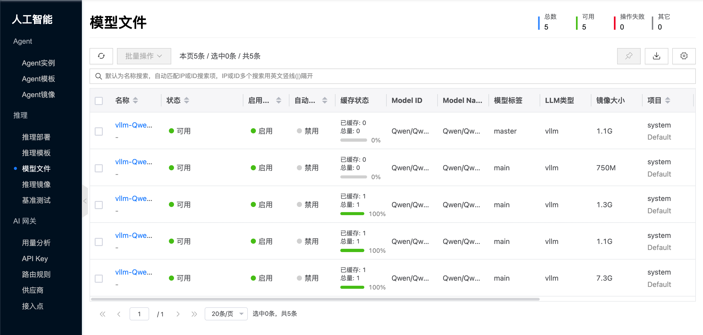
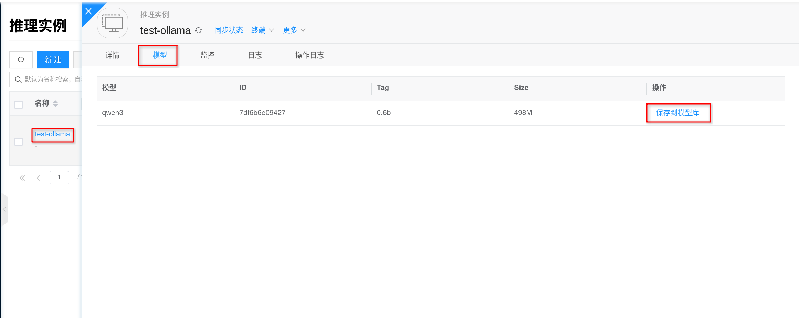
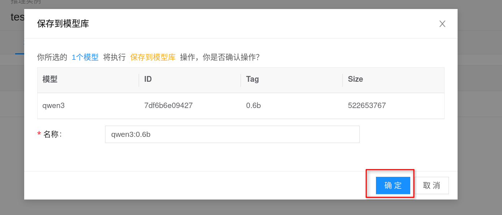

# 模型文件

## 概念介绍

模型文件是平台内可复用、可挂载、可缓存的模型数据条目，管理来源、版本与挂载关系，本身不对外提供推理 API。多宿主机复用同一条目时，平台可将模型数据缓存到对应节点，便于模板预挂载与多部署共享，并降低重复在线下载。

与模板、部署、镜像的关系如下：

- **推理模板**：挂载模型文件并组合镜像、规格；经 [导入模型](./template) 时常一并生成可挂载的模型相关资源。
- **推理部署**：基于模板启动服务并加载已挂载模型；其下的 **实例** 为运行副本。
- **推理镜像**：须与模型、模板类型一致。

控制台路径为 **人工智能 → 推理 → 模型文件**。

## 常用操作

### 从推理模板导入

模型文见是从 **人工智能 → 推理 → 推理模板 → 导入模型**（从模型库 / Hugging Face / ModelScope ）导入时自动创建的。导入过程会生成可挂载的模型相关资源，并计算需要的显存。

### 从实例保存为模型文件

适合已在实例内拉取并验证过的模型（常见于 Ollama：在实例中 `ollama pull` 后入库）。在 [推理部署](./deployment) 侧栏打开目标部署的 **实例**，进入实例的 **模型** 相关页签，对目标模型执行 **保存为模型文件**（文案以按钮为准），填写名称等信息后保存。

保存后可在其他同类型模板或部署中选用，无需再次手动拉取。

### 查看详情

打开某一模型文件的侧栏详情，常见页签包括：

- **详情**：查看来源、状态、类型，以及挂载与缓存相关信息。
- **操作日志**：排查导入、同步与相关任务事件。

### 其他操作

列表或详情操作（受状态与权限约束）包括：

- **启用 / 禁用**：控制条目是否可供选用。
- **设置共享 / 公开范围**：按项目与可见性需要使用。
- **开启自动缓存**：需条目已启用；开启后节点侧会占用额外磁盘。
- **同步状态**：向平台拉取最新状态。
- **更改项目** / **删除**：已被模板或部署引用的条目，应先解除引用再删除；换版本时宜新增条目再切换引用。

## 常见问题

### 导入慢或失败

检查到模型源的网络、带宽、代理或防火墙，以及模型体积与节点磁盘空间。在线导入依赖节点可达对应源；平台环境可能使用镜像站。外网受限时可先在可联网实例中准备模型，再 **保存为模型文件**。更多排障见 [快速开始/常见问题](./quickstart#faq)。

### 模板里没有可选模型

确认列表中已有匹配类型且状态就绪的条目；模型数据仍在准备中，或类型与模板、镜像不一致时，将无法选用。

### 挂载后部署里看不到模型

确认挂载已生效且部署 / 实例已就绪；进入实例执行 `ollama list` 或访问 `/v1/models`，并结合日志排查挂载或资源问题。

### 删除失败或影响现有部署

先解除模板上的模型挂载引用，再删除条目。多节点或开启自动缓存时，注意磁盘占用。
