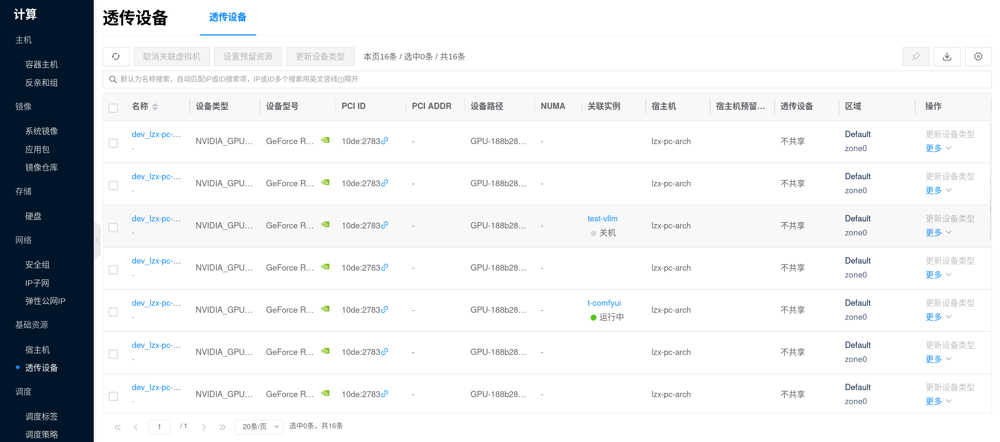
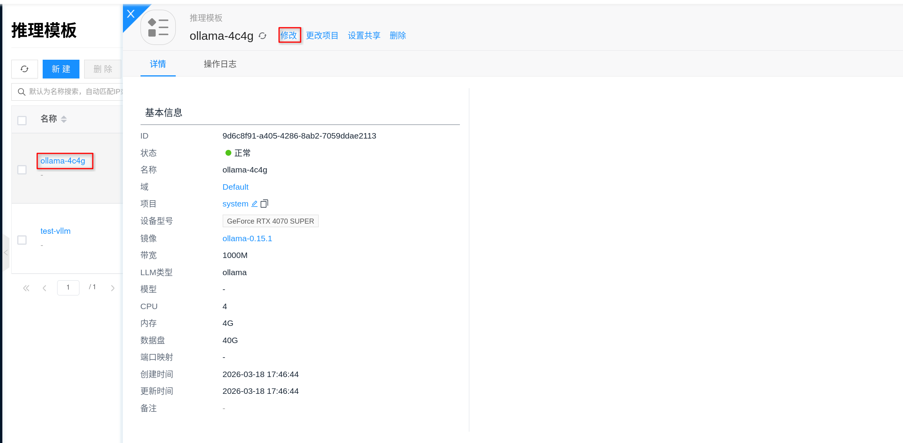
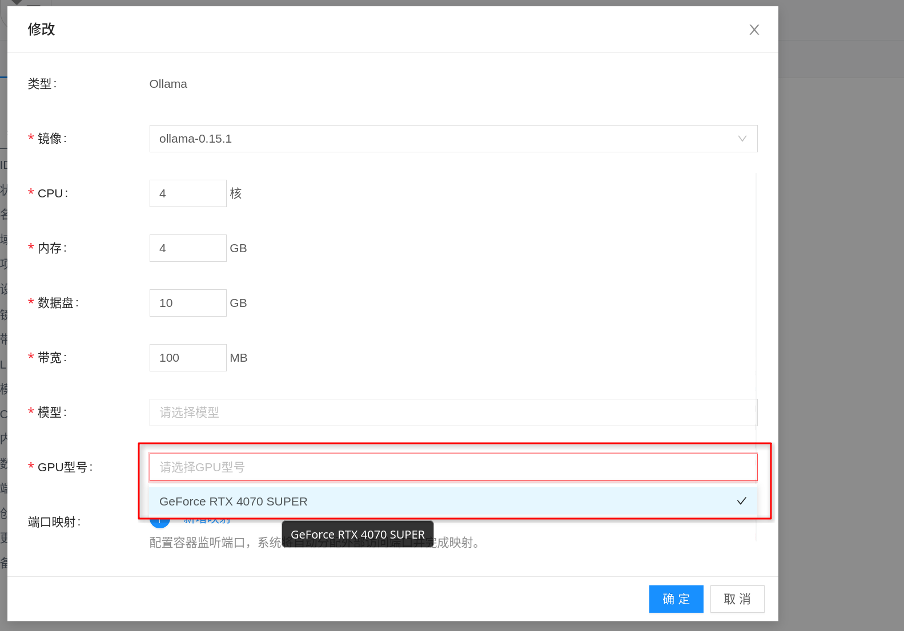
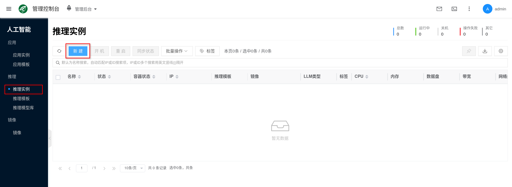
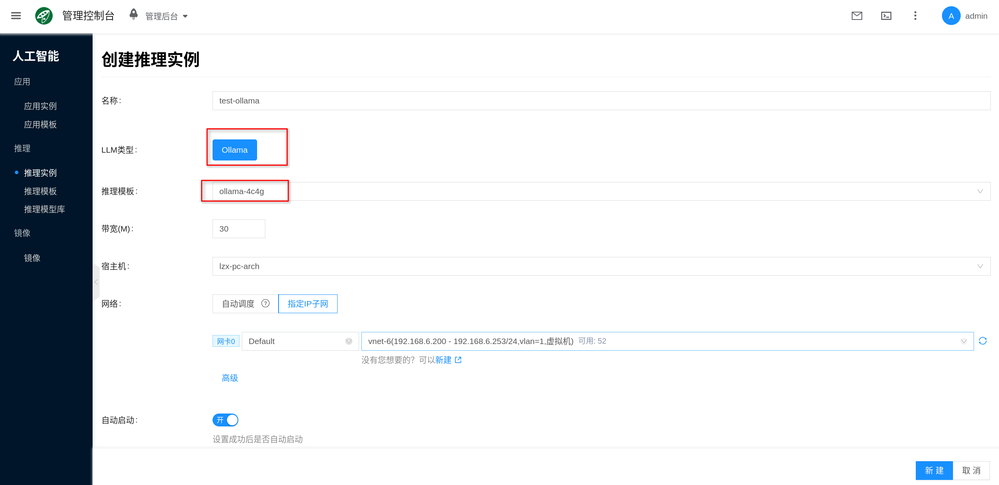
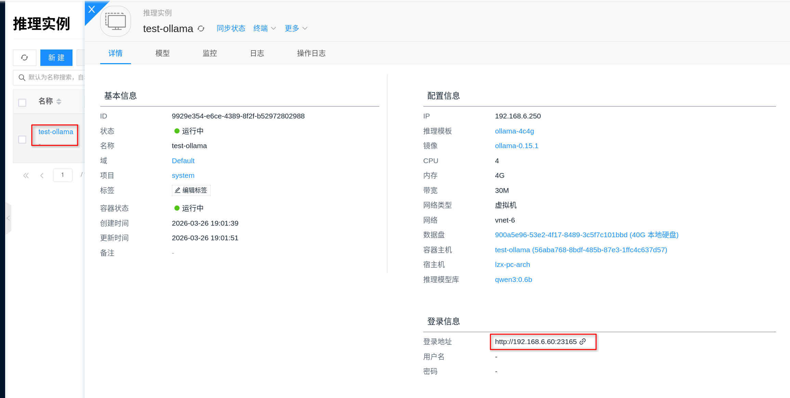
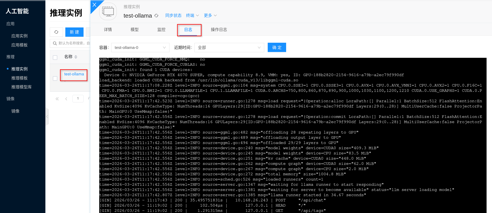
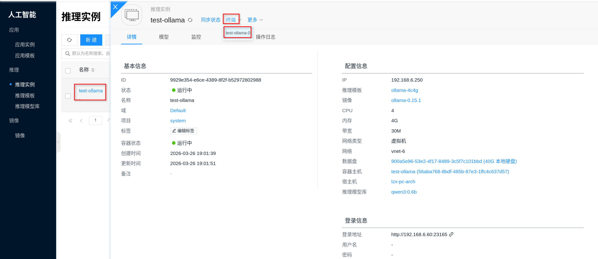
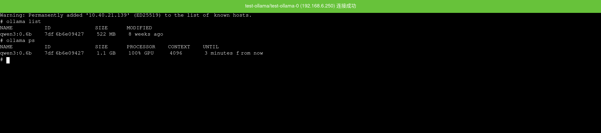

# Ollama

Ollama 是轻量的本地 LLM 推理服务，**需要 GPU**，适用于快速验证与小规模推理场景。

## 快速开始 {#quickstart}

创建 Ollama 推理实例大致分为以下几步：

1. **准备 GPU 环境**：完成 [配置 NVIDIA 与 CUDA 环境](../../getting-started/setup-nvidia-cuda)，并为模型缓存准备足够的持久化存储空间。
2. **为套餐配备 GPU**：先到 [推理模板](./template) 中为 Ollama 套餐对应的模板配置 GPU、CPU、内存和数据盘；平台通常会预置默认模板，也可以按需新建或编辑。
3. **创建推理实例**：控制台 **人工智能 → 推理 → 推理实例**，新建，选择已经配好 GPU 的 **Ollama** 推理模板创建实例。
4. **选择模型（可选）**：若 [推理模型库](./model-library) 中已经有目标模型，可在模板或实例参数中直接选择；若当前没有可选模型，也可以先创建实例，再通过 `ollama pull` 手动拉取。
5. **获取服务地址并验证**：进入实例详情页「连接信息」获取推理服务地址；结合运行状态与日志确认模型加载成功并可对外提供推理服务（具体调用方式以连接信息与镜像说明为准）。

### 1. 准备 GPU 环境

Ollama 依赖 GPU 进行推理，请先完成 [配置 NVIDIA 与 CUDA 环境](../../getting-started/setup-nvidia-cuda)，并重点确认以下几项：

1. 节点能够识别到 GPU，且驱动状态正常。
2. 目标 GPU 显存能够容纳你准备运行的模型。
3. 数据盘空间充足，因为 Ollama 模型文件会缓存在容器内的 `/root/.ollama/models`，平台会将这一目录挂载到持久化存储上。
4. 如果准备在线拉取模型，请提前确认节点到模型源的网络连通性。

可先在 GPU 节点上执行下面的命令做基础检查：

```bash
nvidia-smi
```

```bash
curl -I https://registry.ollama.ai
```



:::tip
如果计划挂载多个模型，建议在创建模板前就把数据盘容量一并规划好。Ollama 的模型分层文件、manifest 和后续缓存都会持续占用磁盘空间。
:::

### 2. 为套餐配备 GPU

在创建实例前，建议先进入 **人工智能 → 推理 → 推理模板**，把 Ollama 套餐对应的模板规格调好。这里的“套餐”可以理解为实例创建时要选择的资源规格：先把 GPU、CPU、内存和数据盘配好，再回到实例页面创建。

1. 进入控制台 **人工智能 → 推理 → 推理模板**。
2. 选择现有 Ollama 模板点击 **修改**，或点击 **新建** 创建一个 `Ollama` 推理模板。
3. 在规格配置中，为套餐选择合适的 GPU 型号，并同步确认 CPU、内存与数据盘大小。
4. 在镜像字段中选择对应的 [AI镜像](../llm-image)，保存模板。

为套餐配备 GPU 时，重点关注：

- **GPU 显存**：这是 Ollama 能否顺利加载模型的关键指标，优先按目标模型大小选择。
- **CPU / 内存**：会影响请求处理、排队和模型运行稳定性；显存够用时，CPU 和内存不足同样会导致启动失败或响应慢。
- **数据盘**：模型文件会持久化到 `/root/.ollama/models`，磁盘过小会导致模型下载失败、升级困难或缓存被打满。
- **镜像版本**：优先选择平台验证过的 Ollama 镜像，并尽量固定明确版本，便于后续升级和回滚。




:::tip
如果你希望实例重启后仍然保留已下载模型，务必使用带持久化数据盘的模板；平台会将 Ollama 的模型目录挂载到持久化存储，而不是依赖容器临时层。
:::

### 3. 选择模型（可选）

如果模板或实例页面的模型相关字段里已经有目标模型可选，建议优先直接选择。这样实例创建完成后，通常就可以直接在 Ollama 中看到对应模型，减少手动下载步骤。

推荐流程如下：

1. 先在 [推理模型库](./model-library) 中准备好目标模型。
2. 再回到 [推理模板](./template) 或实例创建页面，选择要挂载的模型版本。
3. 创建完成后，可在实例终端执行 `ollama list`，确认模型已经加载到当前实例。

如果当前模型库里还没有可选模型，也不影响继续使用 Ollama。可以先创建实例，等实例运行起来后，再进入终端通过 `ollama pull` 手动拉取模型。例如：

```bash
ollama pull qwen2.5:7b
```

拉取完成后，执行下面的命令确认模型已经下载到本地：

```bash
ollama list
```

:::tip
如果只是临时验证某个模型，直接 `ollama pull` 会更快捷；如果后续希望多个 Ollama 实例复用同一份模型，建议把已经验证过的模型沉淀到 [推理模型库](./model-library) 统一管理。
:::

### 4. 创建推理实例

控制台入口为 **人工智能 → 推理 → 推理实例**。

1. 点击 **新建**。
2. 选择已经配好 GPU 的 `Ollama` 推理模板或实例类型。
3. 填写实例名称，并按页面要求选择项目、区域、网络等通用配置。
4. 在页面的模型、挂载模型或模型版本等字段中，如果已经有目标模型可选，可以直接选择；如果当前没有可选模型，也可以留空后直接提交创建。

如果控制台里还没有可用的 Ollama 模板，可以先回到 **人工智能 → 推理 → 推理模板** 创建或编辑模板，再返回实例页面创建。




页面中的带宽、宿主机、网络等字段可按实际场景决定：

- **带宽**：用于限制容器网络带宽，按业务访问量填写。
- **宿主机（可选）**：如需固定跑在某台 GPU 节点上，可手动指定；否则让平台自动调度。
- **网络**：可使用自动分配，也可指定已有 IP 子网。

### 5. 获取服务地址并验证

实例创建成功后，进入实例详情页，打开 **连接信息**，即可获取 Ollama 服务地址。按当前平台实现，Ollama 服务默认监听 `11434` 端口，通常可通过 `http://<实例IP>:11434` 的形式访问。



建议按下面顺序验证：

1. 先确认实例状态为“运行中”。
2. 打开详情页的 **日志**，确认没有模型加载失败、显存不足或下载失败等报错。
3. 如有需要，可通过详情页的 **终端** 进入容器，执行 `ollama list` 检查当前已安装模型。
4. 使用 HTTP API 做一次连通性和推理验证。

先检查服务是否可访问：

```bash
curl <service-url>/api/tags
```

如果已经安装好模型，再执行一次聊天请求验证：

```bash
curl <service-url>/api/chat \
  -H 'Content-Type: application/json' \
  -d '{
    "model": "<model>:<tag>",
    "messages": [
      {
        "role": "user",
        "content": "你好，请用一句话介绍你自己。"
      }
    ],
    "stream": false
  }'
```

如果返回了模型列表或正常的 JSON 推理结果，就说明服务已经可以对外提供能力。

:::tip
如果 `api/tags` 能访问但模型列表为空，通常表示实例已经启动成功，但还没有挂载模型，或者 `ollama pull` 还未完成。
:::

## 配置

### 镜像与规格

- **规格选择**：参考 [推理模板](./template)，根据模型大小与并发需求选择 CPU/内存/GPU（重点关注 GPU 显存）。
- **镜像选择**：参考 [AI镜像](../llm-image)，使用明确版本（tag/digest）便于升级与回滚。

### 模型与缓存

- **模型库**：推理类应用可结合 [推理模型库](./model-library) 统一管理模型来源、版本与复用策略。
- **缓存与磁盘**：模型文件通常占用较大磁盘空间，建议为模型缓存与日志准备持久化存储，并建立清理策略，避免磁盘爆满。

### 网络

- 如需从外部拉取镜像或模型，请确保节点具备访问对应仓库的网络连通性与带宽。

### 容量与变更

- **容量**：关注 GPU 显存、模型加载时间与并发队列；容量不足时优先评估更多 GPU 资源或更大显存。
- **升级与回滚**：通过 [AI镜像](../llm-image) 的版本管理进行变更，建议在非高峰期操作。
- **观测**：重点关注 GPU/CPU 利用率、显存占用、请求延迟与错误率；结合日志定位模型加载失败、显存不足等问题。

## 常见问题

### 怎么查看服务日志？

通过前端界面：点击对应的推理实例，进入详情页面，再点击 **日志**，就能查看 Ollama 的服务输出日志，方便用于错误排查。

排查问题时，通常优先关注这些信息：

- 模型拉取、校验或解压是否失败。
- 模型加载过程中是否出现显存不足、内存不足或进程退出。
- 服务是否已经成功监听 `11434` 端口并进入可对外提供推理的状态。

如果实例是刚创建完成，建议结合实例状态一起看日志，重点确认模型是否已经下载完成，以及服务是否已经完成初始化。



### 怎么进入终端？

通过实例详情页面中的 **终端** 可以直接进入容器，适合用于检查当前模型、模型缓存目录和磁盘占用情况。

如果需要在容器内做基础检查，可优先执行：

```bash
ollama list
ollama ps
```

```bash
du -sh /root/.ollama/models
ls -lah /root/.ollama/models
```




### 节点看不到 GPU / 推理性能异常

- 检查是否已完成 [配置 NVIDIA 与 CUDA 环境](../../getting-started/setup-nvidia-cuda)。
- 在节点上执行 `nvidia-smi` 验证驱动与 GPU 状态。

### 模型下载慢或占用磁盘过大

- 检查节点到模型源/镜像仓库的网络质量与带宽。
- 规划模型缓存目录与清理策略，避免长期积累导致磁盘爆满。

### 启动失败或频繁 OOM

- 通常与显存不足、并发过高或模型过大有关；调整规格（GPU/内存）或降低并发，并关注显存与内存峰值。
