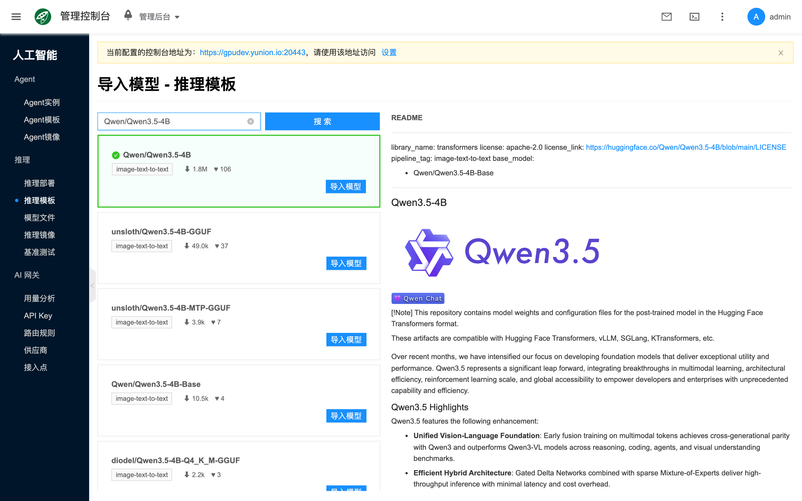
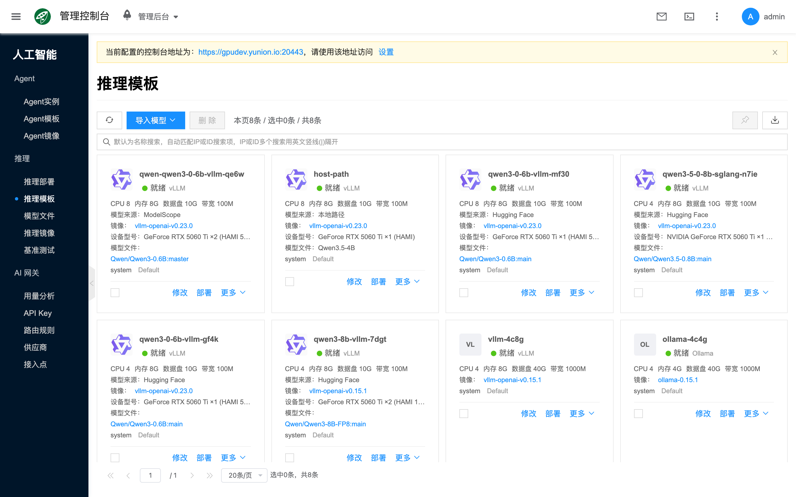
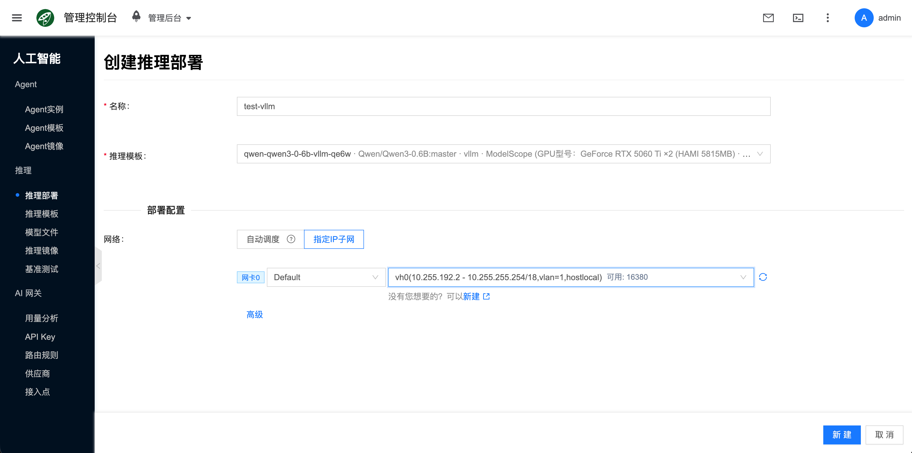
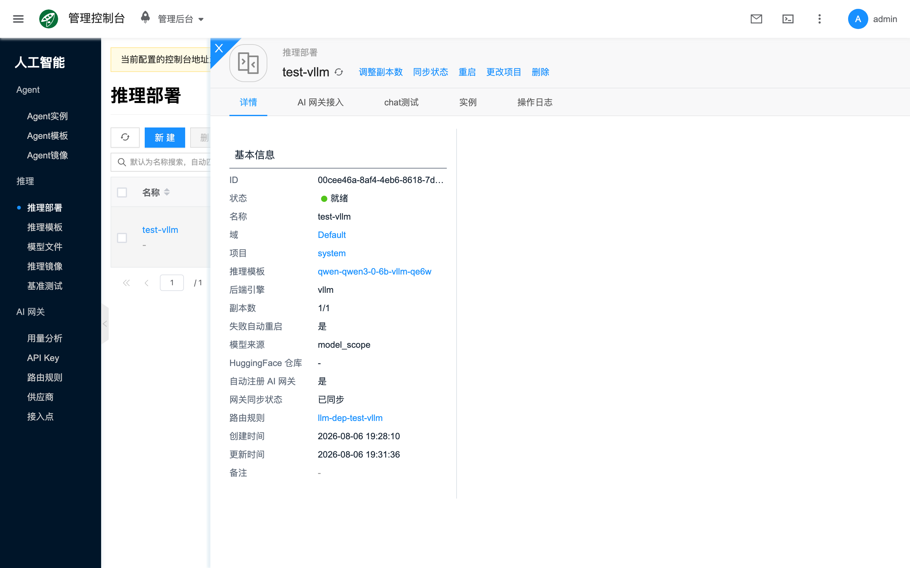
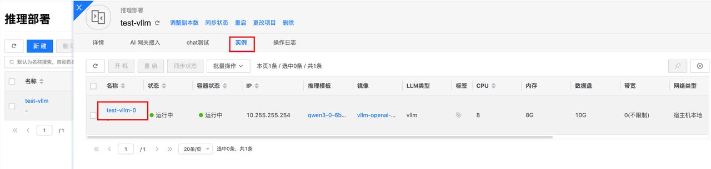
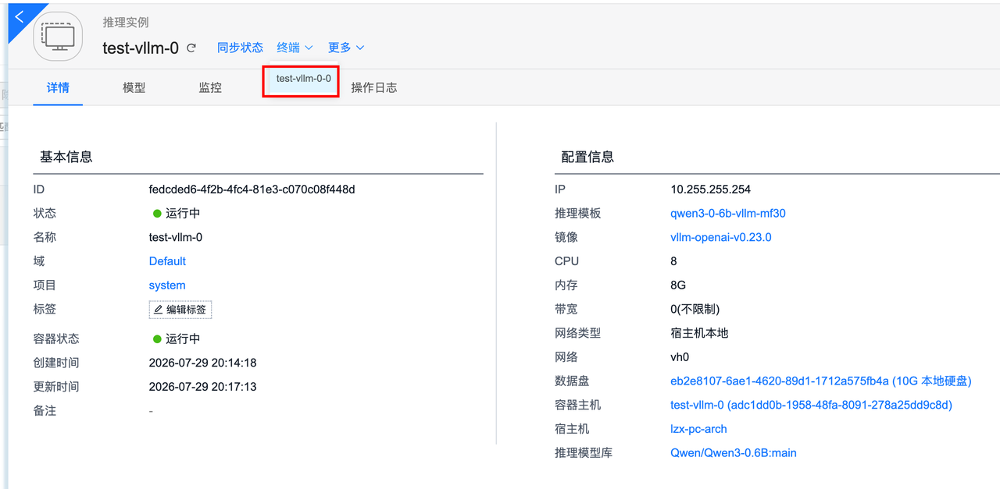
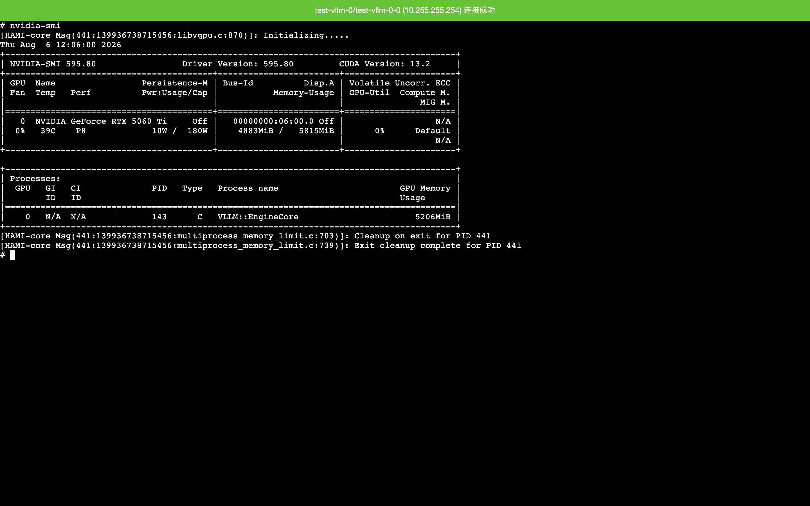
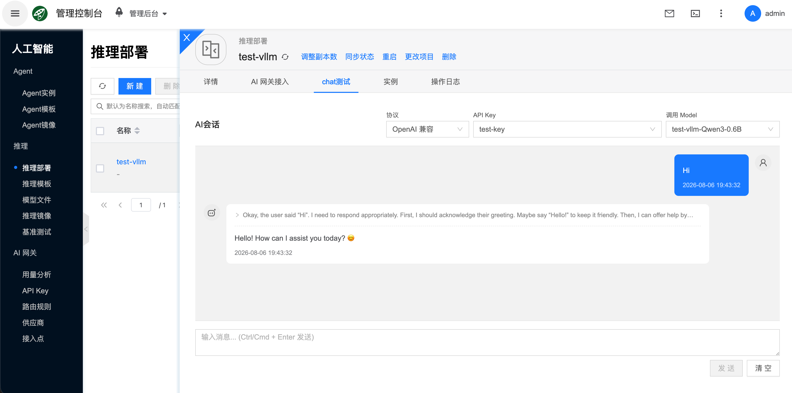
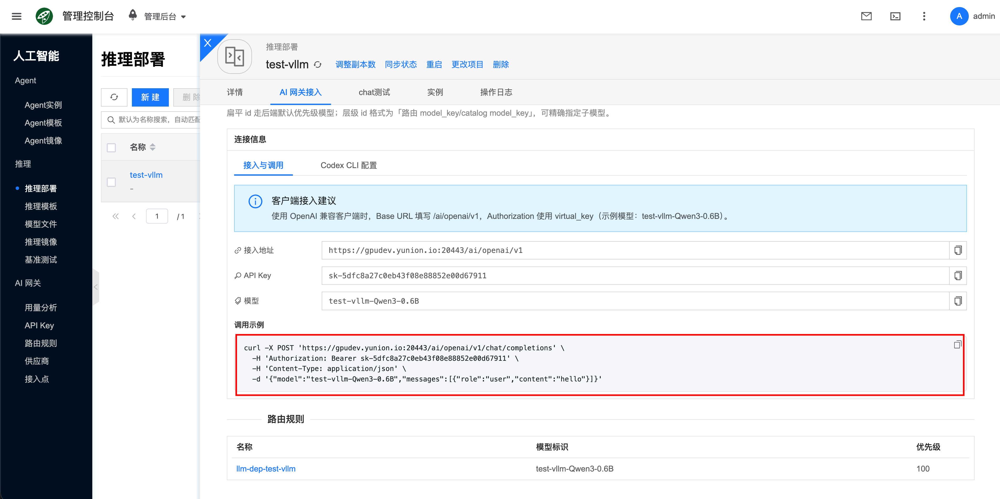
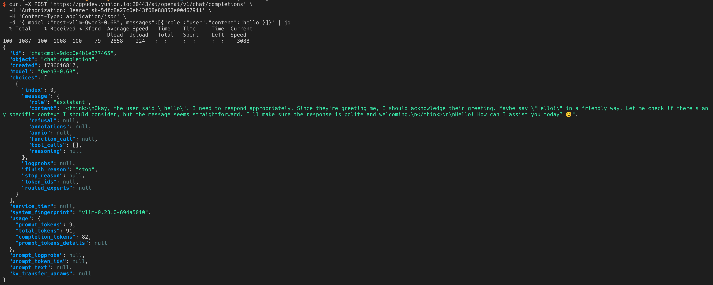

import FaqImagePullFailed from './_parts/_faq-image-pull-failed.mdx';

# 快速开始

从导入模型到 chat 验证的端到端路径：在推理模板侧 **导入模型** 生成模板 → 基于模板创建部署 → 用 API Key 做 **chat测试**（或 curl）。

容器节点环境请先完成 [配置 NVIDIA 与 CUDA 环境](/docs/aicloud/getting-started/setup-nvidia-cuda)。概念说明见 [推理部署](./deployment)、[推理模板](./template)。

## 步骤概览

1. [从 ModelScope 导入并生成模板](#import-modelscope)（也可 Hugging Face / 本地路径）。
2. [创建推理部署](#create-deployment)，等待就绪。
3. （可选）[查看 HAMI 限制显存是否生效](#verify-hami-memory)。
4. [创建 API Key](#create-api-key) 后做 [chat 测试](#chat-test)；可选 [curl](#aiproxy-curl)。

## 从 ModelScope 导入并生成模板 {#import-modelscope}

vLLM 等引擎需要挂载可加载模型。推荐在 **推理模板** 页从 ModelScope（魔搭社区）导入，并同时生成带模型配置的模板（入口不在「模型文件」列表的社区导入）。

更细的字段说明见 [推理模板/从 ModelScope 导入](./template#import-modelscope)。

1. 进入 **人工智能 → 推理 → 推理模板**。
2. 点击 **导入模型**，选择 **从 ModelScope**。


3. 搜索目标模型（示例：`Qwen/Qwen3.5-4B`），选中后打开配置抽屉。



4. 在导入配置中选择推理引擎（**vLLM** 或 **SGLang**，默认 vLLM），配置项目、名称、社区镜像、CPU/内存/数据盘、GPU（启用 HAMI 时选带 **HAMI** 前缀的型号）与端口（vLLM 默认 TCP `8000`，SGLang 默认 TCP `30000`）等，提交导入。


5. 返回模板列表，等待模板状态就绪（如 **就绪 vLLM**）。在对应卡片上点击 **部署**，进入创建推理部署页（也可稍后从部署列表 **新建**）。



:::tip
模板卡片上可核对 CPU、内存、数据盘、镜像与模型文件等信息，确认无误后再部署。节点需能访问 `https://www.modelscope.cn`，并预留足够数据盘空间。
:::

## 创建推理部署 {#create-deployment}

控制台入口：**人工智能 → 推理 → 推理部署 → 新建**；或从模板卡片 **部署** 进入（会预选该模板，`from_sku`）。

部署页主流程是 **选择已有推理模板**；模型导入发生在模板页，不要在部署页寻找多来源导入入口。

1. 填写 **名称**（如 `test-vllm`）。
2. 确认 **推理模板** 已选中（类型、模型来源、规格应与模板一致）。
3. 在 **部署配置** 中按需设置 **网络**（默认网卡或指定 IP 子网）。
4. 点击 **新建** 提交。



等待部署状态变为 **就绪**（网关同步状态常为 **已同步**）后，再进行 chat / curl 验证。



## 查看 HAMI 限制显存是否生效 {#verify-hami-memory}

当导入模板时选择了带 **HAMI** 前缀的 GPU，并配置了 **显存（MiB）**（或由挂载模型估算带出）时，可在部署就绪后确认容器内可见显存上限是否与模板一致。未启用 HAMI、未限制显存时可跳过本步。

HAMI 安装与透传设备上报见 [配置 NVIDIA 与 CUDA 环境](/docs/aicloud/getting-started/setup-nvidia-cuda)。

1. 打开目标 **推理部署** 详情侧栏，切换到 **实例** 页签。
2. 点击运行中的实例名称，进入实例详情。



3. 点击 **终端**，选择对应容器进入 Web 控制台。



4. 在终端执行：

```bash
nvidia-smi
```

5. 查看输出中的 **Memory**（显存总量）：应接近模板里配置的 **显存（MiB）**（例如模板为 `5815` MiB，则容器内可见上限应为该限制值，如下图 `… / 5815MiB`），**而不是**整卡物理显存。输出中若出现 `HAMI-core` 相关日志，也表明容器侧已加载 HAMI。
6. （可选）在宿主机再执行一次 `nvidia-smi`：宿主机仍显示整卡容量，容器内为限制值，即表示 HAMI 显存限制已生效。



## 创建 API Key {#create-api-key}

通过 AI 网关调用推理服务（含 **chat测试**）前，需先创建 API Key。字段与运维说明见 [AI 网关/API Key](../ai-proxy/api-key)。

1. 进入 **人工智能 → AI 网关 → API Key**。
2. 点击 **新建**，填写 **名称**；**单次最大 Token**、**每分钟请求数** 可按需限制，留空表示不限制。
3. 提交后**保存**生成的 Key，供 chat 测试与 curl 使用。


## chat 测试 {#chat-test}

1. 进入 **人工智能 → 推理 → 推理部署**，打开目标部署详情侧栏。
2. 切换到 **chat测试** 页签。
3. 配置：
   - **协议**：选择 **OpenAI 兼容**
   - **API Key**：选择上一节创建的 Key
   - **调用 Model**：在下拉列表中选择要测试的模型 id（须与部署注册的模型一致）
4. 输入测试消息（如 `Hi`），点击 **发送**（或 `Ctrl/Cmd + Enter`）。
5. 收到模型正常回复，即表示推理部署可用。



:::tip
也可在详情侧栏 **AI 网关接入** 中选择 API Key 后，点击 **快速测试** 跳转到 **chat测试**。
:::

若要把该推理服务接到 Agent（如 Hermes），可在 Agent 侧填写网关接入地址与同一 API Key / Model，见 [HermesAgent](../llm-app/instance/hermes)。

## curl 测试（可选）{#aiproxy-curl}

1. 在部署详情侧栏打开 **AI 网关接入**。
2. 在 **选择 API Key 生成调用示例** 中选择已创建的 Key。
3. 页面会显示 **接入地址**、**API Key**、**模型** 及 **调用示例**。
4. 复制示例中的 `curl` 在终端执行；返回正常响应即表示服务可用。




## 接下来

- 部署概念、详情页签与运维操作：[推理部署](./deployment)
- 模板概念与配置项：[推理模板](./template)
- AI 网关：[快速开始](../ai-proxy/quickstart) / [API Key](../ai-proxy/api-key) / [路由规则](../ai-proxy/routing)
- （可选）压测：[基准测试](./benchmark)

## 常见问题 {#faq}

### ModelScope 导入失败或长时间卡住

- 检查节点能否访问 `https://www.modelscope.cn`。
- 检查数据盘空间是否足够。
- 查看模板/模型相关任务或事件日志。

### 创建失败或一直无法就绪

- 核对模板类型、镜像类型、挂载模型是否齐全。
- 检查节点 GPU / 显存 / 磁盘与网络。
- 在部署详情 **操作日志** 页签查看调度与拉取错误。

<FaqImagePullFailed />

### chat 测试无回复或鉴权失败

- 确认已创建并选择了正确的 API Key。
- **调用 Model** 须与 **AI 网关接入** 页显示的模型 id 一致。
- 确认部署就绪且网关同步状态正常。

### 容器内 `nvidia-smi` 仍显示整卡显存

- 确认模板 GPU 选的是带 **HAMI** 前缀的型号，且填写了（或估算了）**显存（MiB）**。
- 确认部署基于该模板创建。
- 确认宿主机已启用 HAMI，透传设备共享模式为 **HAMI**（见 [配置 NVIDIA 与 CUDA 环境](/docs/aicloud/getting-started/setup-nvidia-cuda)）。
