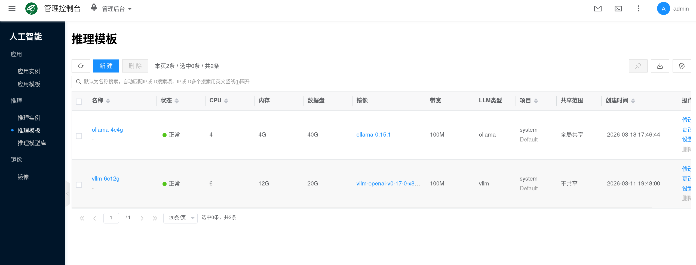
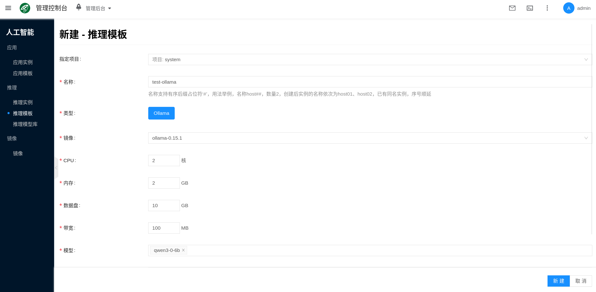
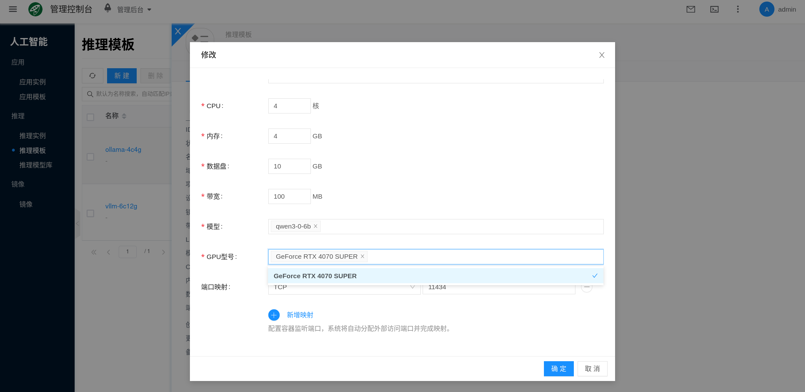
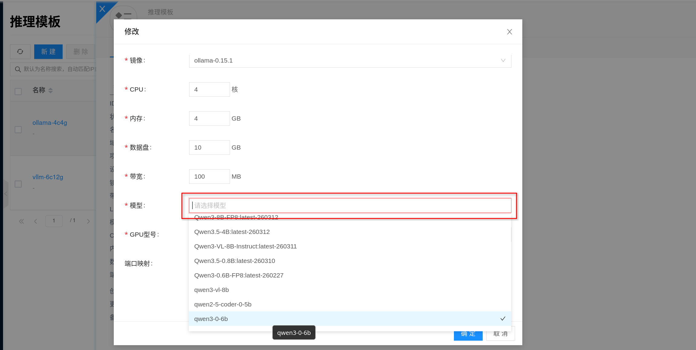
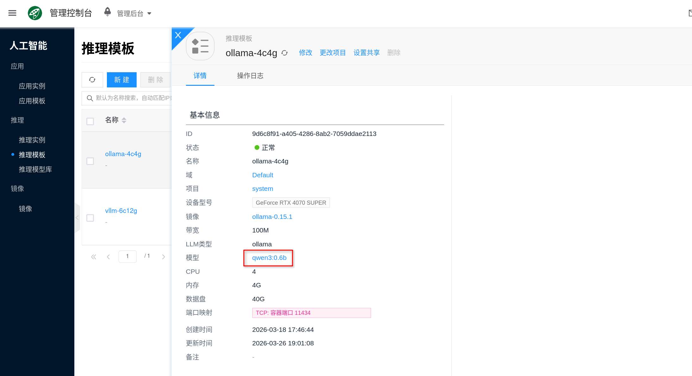

# 推理模板

推理模板用于为 AI 推理实例预设一组可复用的运行配置。创建实例时，选择模板即可一次性复用类型、镜像、CPU、内存、GPU、数据盘、挂载模型和端口映射等设置。

它可以理解为“推理实例的标准规格”。模板配置得越清晰，后续批量创建、扩容、回滚和排障就越稳定。当前文档以 `Ollama` 模板为例介绍推理模板的使用方式，其他推理引擎后续补充。

## 快速开始 {#quickstart}

创建推理模板大致分为以下几步：

1. **准备镜像、模型与 GPU 环境**：确认目标类型、[AI镜像](../llm-image) 和 GPU 环境已准备好；当前文档以 `Ollama` 模板为例，如果希望模板预挂载模型，再提前在 [推理模型库](./model-library) 中准备好目标模型。
2. **创建或编辑模板**：控制台 **人工智能 → 推理 → 推理模板**，新建模板或修改平台预置模板。
3. **填写模板配置**：按需要设置类型、镜像、CPU、内存、数据盘、GPU、端口映射和挂载模型等字段。
4. **使用模板创建实例**：进入 **人工智能 → 推理 → 推理实例**，选择该模板创建实例并完成验证。

### 1. 前提准备

在创建模板前，建议先确认以下几项：

1. 你已经明确当前要创建的模板类型；本文以 `Ollama` 模板为例。
2. 已准备好与模板类型一致的 [AI镜像](../llm-image)。
3. 如果希望模板预挂载模型，已在 [推理模型库](./model-library) 中准备好目标模型。
4. 目标节点具备足够的 GPU、CPU、内存和数据盘容量。
5. 如果模板需要在线拉取模型或镜像，节点具备访问目标仓库的网络连通性。

:::tip
模板只负责定义默认规格，不会替你“自动创造资源”。如果节点的 GPU、显存、内存或存储不足，即使模板能保存，后续实例创建时仍然可能调度失败或启动失败。
:::

### 2. 创建或编辑模板

控制台入口为 **人工智能 → 推理 → 推理模板**。

1. 点击 **新建**，或选择一个已有模板点击 **修改**。
2. 选择模板类型；当前文档以 `Ollama` 为例。
3. 填写模板名称，并完成镜像、规格、模型和端口等配置。
4. 保存模板。

平台一般会预置默认模板，也可以直接基于默认模板修改，例如更新 GPU 型号、数据盘大小或挂载模型。

### 3. 使用模板创建实例

模板保存后，进入 **人工智能 → 推理 → 推理实例** 创建实例，选择对应模板即可复用模板中的主要配置。当前以 `Ollama` 为例，实例创建与验证可直接参考 [Ollama](./ollama)。

## 核心配置项

推理模板常见配置项如下：

| 配置项 | 作用 | 使用建议 |
| --- | --- | --- |
| 类型 | 指定模板对应的推理引擎 | 必须与镜像、挂载模型的类型一致；当前文档以 `Ollama` 为例 |
| AI镜像 | 指定实例运行时使用的容器镜像 | 选择与模板类型一致、版本明确的镜像 |
| CPU / 内存 | 决定推理服务的基础资源 | 显存够用时，CPU 和内存依然会影响加载速度、并发和稳定性 |
| 数据盘 | 为模型、缓存和运行数据提供持久化存储 | 推理模板必须规划数据盘，磁盘过小会导致模型下载或挂载失败 |
| GPU | 决定模型能否加载以及吞吐上限 | 优先关注 GPU 型号、显存和数量 |
| 挂载模型 | 预先关联推理模型库中的模型 | 挂载模型的类型必须与模板类型一致 |
| 端口映射 | 将容器端口暴露给外部访问 | 不同引擎端口不同；以 `Ollama` 为例，常见端口是 `11434` |
| 带宽 | 限制容器网络吞吐 | 在线下载模型、镜像或对外提供 API 时需要考虑 |

### 类型与镜像

模板类型决定了实例运行方式，也决定了后续可选镜像和模型范围。当前文档以 `Ollama` 模板为例，重点说明以下校验关系：

- `Ollama` 模板应选择 `Ollama` 类型镜像。
- 挂载到模板中的模型，也应与 `Ollama` 模板类型一致。

如果镜像或挂载模型的类型不匹配，模板将无法保存。

### CPU、内存、GPU 与数据盘

这些字段决定模板能否支撑目标模型稳定运行：

- **CPU**：影响模型加载、请求排队和部分预处理任务。
- **内存**：影响推理进程、缓存和运行稳定性；不足时可能导致 OOM 或频繁重启。
- **GPU**：决定大模型是否能装入显存，也会影响并发能力和延迟表现。
- **数据盘**：用于保存模型文件、缓存和运行时数据，是推理模板中非常关键的一项。

对推理模板来说，数据盘不是可有可无的“附加项”。以当前文档示例中的 `Ollama` 模板为例，平台需要持久化模型目录：

- Ollama 的模型目录位于 `/root/.ollama/models`
- 该目录依赖持久化存储来保留模型和缓存

:::tip
如果你打算挂载多个模型，或者希望实例重启后继续复用缓存，建议优先加大数据盘，而不是依赖容器临时层。
:::

### 挂载模型

模板支持预挂载 [推理模型库](./model-library) 中的模型。这样用模板创建实例时，模型会随模板一起带入，减少每次手动选择或在线下载的操作。

控制台默认会联动推理模型库；如果当前模型库里还没有合适模型，模板也可以先不挂载模型，后续再补充。

需要注意：

- 挂载模型的类型必须与模板类型一致；以当前示例来说，`Ollama` 模板应挂载 `Ollama` 模型。
- 一个模板可以挂载多个模型。
- 实例创建后，会继承模板中的挂载模型列表。
- 已被模板预挂载的模型，在模型库中通常不能直接删除或禁用后立刻移除使用关系，建议先解除模板引用。

如果模型库中的模型已经开启自动缓存，平台会按模型关联的镜像执行节点侧缓存，这通常有助于减少首次启动时的等待时间。

### 端口映射与网络

模板中的端口映射决定了实例服务如何对外暴露。不同推理引擎的默认端口可能不同，当前文档以 `Ollama` 为例，通常暴露 `11434`。

此外还需要注意：

- **带宽**：会影响 API 吞吐和模型在线下载速度。
- **宿主机**：如果需要固定在某台 GPU 节点运行，可以在实例创建时指定。
- **网络**：可选择自动调度或指定已有子网；最终以实例级网络配置为准。

## 模板与实例的关系

推理模板负责提供“默认值”，推理实例负责承载“实际运行状态”。理解这层关系有助于避免很多运维误解：

- **新建实例时**：实例会继承模板中的资源规格、镜像、挂载模型和端口映射等主要配置。
- **修改模板后**：通常只会影响后续新建实例；已经在运行的实例不会自动同步到新模板配置。
- **升级或回滚时**：建议优先修改模板并重新创建实例，或在实例侧执行明确的规格/镜像变更操作。

:::tip
如果你打算长期维护一组标准化推理环境，建议按模型大小、GPU 档位或用途规划多个模板，例如“7B 测试模板”“32B 生产模板”“Ollama 验证模板”。
:::

## 常见问题

### 模板保存失败，提示镜像或模型类型不匹配

- 检查模板类型是否与 [AI镜像](../llm-image) 类型一致。
- 检查挂载模型是否来自同类型的 [推理模型库](./model-library) 条目。
- 以当前示例来说，不要把非 `Ollama` 类型的镜像或模型挂到 `Ollama` 模板中。

### 明明模板创建成功了，实例还是调度失败

- 模板能保存，不代表运行节点一定有足够资源。
- 重点检查 GPU 型号、显存、CPU、内存和数据盘是否满足要求。
- 如果指定了宿主机，还要确认该节点上确实存在可分配的 GPU 与存储资源。

### 修改模板后，已有实例为什么没有变化

模板主要用于后续创建。已经运行中的实例通常不会自动跟随模板变化，需要你在实例侧单独执行重建流程。

### 数据盘应该怎么估算

- **Ollama**：重点估算 `/root/.ollama/models` 的模型体积和后续缓存增长。
- 如果会挂载多个模型，建议按“模型文件总量 + 缓存 + 未来增量”预留空间，不要只按单个模型大小估算。
