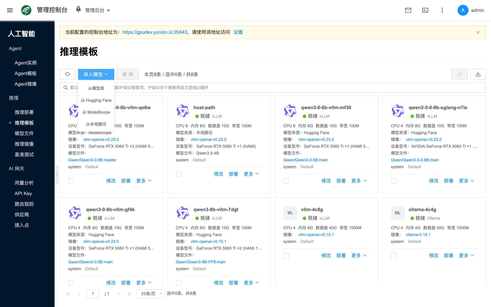
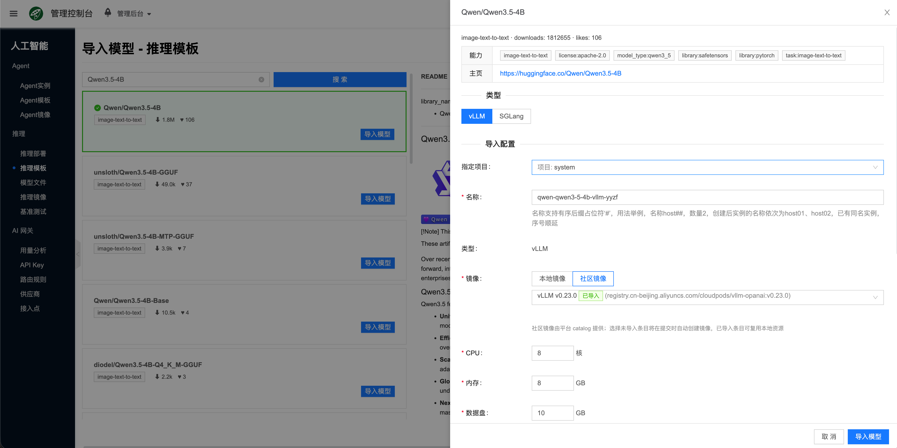
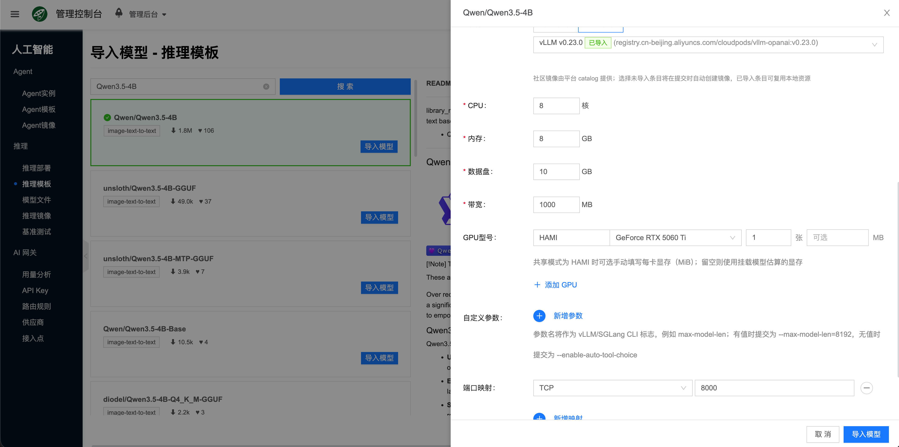
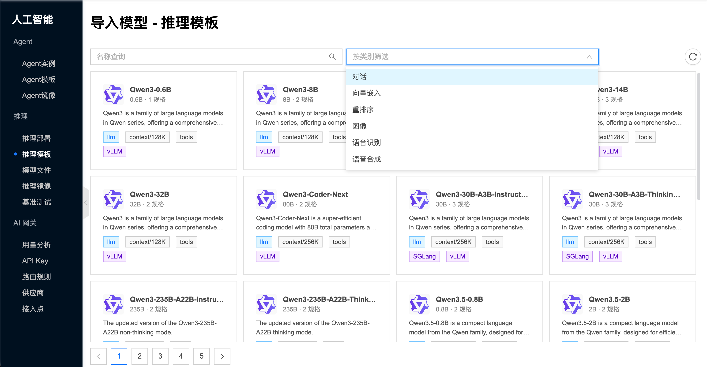
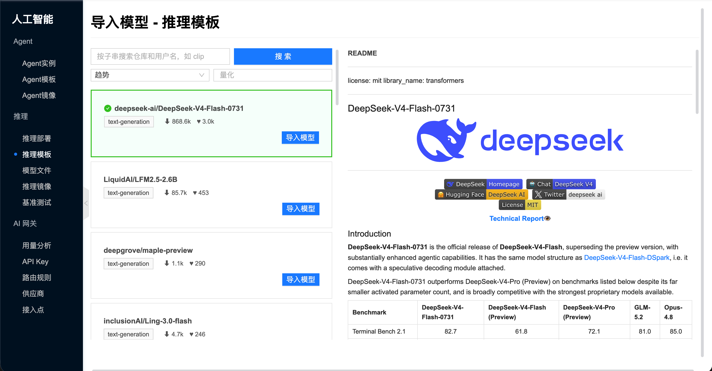
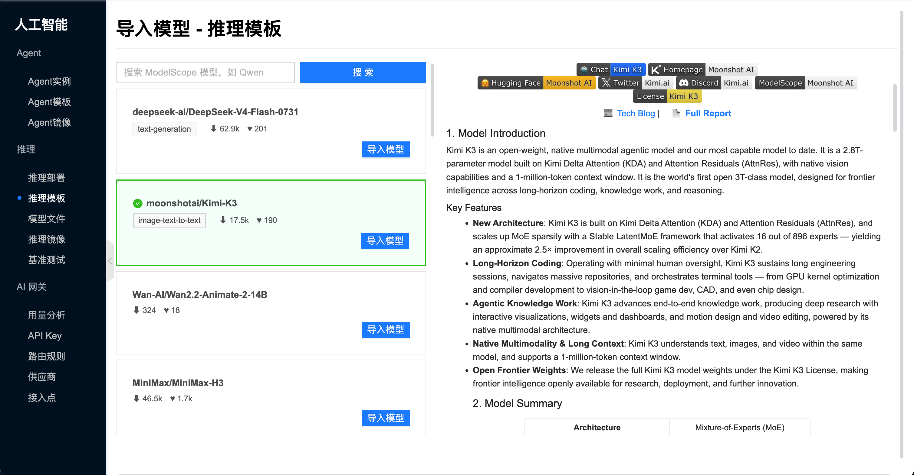
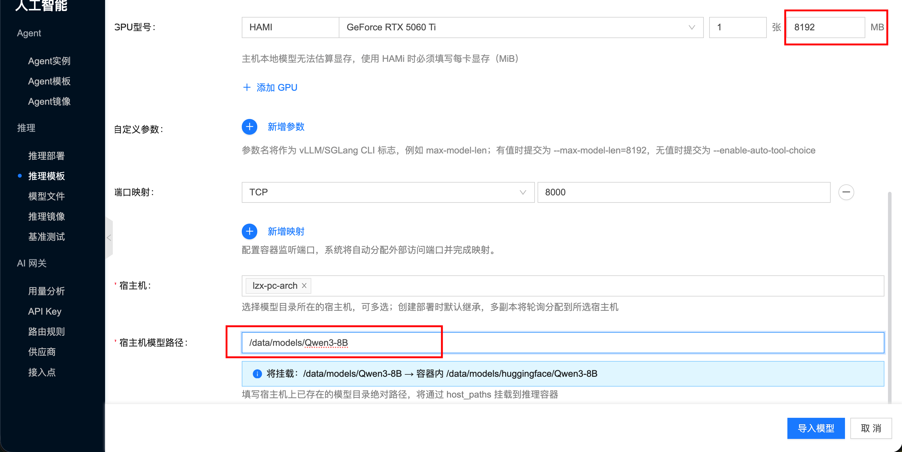
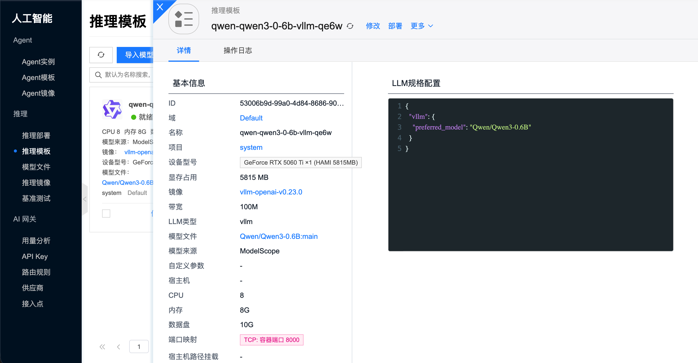

# 推理模板

## 概念介绍

推理模板为推理服务预设可复用的运行配置。创建 [推理部署](./deployment) 时选择模板，即可复用类型、镜像、CPU、内存、GPU、数据盘、挂载模型与端口映射等规格。

与部署、模型、镜像的关系如下：

- **推理部署**：基于模板创建。修改模板后，对已关联的已有部署执行 **重启**，新配置即可生效；新建部署会直接使用最新模板。
- **模型文件**：经 **导入模型**（从模型库 / Hugging Face / ModelScope / 本地路径）生成模板时，通常会一并处理可挂载的模型相关资源。
- **推理镜像**：须与模板类型一致。

控制台路径为 **人工智能 → 推理 → 推理模板**。新增模板通过 **导入模型** 完成，列表不提供「新建」。端到端导入与部署见 [快速开始](./quickstart)。

## 常用操作

### 导入模型

列表主入口。可选从模型库、Hugging Face、ModelScope 或本地路径导入，生成推理模板。

导入抽屉中可配置下列字段（对已有模板执行 **修改** 时，字段含义相同）。类型须与镜像、挂载模型一致，否则无法保存。

- **指定项目**：模板所属项目；修改时通常只读。
- **名称**：模板名称；支持 `#` 有序后缀；修改时通常只读。
- **类型**：推理引擎类型；须与镜像、挂载模型一致。从 Hugging Face / ModelScope / 本地路径导入时，可在 **导入配置** 中选择 **vLLM** 或 **SGLang**（默认 vLLM）；从模型库导入或 **修改** 已有模板时通常只读。
- **镜像**：推理容器运行时镜像。导入时可选手动/自动来源：
  - **本地镜像**：选用当前环境中已存在的推理镜像。
  - **社区镜像**：选用平台 catalog 提供的镜像；若本地尚无对应镜像，提交导入时可由平台自动创建 / 拉取。
  - **修改**已有模板时：从已有 [推理镜像](./image) 列表中选择与类型匹配的镜像。
- **CPU**：容器 CPU 上限（核），可按需调整。
- **内存**：容器内存上限，可按需调整。
- **数据盘**：容器数据盘容量，可按需调整。模型以 **overlay 共享** 方式挂载进容器，**模型文件本身不占用数据盘容量**；数据盘主要用于缓存、临时文件等运行期数据。
- **带宽**：网络带宽上限。
- **模型**：挂载到模板的模型数据，由所选 **导入模型** 入口决定（见下方各导入方式）。
- **自定义参数**：传给推理引擎的额外 CLI / 参数（如有）。
- **GPU 型号**：GPU 设备配置（共享模式、型号、数量等）。数量表示占用的 GPU 卡数。常见共享模式：
  - **HAMI**：GPU 共享调度；可限制每卡 **显存（MiB）**。启用时可选手动填写显存，或留空由挂载模型估算。部署就绪后可 [验证 HAMI 显存限制](./quickstart#verify-hami-memory)。
  - **独占**：整卡独占给该工作负载，不与其他容器共享该卡。
  - **无限制**：不做 HAMI 类显存切分限制。
  - **MPS**：使用 NVIDIA MPS，多进程共享 GPU。
- **端口映射**：配置容器监听端口；系统将自动分配外部访问端口并完成映射。
  - **vLLM** 默认监听 **TCP 8000**，除非使用自定义镜像且引擎监听端口不同，否则应保持默认。
  - **SGLang** 默认监听 **TCP 30000**，除非使用自定义镜像且引擎监听端口不同，否则应保持默认。
  - 使用自行定制的镜像时，按镜像说明修改容器端口。
- **宿主机路径挂载**：将宿主机目录映射进容器（可选；常与「从本地路径」导入配合）。

#### 从模型库导入 {#import-model-library}

从平台整理收集的 **模型库（模型目录）** 中搜索并挑选模型（可按类别筛选），再选择该模型下的一条 **规格**（引擎后端、量化、来源等），在导入表单中配置镜像与资源后提交，生成带挂载模型的推理模板。导入抽屉中的字段说明见上方。

#### 从 Hugging Face 导入 {#import-huggingface}

从 Hugging Face 在线检索并选择模型仓库，在导入配置中选择 **vLLM** 或 **SGLang**，生成可挂载资源与推理模板，节点需能访问 Hugging Face。导入抽屉中的字段说明见上方。

#### 从 ModelScope 导入 {#import-modelscope}

从 ModelScope（魔搭）在线选择模型，在导入配置中选择 **vLLM** 或 **SGLang**，生成带挂载模型的推理模板，方便国内访问。导入抽屉中的字段说明见上方。相关导入步骤可参考 [快速开始/从 ModelScope 导入](./quickstart#import-modelscope)。

#### 从本地路径导入 {#import-local-path}

从节点宿主机上的本地目录导入已落盘模型，适合离线或已预先下载的场景。需填写宿主机模型路径（绝对路径），并可指定优先调度的宿主机；可配合 **宿主机路径挂载** 将目录映射进容器。导入抽屉中的字段说明见上方。

:::tip
本地路径导入的模型，如果使用 HAMI 共享显存，需要手动填写要限制的显存大小。
:::

### 查看详情

列表以卡片展示模板状态（如 **就绪 vLLM**）、资源规格、镜像、模型来源与挂载模型等。打开某一模板的侧栏详情，常见页签包括：

- **详情**：查看类型、镜像、CPU/内存/GPU、数据盘、挂载模型、端口等规格。
- **操作日志**：排查导入、修改与相关任务事件。

### 其他操作

- **克隆**：基于已有模板复制全部规格（类型、镜像、CPU/内存/GPU、挂载模型、来源与自定义参数等），只填写新名称。挂载模型复用已有资源，不会重新下载。导入中或导入失败的模板不可克隆。
- **部署**：跳转创建推理部署并预选该模板。
- **修改**：调整镜像、规格、挂载模型、端口等。保存后，对已使用该模板的部署执行 **重启**，新配置才会生效（见 [推理部署/常用操作](./deployment#operations)）。
- **更改项目** / **设置共享范围**：按项目管理与可见性需要使用。
- **删除**：确认无关联部署依赖后再删除。

## 常见问题

### 模板保存失败，提示镜像或模型类型不匹配

检查模板类型、[推理镜像](./image) 与 [模型文件](./model-library) 是否同属一类引擎。

### 模板保存成功，部署却调度失败

检查节点 GPU、显存、CPU、内存与数据盘；若指定了宿主机，确认该节点确有可分配资源。

### 修改模板后，已有部署没有变化

修改模板不会自动热更新正在运行的副本。请打开对应 [推理部署](./deployment)，执行 **重启**，使新配置生效。新建部署会直接使用最新模板。

### 数据盘如何估算

模型以 overlay 共享方式挂载，**模型文件本身不占用数据盘**。数据盘请按运行期缓存、临时文件等预留；过小可能导致缓存或临时数据写满。

导入与部署排障见 [快速开始/常见问题](./quickstart#faq)。
