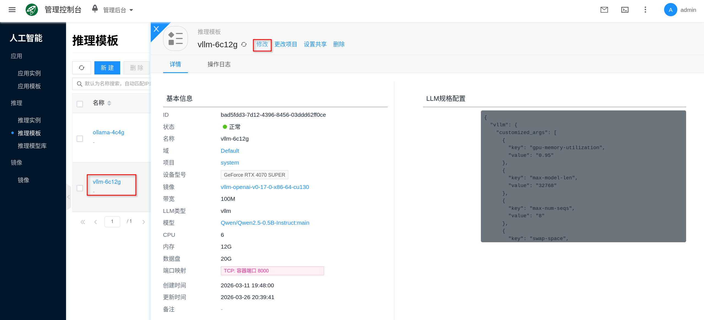
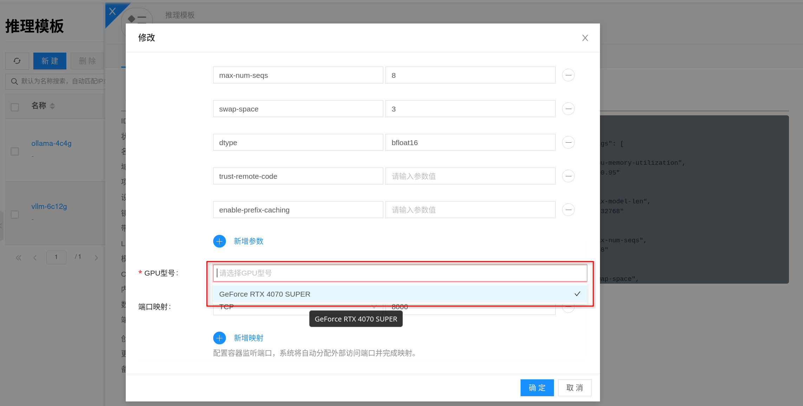
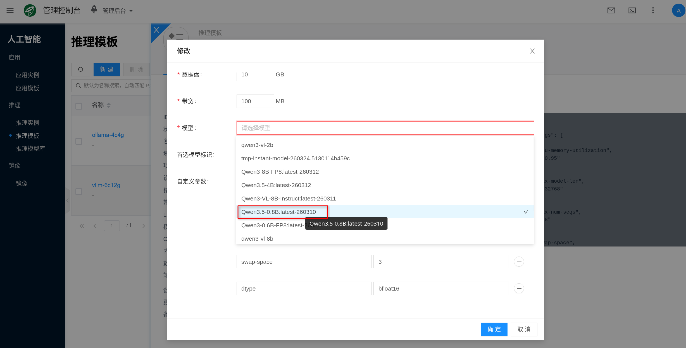

# vLLM

vLLM 是高吞吐、低延迟的 LLM 推理服务，**需要 GPU**，适用于对并发、吞吐和 OpenAI 兼容接口有要求的在线推理场景。

## 快速开始 {#quickstart}

创建 vLLM 推理实例大致分为以下几步：

1. **准备 GPU 环境**：完成 [配置 NVIDIA 与 CUDA 环境](../../getting-started/setup-nvidia-cuda)，并提前规划好 GPU 显存、内存与持久化存储空间。
2. **为模板配置规格与镜像**：先到 [推理模板](./template) 中为 vLLM 模板配置 GPU、CPU、内存、数据盘与 [AI镜像](../llm-image)；平台通常会预置默认模板，也可以按需新建或编辑。
3. **选择模型与版本（可选）**：若 [推理模型库](./model-library) 中已经有目标模型，可在模板或实例参数中直接选择；若当前还没有可用模型，也可以先准备模型目录。
4. **创建推理实例**：控制台 **人工智能 → 推理 → 推理实例**，新建，选择已经配好规格的 **vLLM** 推理模板创建实例。
5. **获取服务地址并验证**：进入实例详情页「连接信息」获取推理服务地址；结合运行状态、日志与 API 调用确认模型已成功加载并可对外提供推理服务。

### 1. 准备 GPU 环境

vLLM 依赖 GPU 做推理，请先完成 [配置 NVIDIA 与 CUDA 环境](../../getting-started/setup-nvidia-cuda)，并重点确认以下几项：

1. 节点能够识别到 GPU，且驱动状态正常。
2. 目标 GPU 显存足够容纳待加载模型。
3. CPU 与内存满足模型加载和并发请求处理需求。
4. 数据盘空间充足，因为模型目录 `/data/models/huggingface` 与缓存目录 `/root/.cache/huggingface` 都会落到持久化存储。
5. 如果要在线下载模型，请提前确认节点到模型源的网络连通性；平台默认会把 Hugging Face 访问地址指向 `https://hf-mirror.com`。

可先在 GPU 节点上执行下面的命令做基础检查：

```bash
nvidia-smi
```

```bash
curl -I https://hf-mirror.com
```


:::tip
如果计划运行大模型或多模型，建议在创建模板前就把 GPU 显存、内存和数据盘容量一起规划好。vLLM 除了加载模型权重，还会消耗额外内存作为缓存与交换空间。
:::

### 2. 为模板配置规格与镜像

在创建实例前，建议先进入 **人工智能 → 推理 → 推理模板**，把 vLLM 模板对应的规格和镜像调好。可以先理解为“先把实例要用的 GPU、CPU、内存、数据盘和镜像配好，再回到实例页面创建”；如果平台已经预置了合适的 vLLM 模板，也可以直接复用。

1. 进入控制台 **人工智能 → 推理 → 推理模板**。
2. 选择现有 vLLM 模板点击 **修改**，或点击 **新建** 创建一个 `vLLM` 推理模板。
3. 在规格配置中，选择合适的 CPU、内存、GPU 型号、GPU 数量和数据盘大小。
4. 在镜像字段中选择对应的 [AI镜像](../llm-image)，保存模板。

为模板配置规格与镜像时，重点关注：

- **GPU 数量与显存**：直接决定模型能否加载，以及 `tensor-parallel-size` 的默认值。平台会按你分配到的 GPU 数量自动设置并行度。
- **CPU / 内存**：会影响请求处理、排队和模型运行稳定性；显存够用时，CPU 和内存不足同样可能导致启动失败或响应变慢。
- **数据盘**：模型目录 `/data/models` 与缓存目录 `/root/.cache` 都依赖持久化存储，磁盘过小会导致模型挂载、下载或升级失败。
- **镜像版本**：优先选择平台验证过的 vLLM 镜像，并尽量固定明确版本，便于后续升级与回滚。




:::tip
如果希望实例重启后仍然保留模型文件和 Hugging Face 缓存，务必使用带持久化数据盘的模板；平台会将 `/data/models` 和 `/root/.cache` 挂载到持久化存储，而不是依赖容器临时层。
:::

### 3. 选择模型与版本（可选）

如果模板或实例页面的模型相关字段里已经有目标模型可选，建议优先直接选择。这样实例创建完成后，通常就能把对应模型直接挂载到 vLLM 的模型目录里，减少重复下载和版本漂移。

可参考以下流程：

1. 进入 **人工智能 → 推理 → 推理模型库**。
2. 通过“导入社区模型”准备目标模型。
3. 回到 **推理模板** 或 **推理实例** 页面，在模型相关配置项中选择要挂载的模型版本。
4. 在实例创建完成后，等待模型挂载或预热完成。



如果当前模型库里还没有可直接挂载的 vLLM 模型，也不影响先继续创建实例。你可以先准备模型目录，并确保它位于 `/data/models/huggingface/<模型相对路径>` 下。常见做法是使用 `huggingface-cli download` 直接把模型拉取到目标目录：

```bash
huggingface-cli download <model> \
  --local-dir /data/models/huggingface/<模型相对路径>
```

例如：

```bash
huggingface-cli download Qwen/Qwen2.5-7B-Instruct \
  --local-dir /data/models/huggingface/Qwen2.5-7B-Instruct
```

下载完成后，目标目录下通常会包含 `config.json`、`tokenizer.json`、`tokenizer_config.json`、`*.safetensors` 等文件，可直接供 vLLM 加载。

当目录下有多个模型时，建议显式配置 `preferred_model`，否则平台会尝试使用它找到的第一个模型目录。

:::tip
推荐优先使用模型库统一管理模型来源和版本。这样同一个模型可以被多个实例复用，也更方便排查“同名模型但版本不同”带来的差异。
:::

### 4. 创建推理实例

控制台入口为 **人工智能 → 推理 → 推理实例**。

1. 点击 **新建**。
2. 选择已经配好规格与镜像的 `vLLM` 推理模板或实例类型。
3. 填写实例名称，并按页面要求选择项目、区域、网络等通用配置。
4. 确认模板、镜像、规格和高级配置后提交创建；如果模型相关配置项里已经有目标模型可选，也可以在这里一并选择；如果当前没有可选模型，也可以先留空后创建。

如果控制台里还没有可用的 vLLM 模板，可以先前往 **人工智能 → 推理 → 推理模板** 创建或编辑模板，再返回实例页面创建。


>
> 截图占位：新建 vLLM 推理实例表单

页面中的通用字段可按实际场景决定：

- **带宽**：用于限制容器网络带宽，按业务访问量填写。
- **宿主机（可选）**：如需固定运行在某台 GPU 节点上，可手动指定；否则由平台自动调度。
- **网络**：可使用自动分配，也可指定已有 IP 子网。

### 5. 获取服务地址并验证

实例创建成功后，进入实例详情页，打开 **连接信息**，即可获取 vLLM 服务地址。按当前平台实现，vLLM 容器内默认监听 `8000` 端口，但对外访问地址仍应以控制台显示的连接信息为准。

> 截图占位：实例详情页连接信息

建议按下面顺序验证：

1. 先确认实例状态为“运行中”。
2. 打开详情页的 **日志**，确认没有模型加载失败、显存不足、参数错误或下载失败等报错。
3. 如有需要，可通过详情页的 **终端** 进入容器，检查模型目录和运行日志。
4. 使用 HTTP API 做一次健康检查和模型枚举验证。

先检查服务是否可访问：

```bash
curl <service-url>/health
```

再查看 vLLM 当前暴露的模型列表：

```bash
curl <service-url>/v1/models
```

如果返回 `200 OK`，且 `/v1/models` 中已经能看到模型 `id`，说明服务已经基本可用。接下来就可以按本文后面的示例发起 OpenAI 兼容请求。

:::tip
`/v1/chat/completions` 和 `/v1/completions` 请求里的 `model` 字段，建议直接使用 `/v1/models` 返回的 `id`，不要手工猜测。
:::

## 模型与持久化

### 持久化路径

vLLM 容器中这些目录与路径最值得关注：

- `/data/models`：平台为 vLLM 挂载的模型数据根目录。
- `/data/models/huggingface`：vLLM 默认扫描的模型目录。
- `/root/.cache/huggingface`：Hugging Face 缓存目录，平台会将 `/root/.cache` 持久化。
- `/tmp/vllm.log`：vLLM 启动日志文件，可用于排查启动超时或参数错误；该路径更偏运行时调试，不建议作为长期持久化日志目录。

### 模型选择规则

平台启动 vLLM 时，会先在 `/data/models/huggingface` 下解析要加载的模型目录，规则如下：

1. 如果配置了 `preferred_model`，且对应目录存在，则优先加载该目录。
2. 如果没有配置 `preferred_model`，或者配置目录不存在，则回退到模型目录下找到的第一个目录。
3. 服务启动后，平台会把最终加载目录的 basename 作为 `served-model-name` 传给 vLLM。

这意味着：

- 如果你把模型放在 `/data/models/huggingface/Qwen2.5-7B-Instruct`，那么接口里的模型名通常会是 `Qwen2.5-7B-Instruct`。
- 如果你的目录结构是 `/data/models/huggingface/Qwen/Qwen2.5-7B-Instruct`，实际暴露的模型名通常仍会以末级目录名为准。
- 当目录里有多个模型时，强烈建议显式设置 `preferred_model`，避免因为目录扫描顺序导致加载错模型。

## vLLM 特有配置

### `preferred_model`

`preferred_model` 用来指定 vLLM 启动时优先选择的模型目录。它填写的是 `/data/models/huggingface` 下的相对目录名，而不是接口中的模型显示名。

例如：

- 目录是 `/data/models/huggingface/Qwen2.5-7B-Instruct` 时，可填写 `Qwen2.5-7B-Instruct`
- 目录是 `/data/models/huggingface/Qwen/Qwen2.5-7B-Instruct` 时，可填写 `Qwen/Qwen2.5-7B-Instruct`

如果修改了 `preferred_model`，建议在变更后重建实例，或至少执行一次完整重启流程，并再次用 `/v1/models` 验证实际加载结果。

### `customized_args`

`customized_args` 用来补充 vLLM 启动参数。平台会在默认启动参数基础上追加这些配置，并做一层安全限制。

填写规则如下：

- `key` 不要带前导 `--`，例如填写 `max-model-len`，不要填写 `--max-model-len`
- `key` 只允许字母、数字、`-`、`_`
- 同名参数按“实例级覆盖模板级”的方式合并
- `value` 为空时，平台会把它当作不带值的开关参数，例如 `trust-remote-code`
- 空值方式只适用于布尔开关类参数；如果某个 vLLM 参数本身必须带值，仍然要填写对应 `value`

以下参数由平台接管，不能通过 `customized_args` 覆盖：

- `model`
- `served-model-name`
- `port`
- `tensor-parallel-size`

其中：

- `tensor-parallel-size` 会根据实例实际分配到的 GPU 数量自动设置
- `swap-space` 平台会按模板内存自动计算一个默认值，通常约为内存的一半（单位 GiB，最小为 `1`），但你可以显式覆盖它

一个常见的填写方式如下：

| 启动参数 | `key` | `value` | 说明 |
| --- | --- | --- | --- |
| `--max-model-len 32768` | `max-model-len` | `32768` | 控制上下文长度 |
| `--gpu-memory-utilization 0.9` | `gpu-memory-utilization` | `0.9` | 控制显存利用率上限 |
| `--swap-space 8` | `swap-space` | `8` | 覆盖平台默认交换空间 |
| `--trust-remote-code` | `trust-remote-code` | 留空 | 为布尔开关类参数 |

### 平台默认追加的关键参数

平台启动 vLLM 时，核心命令等价于：

```bash
python3 -m vllm.entrypoints.openai.api_server \
  --model <resolved-model-path> \
  --served-model-name <basename-of-model-dir> \
  --port 8000 \
  --tensor-parallel-size <gpu-count> \
  --swap-space <computed-swap-space>
```

因此在排查问题时，可以优先围绕下面几项定位：

- 模型目录是否存在、是否完整
- `/v1/models` 返回的模型名是否与你请求中使用的 `model` 一致
- GPU 数量与 `tensor-parallel-size` 是否匹配
- `customized_args` 是否传入了当前镜像不支持的参数

## 接口调用示例

vLLM 在当前平台中以 OpenAI 兼容模式运行，因此可以直接使用 OpenAI 风格的 HTTP 接口。下面以 `curl` 为例说明最常见的验证方式。

:::note
如果你的连接信息经过了网关、负载均衡或鉴权代理，请按实际要求补充 `Authorization` 等请求头；如果当前环境没有开启鉴权，可以省略该请求头。
:::

### 1. 健康检查

```bash
curl <service-url>/health
```

正常情况下应返回 `200 OK`。

### 2. 查看模型列表

```bash
curl <service-url>/v1/models
```

返回结果通常类似：

```json
{
  "object": "list",
  "data": [
    {
      "id": "<model-name>",
      "object": "model"
    }
  ]
}
```

后续请求中的 `model` 字段，建议直接使用这里返回的 `<model-name>`。

### 3. OpenAI 兼容聊天接口

```bash
curl <service-url>/v1/chat/completions \
  -H 'Content-Type: application/json' \
  -d '{
    "model": "<model-name>",
    "messages": [
      {
        "role": "system",
        "content": "你是一个简洁的中文助手。"
      },
      {
        "role": "user",
        "content": "请用一句话介绍你自己。"
      }
    ],
    "temperature": 0.7,
    "top_p": 0.9,
    "max_tokens": 256,
    "stream": false
  }'
```

如果要启用流式返回，可把 `stream` 改成 `true`，客户端按 Server-Sent Events 方式读取增量结果。

### 4. OpenAI 兼容补全接口

```bash
curl <service-url>/v1/completions \
  -H 'Content-Type: application/json' \
  -d '{
    "model": "<model-name>",
    "prompt": "请用三句话介绍 vLLM 的主要用途。",
    "temperature": 0.7,
    "top_p": 0.9,
    "max_tokens": 256,
    "stream": false
  }'
```

对于纯补全文本场景，可以使用 `/v1/completions`；对于指令跟随、对话和 Agent 场景，通常更推荐 `/v1/chat/completions`。

### 常见参数说明

- `model`：必须与 `/v1/models` 返回的模型名一致。
- `messages`：聊天接口输入消息数组，按 `role` + `content` 组织。
- `prompt`：补全接口输入文本。
- `stream`：是否启用流式输出；`true` 表示边生成边返回。
- `temperature`：采样温度，值越大随机性越高。
- `top_p`：核采样阈值，常与 `temperature` 配合使用。
- `max_tokens`：本次生成的最大输出 token 数。

## 配置建议

### 镜像与规格

- **规格选择**：参考 [推理模板](./template)，重点关注 GPU 显存、GPU 数量、CPU/内存与并发规模之间的匹配。
- **镜像选择**：参考 [AI镜像](../llm-image)，使用明确版本（tag/digest）便于升级与回滚，并注意 CUDA、驱动与 vLLM 版本兼容性。

### 模型与版本

- **模型库**：结合 [推理模型库](./model-library) 统一管理模型来源、版本与复用策略。
- **目录规划**：建议给每个模型使用清晰稳定的目录名，便于 `preferred_model` 精确指向目标目录。
- **缓存与磁盘**：模型文件通常占用较大磁盘空间，建议为模型目录和 Hugging Face 缓存准备足够的持久化存储，并建立清理策略。

### 并发、吞吐与延迟

- **容量规划**：吞吐与延迟通常受 GPU 显存、并发和批处理策略影响；容量不足时可横向扩展实例或升级 GPU 规格。
- **网络**：推理接口对网络延迟敏感，建议业务侧与推理服务之间保持稳定低延迟链路，避免跨地域和高抖动链路。
- **参数调优**：需要更高吞吐或更长上下文时，可优先评估 `gpu-memory-utilization`、`max-model-len` 和 `swap-space` 等高级参数。

### 变更与观测

- **升级与回滚**：通过 [AI镜像](../llm-image) 控制运行时版本；变更前评估 CUDA、驱动、镜像与模型版本兼容性。
- **观测指标**：重点关注 GPU 利用率、显存占用、QPS、P95/P99 延迟、错误率。
- **日志排查**：模型加载失败、显存不足或高级参数错误时，可优先检查控制台日志以及容器内的 `/tmp/vllm.log`。

## 常见问题

### 怎么进入容器？

通过实例详情页面中的 **终端** 可以直接进入容器，用于检查模型目录、缓存目录或运行日志。

> 截图占位：vLLM 实例终端入口
>
> 截图占位：vLLM 容器终端界面

### 怎么查看服务日志？

通过前端界面：点击对应的推理实例，进入详情页面，再点击 **日志**，就能查看 vLLM 的服务输出日志，方便用于错误排查。

> 截图占位：vLLM 实例日志页

如果需要进一步定位启动问题，也可以进入容器后查看：

```bash
tail -n 50 /tmp/vllm.log
```

### 启动后无法加载模型

- 检查模型目录是否位于 `/data/models/huggingface` 下，且目录内容完整。
- 检查 `preferred_model` 是否拼写正确，对应目录是否真实存在。
- 检查规格是否满足模型加载所需的显存与内存峰值。
- 检查高级参数是否传入了镜像当前版本不支持的选项。

### `/v1/models` 有返回，但调用时报模型不存在

- 请求里的 `model` 字段应与 `/v1/models` 返回的 `id` 完全一致。
- 不要直接使用仓库名、目录父路径或自己猜测的名称；平台会把最终加载模型目录的末级目录名作为 `served-model-name`。

### 吞吐低或延迟高

- 关注 GPU 利用率与显存占用是否偏低或偏高，检查是否存在 CPU、内存或网络瓶颈。
- 调整规格与并发策略，必要时横向扩容多个实例分摊流量。
- 结合业务请求规模评估是否需要调优 `gpu-memory-utilization`、上下文长度或负载分配策略。

### GPU 不可用或驱动不匹配

- 按 [配置 NVIDIA 与 CUDA 环境](../../getting-started/setup-nvidia-cuda) 检查驱动、CUDA 版本与节点状态。
- 在节点上执行 `nvidia-smi` 验证驱动与 GPU 状态。
