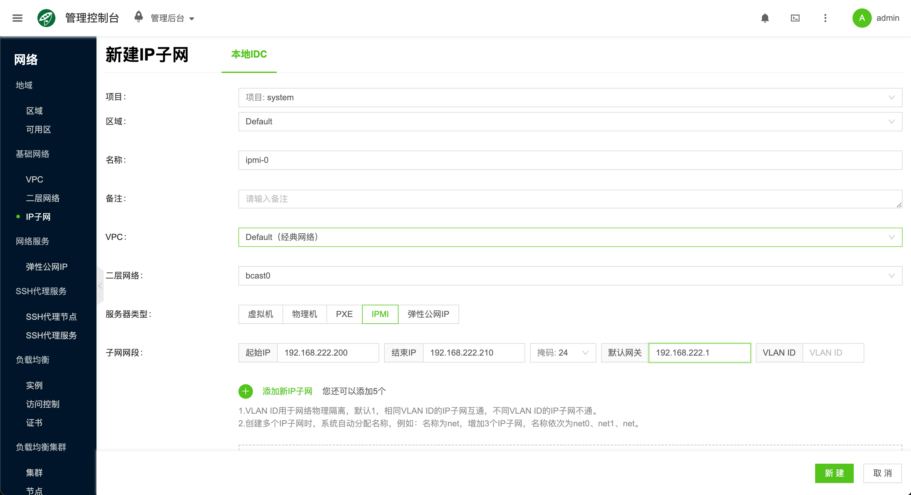
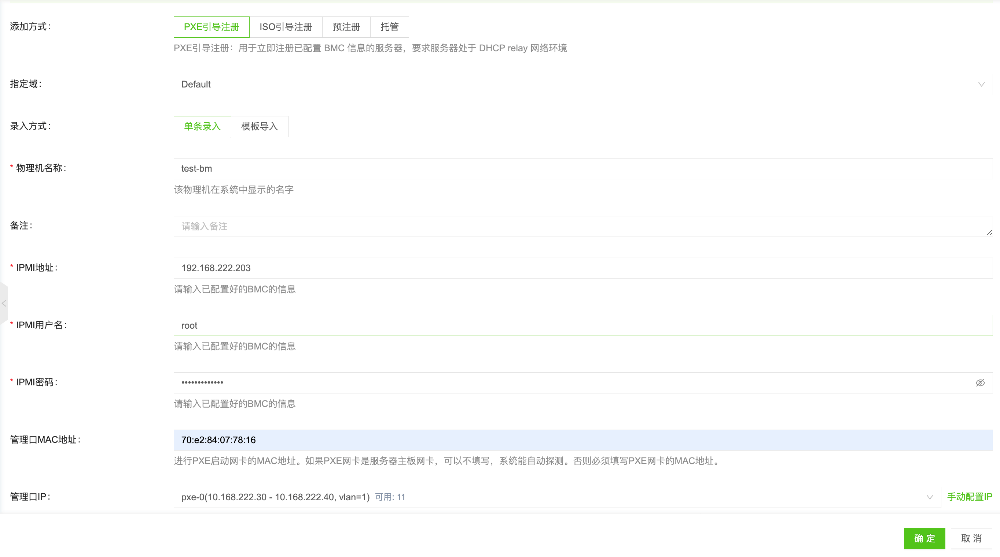
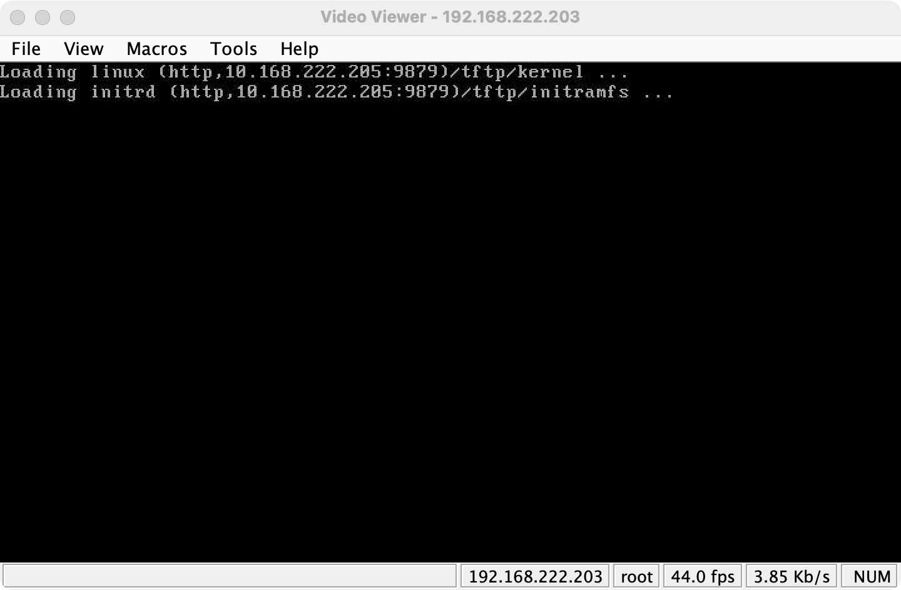
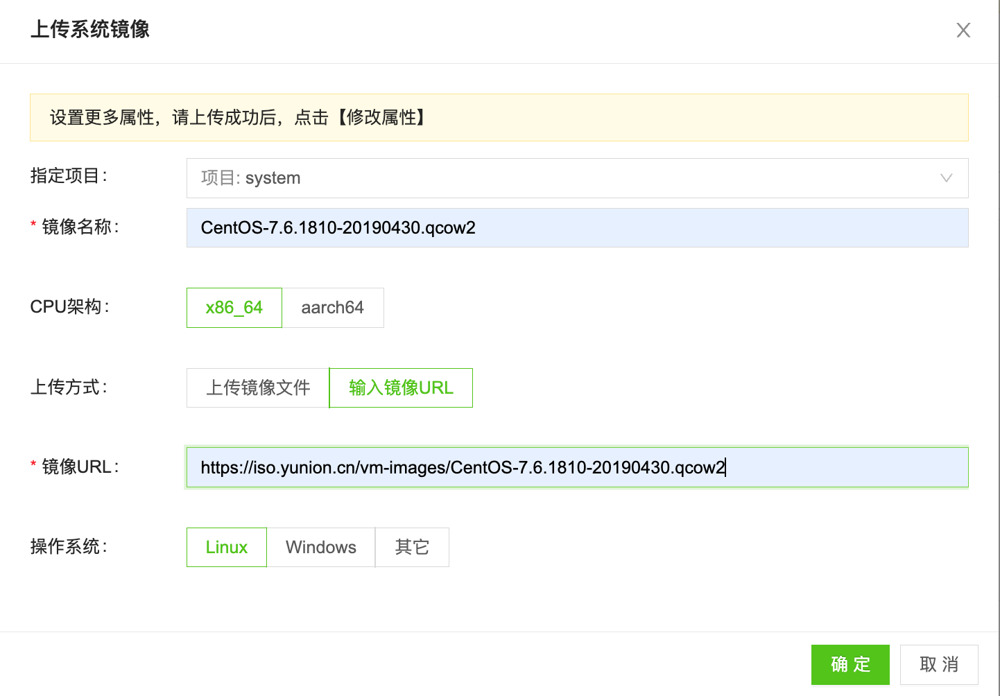
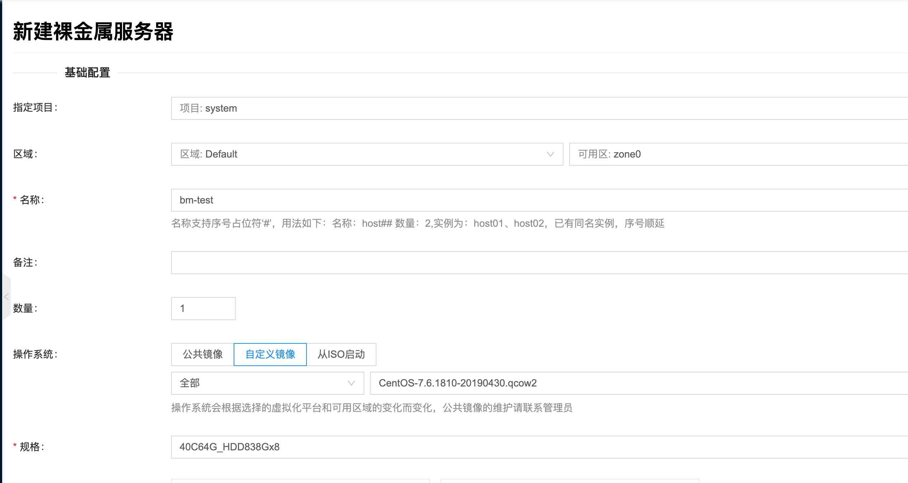
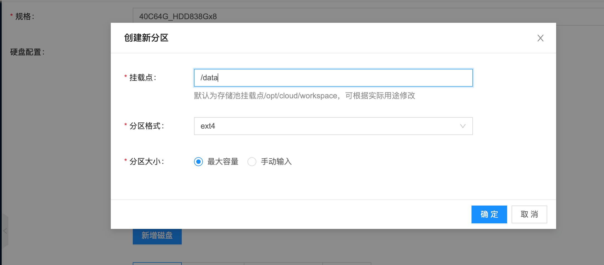
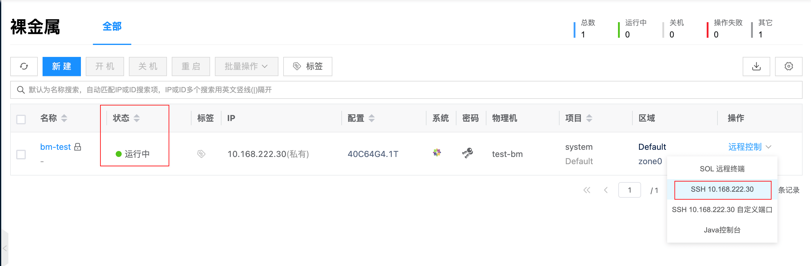
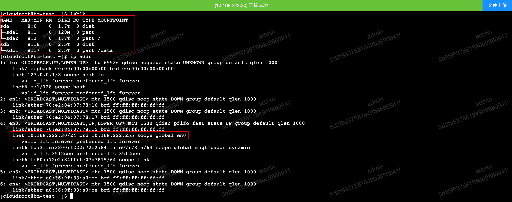

# Docker Compose 快速安装

使用 [Docker Compose](https://docs.docker.com/compose/) 快速部署 Cloudpods Baremetal 物理机管理服务。

## 环境准备

### 机器配置要求

- 最低配置要求: CPU 2核, 内存 4GiB, 存储 100GiB
- docker 版本: ce-23.0.2
    - docker 建议安装最新的 ce 版本，新版本已经包含 docker-compose 插件
    - docker 需要开启容器网络以及 iptables

### 安装配置 docker

:::tip 注意
如果您的环境已经安装了新版本的 docker ，可以跳过改步骤。
:::

请自行参考官方文档安装：[Install Docker Engine](https://docs.docker.com/engine/install/) 。

## 运行 Cloudpods Baremetal 服务

1. 在部署机器上创建 cloudpods-baremetal 目录，并且进入该目录。

```bash
mkdir cloudpods-baremetal
cd cloudpods-baremetal
```

2. 使用下面的命令，把运行物理机管理的 docker compose 配置文件下载下来。

```bash
curl https://raw.githubusercontent.com/yunionio/ocboot/master/compose/baremetal/docker-compose.yml -o docker-compose.yaml
```

3. 在 cloudpods-baremetal 目录运行下面的 docker compose 命令。

运行服务，注意需要设置 LISTEN_INTERFACE 和 PUBLIC_IP 两个环境变量。

- **LISTEN_INTERFACE**: 服务监听的网卡，比如 eth0 ，改网卡会负责接受 DHCP 请求。
- **PUBLIC_IP**: 服务监听的 IP 地址，为对应 LISTEN_INTERFACE 网卡上的 IP 地址，可通过 `ip addr show` 查看对应网卡上的地址。

下面命令假设 eth0 网卡上的 ip 地址为 10.168.222.205，具体设置请根据自己的环境设置。

```bash
LISTEN_INTERFACE=eth0 PUBLIC_IP=10.168.222.205 docker compose up
```

4. 等服务启动完成后，就可以登陆 **https://$PUBLIC_IP** 访问前端服务，默认登陆用户密码为：admin 和 admin@123 。


## 纳管物理机测试

物理机管理服务部署完成后，接下来纳管物理机测试。

:::tip 注意
- 待纳管的物理机需要和运行服务的节点在同一个广播域下
- 该广播域中需要禁用其他 dhcp 服务，因为 baremetal 物理机管理服务会运行 dhcp 服务
- 如果待管理的物理机运行在其他广播域，则需要在交换机上配置 dhcp relay 到物理机管理服务的 PUBLIC_IP 地址
:::

待纳管的物理机信息：

- 型号: Lenovo RD640
- IPMI 带外信息:
    - IP: 192.168.222.203
    - 用户: root
    - 密码: YourIPMI@Password
- BIOS 设置 PXE 网络启动为第一启动顺序

### 1. 创建物理机网段

纳管物理机，需要创建 PXE, IPMI 和物理机 3个类型的 IP 子网。

- 物理机类型: 该网段用于物理机的 PXE 网络引导启动和裸金属（安装操作系统）
- IPMI 类型: 用于记录物理机 BMC 带外控制的地址

这两个网段需要是运行服务所在节点网络可达的，请根据自己的网络环境设置。

点击前端“网络/IP子网/新建"，创建以下的两个子网。

1. 创建一个物理机类型的子网，假设需要给物理机 PXE 启动的网段为 10.168.222.30 到 10.168.222.40，网关为 10.168.222.1，**并设置 dhcp_relay 为 PUBLIC_IP**，名称为 bmnet-0。

:::tip 注意
- 此物理机类型网段的开始和结束 ip 范围，以及默认网关是和实际环境网络环境相关的，是对应到交换机和路由器上的配置，注意划分的 ip 不要和已有环境的冲突了
- **这里一定要设置 dhcp_relay 为 PUBLIC_IP，在这个环境中是 10.168.222.205，请根据自己环境修改。**
    - 因为 baremetal-agent 服务只会响应从 dhcp_relay 过来的单播 dhcp 请求，用 docker compose 部署的服务中包含了一个 dhcp_relay 服务，也监听到 PUBLIC_IP 上，会把 dhcp 广播 relay 到 agent 服务。
:::


2. 创建一个 IPMI 类型的子网，该网段需要包含物理机的 ipmi ip，假设为 192.168.222.200 到 192.168.222.210，网关为 192.168.222.1，名称为 ipmi-0。



4. 查看创建好的2个网段。


### 2. 纳管物理机

在前端添加物理机，点击”主机/物理机/添加”，选择 “PXE 注册引导”，输入对应的物理机纳管信息。

- 名称: test-bm
- IPMI 信息（这些以具体机器所在环境为准）
    - IPMI 地址: 192.168.222.203
    - IPMI 用户名: root
    - IPMI 密码: YourIPMI@Password
- 管理口 MAC 地址: 70:e2:84:07:78:16
    - PXE 网络启动的网卡 MAC 地址，如果物理机支持 Redfish API 可以不填，平台能自动探测到
- 管理口 IP: 选择刚才创建的 bmnet-0 子网



创建完成后，在物理机列表可以看到机器处于“准备中”的状态，并且探测到了品牌为 Lenovo 。


可以通过访问物理机的带外控制台，会看到物理机开始 PXE 引导，如果网络配置没有问题，物理机会获得物理机管理服务下发的 grub 引导配置。

<!--  -->

获取 grub 配置后，物理机会从管理服务的 PUBLIC_IP 下载内核和 initramfs。



下载完成后，就会进入 yunionos 内存系统。


之后平台的服务会通过 ssh 远程探测收集物理机的硬件信息，等物理机变成“运行中”的状态，就算纳管成功了。

勾选对应的物理机，点击启用，就可以进行后续的安装操作系统等操作。


### 3. 导入装机镜像

点击“主机/系统镜像/上传”按钮，导入需要装机的镜像。

- 名称：CentOS-7.6.1810-20190430.qcow2
- 输入镜像 URL：https://iso.yunion.cn/vm-images/CentOS-7.6.1810-20190430.qcow2



等待镜像状态变成“可用”，就可以将此镜像用于安装操作系统了。

### 4. 创建裸金属(安装操作系统)

点击“主机/裸金属/新建”按钮，填入以下的信息，安装操作系统。

- 名称: bm-test
- 镜像: 选择刚才导入的 CentOS-7.6.1810-20190430.qcow2
- 规格: 纳管物理机的硬件规格，比如下面截图里面的 **40C64G_HDD838Gx8** 表示物理机CPU有40核，64G内存，8块838G的HDD机械盘



- 硬盘配置: 
    - 选择4块做RAID10给系统盘

    - 剩下4块做RAID5作为数据盘，格式化ext4文件系统挂载到/data目录


    - 查看分区结果


- 网络：选择 bmnet-0


配置完成后，点击新建，回到裸金属列表，就能看到一条叫作"bm-test"的裸金属记录。等部署完成后，裸金属的状态会变成“运行中”。



然后就可以通过 ssh 或者带外控制登录到装好的系统里面，查看主机名，磁盘分区和网络设置都符合预期。



更多物理机相关原理和使用介绍，请参考文档：[用户手册/物理机](../guides/baremetal)。

## 操作说明

### 1. 将服务放到后台运行

可以使用 '-d/--detach' 参数把所有服务放到后台运行，命令如下：

```bash
# 所有服务放到后台运行
# 下面命令假设 eth0 网卡上的 ip 地址为 10.168.222.205，具体设置请根据自己的环境设置。
$ LISTEN_INTERFACE=eth0 PUBLIC_IP=10.168.222.205 docker compose up -d

# 服务放到后台后，可以通过 logs 自命令查看输出日志
$ docker compose logs -f
```

### 2. 登陆 climc 命令行容器

如果要使用命令行工具对平台做操作，可以使用下面的方法进入容器：

```bash
$ docker exec -ti cloudpods-baremetal-climc-1 bash
Welcome to Cloud Shell :-) You may execute climc and other command tools in this shell.
Please exec 'climc' to get started

# source 管理员认证信息
bash-5.1# source /etc/yunion/rcadmin
bash-5.1# climc user-list
```

### 3. 登录物理机 pxe 内存系统

当物理机通过 pxe 启动成功后，会引导进入一个内存 linux 系统，可以通过下面的方式 ssh 进入这个系统，遇到错误的时候方便排查。

```bash
# 1. 进入 climc 容器
docker exec -ti cloudpods-baremetal-climc-1 bash

# 2. 查看物理机 id
climc host-list

# 3. ssh 到 host 的内存系统
climc host-ssh $对应物理机id
```

另外也可以通过 `climc host-logininfo $对应物理机id` 获取 root 用户的登录密码。

如果物理机 pxe 内存系统上报登录信息失败，则会设置成默认的密码：mosbaremetal，对应逻辑可参考[通知代码](https://github.com/yunionio/yunionos/blob/master/src_pxe/etc/init.d/S99notify#L12-L20)。


### 4. 查看服务配置和持久化数据

所有服务的持久化数据都是存储在 *cloudpods-baremetal/data* 目录下面的，所有配置都是自动生成的，一般不需要手动修改，下面对各个目录做说明：

```bash
$ tree data
data
├── etc
│   ├── nginx
│   │   └── conf.d
│   │       └── default.conf    # 前端 nginx 配置
│   └── yunion
│       ├── *.conf  # cloudpods 各个服务配置
│       ├── pki     # 证书目录
│       ├── rcadmin     # 命令行认证信息
├── opt
│   └── cloud
│       └── workspace
│           └── data
│               └── glance # 镜像服务存储的镜像目录
└── var
    └── lib
        ├── influxdb    # influxdb 持久化数据目录
        └── mysql       # mysql 数据库持久化数据目录
```

### 5. 删除所有容器

所有服务的持久化数据都是存储在 *cloudpods-baremetal/compose/data* 目录下面的，删除容器不会丢失数据，下次直接用 *docker compose up* 重启即可，操作如下：

```bash
# 删除服务
$ docker compose down
```

## 升级

通过 docker compose 升级很方便，只用更新 docker-compose.yml 的配置文件，然后重启服务就行。

### 更新 compose 配置文件

当上游的 [ocboot/compose/baremetal/docker-compose.yml](https://github.com/yunionio/ocboot/blob/master/compose/baremetal/docker-compose.yml) 更新了，就可以通过 curl 命令下载最新的配置文件，然后重新启动就可以了，步骤如下：

```bash
# 注意切换到对应的 cloudpods-baremetal 目录
$ cd cloudpods-baremetal

# 下载配置文件
$ curl https://raw.githubusercontent.com/yunionio/ocboot/master/compose/baremetal/docker-compose.yml -o docker-compose.yaml
```

### 重启 compose 服务

拉取最新的 docker-compose.yml 配置文件后，使用下面命令重启服务就行了。

```bash
$ docker compose down

# 下面命令假设 eth0 网卡上的 ip 地址为 10.168.222.205，具体设置请根据自己的环境设置。
$ LISTEN_INTERFACE=eth0 PUBLIC_IP=10.168.222.205 docker compose up
```
