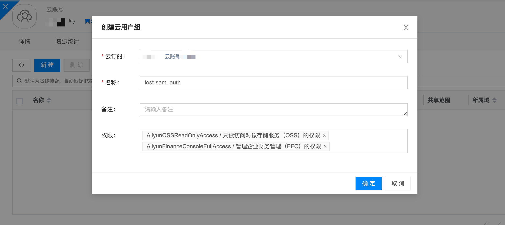
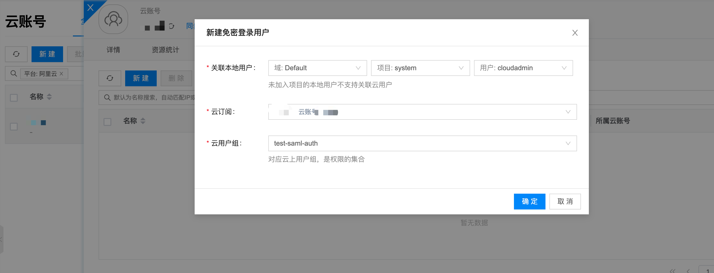
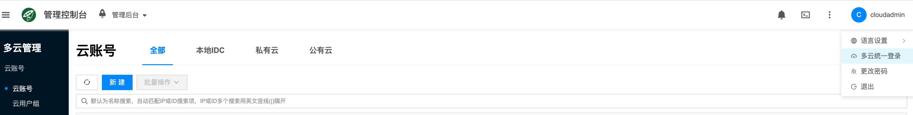

# 最佳实践

## 启用免密认证

- 找到需要开启免密登录的云账号
- 查看云账号右侧, 单击 **更多** > **属性设置** > **设置免密登录** 如下图所示

- 单击 **开启** 按钮, 点击 **确定** 开启免密登录 如下图所示

:::tip
若关闭免密登录，云账号不会删除底下免密登录资源，仅会禁止用户免密登录
:::

## 身份提供商
开启之后云平台会在此云账号底下各个云订阅创建身份提供商
- 选取此云账号底下任意云订阅查看身份提供商是否正常创建，如下图所示

:::tip
平台会同步其他注册的身份提供商，只要其中存在一个可用的身份提供商即可。
部分公有云有身份提供商数量限制，若超出限制，删除部分身份提供商后，再启用禁用云账号，平台会重新开始创建身份提供商
:::

## 新建云用户组
- 如下图所示

## 新建免密用户
- 如下图所示

## 测试免密登录

- 单击平台右上角用户名，再单击 **多云统一登录** 如下图

- 点击 **免密登录用户** 切换到免密用户列表,如下图

- 单击用户列表右侧 **免密登录** 进行测试

