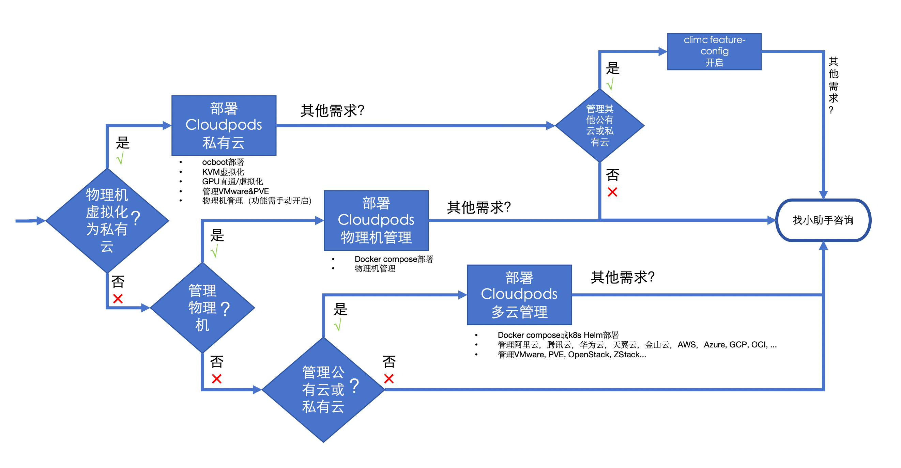

# 快速开始

请根据功能使用场景选择要部署的 Cloudpods 产品：

import Tabs from '@theme/Tabs';
import TabItem from '@theme/TabItem';

- 私有云：私有云部署方式包含本地 IDC 基础设施管理的功能，是一个轻量级的私有云实现，包含了虚拟机、存储、网络、GPU卡和裸金属等功能。
    - [快速部署私有云](./onpremise/quickstart-virt)
- 多云管理：多云管理部署方式包含了纳管 VMware、私有云和公有云的功能，帮助企业统一管理异构 IT 基础设施资源。
    - [使用 docker compose 快速部署多云管理](./cmp/quickstart-docker-compose)
    - [使用 helm 在 Kubernetes 上部署多云管理](./cmp/quickstart-k8s-helm)
- 物理机管理：轻量级物理机管理服务，包含将物理机加入资源池，裸金属安装操作系统，磁盘 raid 和 bonding 网络配置等各种生命周期管理等功能。
    - [使用 docker compose 快速部署物理机管理](./baremetal/docker-compose)

## 如何选择？

import IndexDocCardList from '@site/src/components/IndexDocCardList';

<IndexDocCardList />
