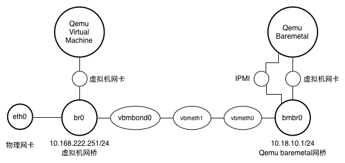

# 模拟物理机环境

## 背景

在默认部署的环境中，我们往往没有实际的物理机，这个时候要测试物理机和裸金属的管理逻辑，就比较麻烦。

这个时候就可以使用计算节点上的 [qemu](https://github.com/yunionio/qemu/tree/stable-2.12) 和 [OpenIPMI](https://openipmi.sourceforge.io/) 启动虚拟机，模拟物理机环境。

:::warning
以下步骤的前提是在私有云 All in One 环境的节点上运行的，如果没有环境，请先参考"[Ocboot 私有云 All in One 快速安装](../../../getting-started/onpremise/quickstart-virt)"文档搭建测试环境。
:::

## 配置环境

1. 首先需要安装 `OpenIPMI、gcc、screen和git` 这些工具。

下面步骤是基于 CentOS 7 测试的，其他发行版也大同小异，使用对应的包管理工具安装就行。

```bash
$ yum install -y OpenIPMI gcc screen git
```

2. 使用 git clone 拉取模拟 baremetal 环境的代码，这些代码使用 python3 编写，有少量 c 写的代码，所以需要 gcc 编译下。

其中 baremetal-env 会创建 qemu 结合 OpenIPMI 的环境，包括模拟出 BMC 和相关网络。

```bash
# 拉取代码
$ git clone https://github.com/yunionio/baremetal-env

# 进入目录
$ cd baremetal-env

# 编译 dhtest
$ make dhtest
```

## 配置网络

如下图所示，在宿主机内为模拟的物理机专门分配一个网桥bmbr0，用于给qemu模拟的baremetal提供网络接入，给 baremetal 物理机单独创建一段 10.18.10.0/24 的IP网络。



:::info
注意：这里通过一对veth pair(vbmeth0, vbmeth1)将bmbr0连接到br0。之所以在vbmeth1和br0之间增加一个bond设备vbmbond0，是因为sdnagent会周期性检测宿主机上网桥br0接入的veth和tap设备，如果发现与配置不符合，就会删除多余的veth和tap设备，所以不能直接将veth设备接入到br0，而通过一个bond设备中转。
:::

执行如下脚本创建该网络拓扑：

```bash
$ ./bmtest-network.sh start br0 10.18.10.1
```

接下来把这个网段拆分成3个部分，分别用于IPMI，PXE和baremeta的IP地址分配：

- 10.18.10.2-10.18.10.99为IPMI网段
- 10.18.10.100-10.18.10.199为PXE网段
- 10.18.10.200-10.18.10.254为物理机操作系统网段

```bash
# 首先创建 对应的wire
$ climc wire-create zone0 bmwire 1000
 
 
# 其次创建对应的IP子网
$ climc network-create --server-type ipmi --gateway 10.18.10.1  bmwire ipmi0 10.18.10.2 10.18.10.99 24
$ climc network-create --server-type pxe --gateway 10.18.10.1  bmwire pxe0 10.18.10.100 10.18.10.199 24
$ climc network-create --server-type baremetal --gateway 10.18.10.1  bmwire bmnet0 10.18.10.200 10.18.10.254 24
```

## 开启 baremetal agent 服务

在当前节点开启 baremetal agent 服务，下面假设当前节点名为 lzx-k3s-t1，这里需要根据自己的环境使用 `kubectl get nodes` 获取节点名称。

```bash
$ CUR_NODE=lzx-k3s-t1
$ kubectl label node $CUR_NODE onecloud.yunion.io/baremetal=enable
```

等待 baremetal-agent pod 变成 Running，使用下面的命令查看：

```bash
$ kubectl get pods -n onecloud | grep bare
default-baremetal-agent-5bd65898bf-spqrf   1/1     Running            0                  3m38s
```

## 配置dhcp relay

在当前节点，启动一个 dhcp relay 服务，将 bmbr0 上的 dhcp 请求转发到监听 br0 地址的 baremetal-agent 服务上。

使用下面的命令查看 br0 网桥上的 ip :

```bash
$ ip addr show br0
45: br0: <BROADCAST,MULTICAST,UP,LOWER_UP> mtu 1500 qdisc noqueue state UNKNOWN group default qlen 1000
    link/ether 00:22:00:8d:1b:af brd ff:ff:ff:ff:ff:ff
    inet 10.127.100.149/24 brd 10.127.100.255 scope global br0
       valid_lft forever preferred_lft forever
    inet6 fe80::222:ff:fe8d:1baf/64 scope link
       valid_lft forever preferred_lft forever
```

:::warning
发现 br0 上的 ip 是 `10.127.100.149` ，这个 ip 需要替换成对应环境的地址。
:::

```bash
$ BR0_IP=10.127.100.149
$ docker run --rm --network host -ti registry.cn-beijing.aliyuncs.com/zexi/dhcprelay:20240129.0 /opt/yunion/bin/dhcprelay --interface bmbr0 --ip 10.18.10.1 --relay $BR0_IP
```

## 创建 baremetal 实例

使用 `bmtest.py` 创建物理机实例：

```bash
# ./bmtest.py <bm_dir> <bridge> <BMC_IP> <BMC_IP_MASK> <INDEX>
$ ./bmtest.py /opt/bm_dir1 bmbr0 10.18.10.99 255.255.255.0 1
VNC port: 201 # 输出的 vnc 端口，需要加上 5900，所以实际的连接端口是 6101
Formatting '/opt/bm_dir1/disk0', fmt=qcow2 size=104857600000 cluster_size=65536 lazy_refcounts=off refcount_bits=16 # 第一块磁盘
Formatting '/opt/bm_dir1/disk1', fmt=qcow2 size=104857600000 cluster_size=65536 lazy_refcounts=off refcount_bits=16 # 第二块磁盘
net interface 0 MAC: 00:22:69:d2:00:7a # 第一张网卡的 mac 地址，用于 pxe 启动
net interface 1 MAC: 00:22:06:61:6e:26
```

在平台注册物理机记录，这里需要使用第一张网卡的 MAC 地址，上面生成的是 `00:22:69:d2:00:7a`：

```bash
$ climc host-create vbm1 00:22:69:d2:00:7a
```

## 启动物理机实例

进入 `/opt/bm_dir1`，运行 `bm_start` 脚本启动 qemu 和 OpenIPMI ，模拟物理机 pxe 启动。

```bash
$ cd /opt/bm_dir1

# 执行bm_start脚本启动，该脚本会在在screen中启动./bm_run脚本
$ ./bm_start

# 找到 qemu 的 vnc 端口，然后使用 vnc 客户端查看
$ cat ./start | grep vnc
# 比如我看到的是 -vnc :201，就可以使用 vnc 客户端链接 6101 端口
```

查看云平台的 baremetal 注册信息:

```bash
$ climc host-list --host-type baremetal
+--------------------------------------+------+-------------------+--------------+---------+---------+-------------+----------+-----------+------------+-----------+--------------+-----------+--------------+
|                  ID                  | Name |    Access_mac     |  Access_ip   | Status  | enabled | host_status | mem_size | cpu_count | node_count | host_type | storage_size | domain_id | public_scope |
+--------------------------------------+------+-------------------+--------------+---------+---------+-------------+----------+-----------+------------+-----------+--------------+-----------+--------------+
| 98e1fa87-e393-4395-8980-39e2ec3f5600 | vbm1 | 00:22:69:d2:00:7a | 10.18.10.199 | running | false   | offline     | 0        | 0         | 0          | baremetal | 0            | default   | system       |
+--------------------------------------+------+-------------------+--------------+---------+---------+-------------+----------+-----------+------------+-----------+--------------+-----------+--------------+
***  Total: 1 Pages: 1 Limit: 20 Offset: 0 Page: 1  ***
```

## 其他命令


```bash
# 停止
$ sudo ./bm_stop
 
 
# 找到 qemu 的 vnc 端口，然后使用 vnc 客户端查看
$ cat ./start | grep vnc
# 比如我看到的是 -vnc :201，就可以使用 vnc 客户端链接 6101 端口

# 查看 baremetal ipmi 信息
$ climc host-ipmi vbm1
+----------+---------------+
|  Field   |     Value     |
+----------+---------------+
| ip_addr  | 192.168.0.2   |
| password | YunionDev@123 |
| present  | true          |
| username | root          |
+----------+---------------+
 
 
# 获取baremetal pxe系统 ssh 登录信息
$ climc host-logininfo vbm1
+----------+------------------+
|  Field   |      Value       |
+----------+------------------+
| ip       | 192.168.0.254    |
| password | ZF6hRgRWMCmZgg9F |
| username | root             |
+----------+------------------+
 
 
# 装机
$ climc host-enable vbm1
$ climc server-create --disk centos-7.3.1611-20180104.vmdk --allow-delete --auto-start --hypervisor baremetal --ncpu 2 test-bm 2048 --host vbm1
 
 
# 转换宿主机
$ climc host-enable BM002253674848
$ climc host-convert-hypervisor --image cloud-template-2.6.0-20190316.qcow2 vbm1
```
