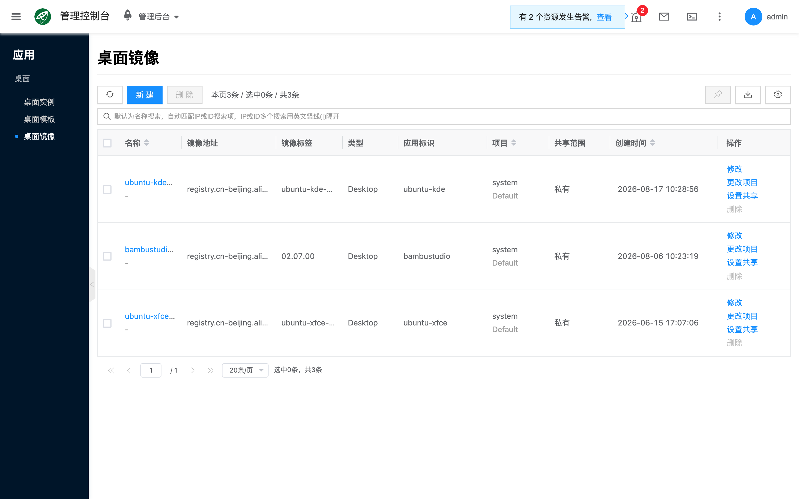

# 桌面镜像

## 概念介绍

桌面镜像是运行 Desktop 类桌面应用的容器镜像。在 [桌面模板](./template) **导入** 社区应用时会同步生成镜像；也可在本页 **新建**。创建模板时须选择类型为 Desktop 的镜像。与其它产品菜单下的容器镜像资源分属不同入口，勿混用。

控制台路径为 **应用 → 桌面 → 桌面镜像**。列表仅展示 `llm_type=desktop` 的镜像条目。

## 常用操作

### 新建

列表点击 **新建**，填写名称、类型、镜像地址、标签与应用标识等并保存。类型须为 Desktop，并与后续模板一致。依赖 GPU 的桌面应用所选镜像还需与 [容器主机](../container/) 节点的 GPU 环境匹配（可参考 [NVIDIA MPS](../container/50_mps)）。更换镜像版本前，建议先在测试模板或实例中验证。

- **名称**：镜像条目在平台中的显示名称；编辑时通常只读。
- **类型**：Desktop；编辑时通常只读。
- **镜像名**：容器镜像仓库地址（含路径）。
- **标签**：镜像 tag。
- **应用标识**：桌面应用的标识字段（`app_name`），用于区分不同桌面应用包；社区导入条目常带有该字段。

从 [桌面模板](./template) **导入** 社区应用时，也会自动创建对应镜像条目。

### 查看详情

打开某一桌面镜像的侧栏详情，常见页签包括：

- **详情**：查看类型、应用标识、镜像地址、标签与状态等信息。
- **操作日志**：排查创建、修改与相关任务事件。

### 其他操作

- **编辑**：调整镜像名、标签、应用标识等（名称与类型通常不可改）。
- **更改项目** / **设置共享范围**：按项目管理与可见性需要使用。
- **删除**：确认无模板依赖后再删除。

## 常见问题

### 镜像拉取失败

检查节点网络与 DNS；私有仓库检查鉴权与权限；确认镜像地址与标签正确。

### 模板里选不到镜像

确认镜像类型为 Desktop，已创建成功且处于可用状态；请在本菜单（桌面镜像）中查找，勿与其它镜像入口混淆。
