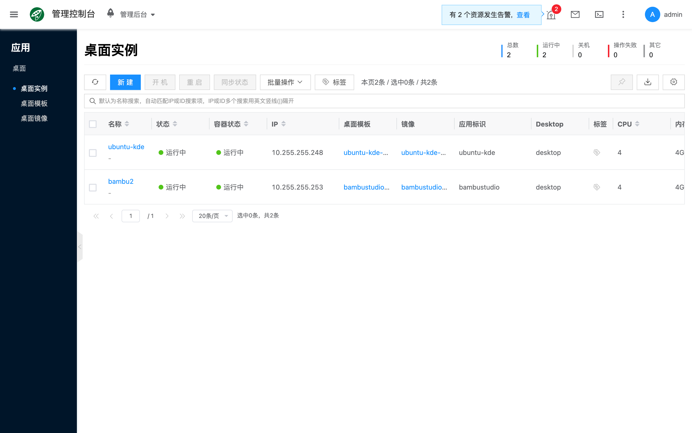
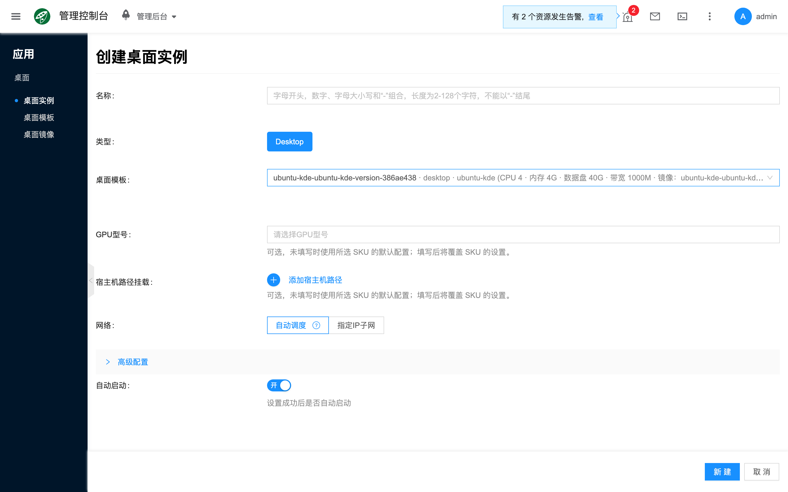
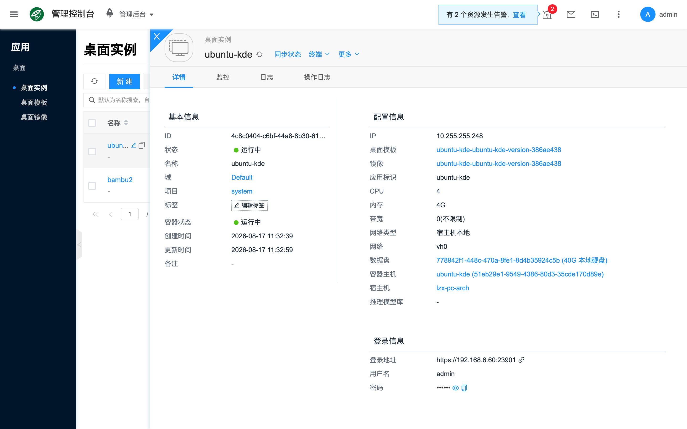

# 桌面实例

## 概念介绍

桌面实例是按 **桌面模板** 创建的可运行桌面应用，对应控制台 **应用 → 桌面 → 桌面实例**。类型固定为 Desktop（`desktop`）。创建前须先有可用的 [桌面模板](./template)（通常通过社区 **导入** 获得，并同步生成 [桌面镜像](./image)）。实例调度到 [容器主机](../container/) 节点上运行。端到端步骤见 [快速开始](./quickstart)。

实例就绪后，可在详情 **登录信息** 中点击 **登录地址** 打开桌面，并可查看用户名与密码；也可使用列表上的 **终端** 进入容器排查。

## 常用操作

### 新建

列表点击 **新建**（页标题为「创建桌面实例」），填写名称、选择桌面模板与调度相关配置后提交。

- **名称**：实例名称。
- **类型**：固定为 Desktop；由当前菜单决定，一般无需改选。
- **桌面模板**：选用已导入或新建的 [桌面模板](./template)；决定镜像、CPU、内存、数据盘、端口与默认 GPU 等规格。
- **GPU 型号**：可覆盖模板中的 GPU 配置（可选）；须与节点可用设备匹配。
- **宿主机路径挂载**：将宿主机目录或文件挂载进容器（可选）。
- **模型**：挂载平台内模型文件（可选；视模板与能力是否支持）。
- **网络**：自动调度或指定 IP 子网。
- **指定宿主机**：将实例调度到指定主机（可选；高级配置中如有）。

创建完成后，在详情 **登录信息** 中点击 **登录地址** 打开桌面，并可查看用户名与密码。

### 查看详情

打开某一桌面实例的侧栏详情，常见页签与信息包括：

- **详情**：状态、类型、模板、资源规格、网络与 **登录信息**（含可点击的 **登录地址**、用户名、密码等）。
- **终端**：进入实例内容器（须实例处于可连接状态，如 running）。
- **日志**：查看服务输出，用于排障。
- **操作日志**：排查创建、启停与相关任务事件。

### 其他操作

列表或详情操作（受状态与权限约束）包括：

- **同步状态**：刷新实例状态。
- **终端**：按容器打开 Web 终端。
- **开机** / **关机** / **重启**：启停实例。
- **更改项目**：调整所属项目。
- **删除**：确认业务不再使用后再删除。

## 常见问题

### 创建后无法打开登录地址

确认实例状态为运行中；检查网络与安全组是否放通对应端口（桌面默认容器端口多为 `3001`，以模板端口映射为准）；在详情中核对 **登录地址** 是否已生成。

### 创建实例时调度失败

检查 [容器主机](../container/) 节点的 CPU、内存、数据盘与 GPU；若模板或创建表单指定了宿主机或 GPU 型号，确认目标节点确有可分配资源。依赖 GPU 的桌面应用需节点已正确配置 GPU 透传或共享（可参考 [NVIDIA MPS](../container/50_mps)）。

### 列表里没有可用模板

先到 [桌面模板](./template) 通过 **导入** 或 **新建** 生成模板（导入会同步创建 [桌面镜像](./image)）。
