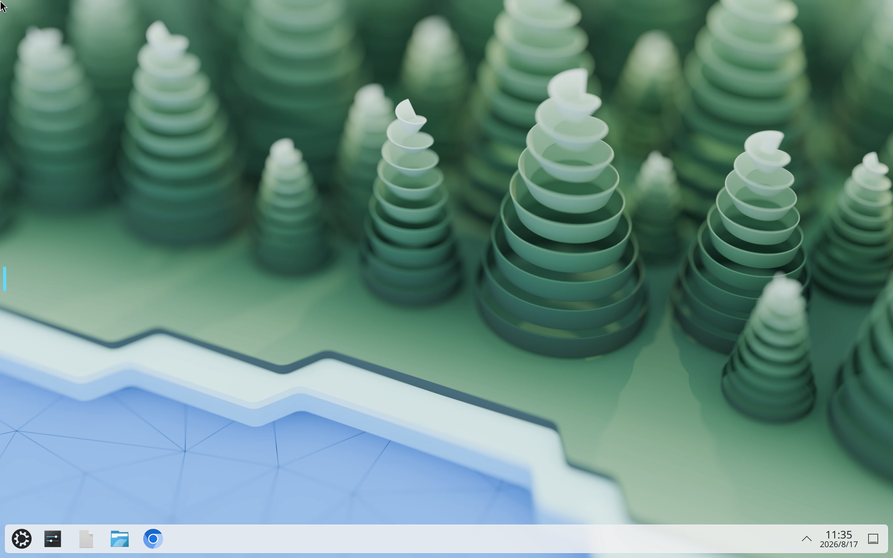

# 快速开始

以社区桌面应用 **ubuntu-kde** 为例，完成端到端路径：在 **桌面模板** **导入** 生成模板与镜像 → 基于模板 **新建** 桌面实例 → 在详情 **登录信息** 中点击 **登录地址** 打开桌面。

实例调度到 [容器主机](../container/) 节点上运行。概念与字段说明见 [桌面模板](./template)、[桌面实例](./instance)、[桌面镜像](./image)。

## 步骤概览

1. [导入 ubuntu-kde 桌面模板](#import-template)
2. [创建 ubuntu-kde 桌面实例](#create-instance)
3. [访问桌面](#access)

## 导入 ubuntu-kde 桌面模板 {#import-template}

1. 进入 **应用 → 桌面 → 桌面模板**。

2. 点击 **导入**，在社区目录中选择 **ubuntu-kde**，打开配置抽屉。

3. 按需配置 GPU 等规格后提交导入。导入成功后，平台会生成对应的 [桌面镜像](./image) 与默认 [桌面模板](./template)（列表中可看到应用标识为 `ubuntu-kde` 的模板）。

:::tip
导入后如需调整 CPU、内存、镜像或端口，可对模板执行 **修改**；字段说明见 [桌面模板](./template)。
:::

## 创建 ubuntu-kde 桌面实例 {#create-instance}

1. 进入 **应用 → 桌面 → 桌面实例**，点击 **新建**。
2. 在 **桌面模板** 中选择刚导入的 ubuntu-kde 模板，填写实例名称与网络等配置后提交。

:::tip
创建页字段说明见 [桌面实例](./instance)。网络可自动调度或指定 IP 子网；请确认目标 [容器主机](../container/) 在线且可调度。
:::

## 访问桌面 {#access}

1. 打开目标桌面实例的侧栏详情。
2. 在 **登录信息** 中点击 **登录地址**，即可在浏览器中打开桌面；按需使用同栏用户名与密码登录。

实例须处于运行中状态；若地址无法打开，检查网络与安全组是否放通模板端口映射（Desktop 默认常见为 TCP `3001`，以实际模板为准），并确认容器计算节点在线。

## 常见问题

### 创建实例时调度失败

检查 [容器主机](../container/) 是否在线（`host_status` 为 online）、以及 CPU、内存、数据盘与 GPU 是否充足。若模板指定了宿主机或 GPU 型号，确认目标节点确有可分配资源。更多说明见 [桌面实例 · 常见问题](./instance)。

### 创建后无法打开登录地址

确认实例状态为运行中；核对详情中的 **登录地址** 是否已生成；检查端口映射与本机到宿主机访问 IP 的连通性。见 [桌面实例 · 常见问题](./instance)。

### 列表里没有可用模板

先完成 [导入 ubuntu-kde 桌面模板](#import-template)，或在 [桌面模板](./template) 中 **新建** 自定义规格。
