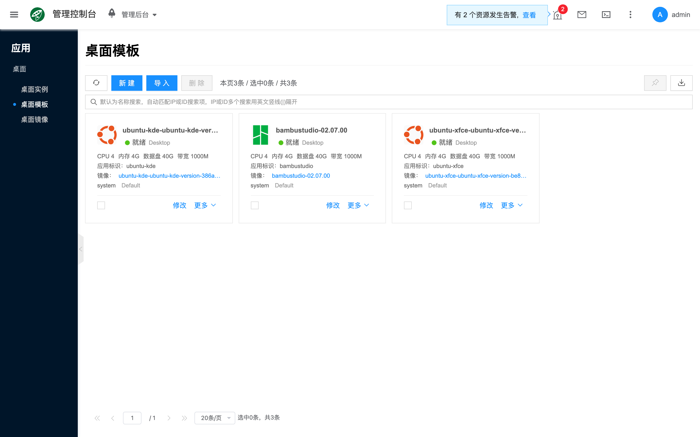
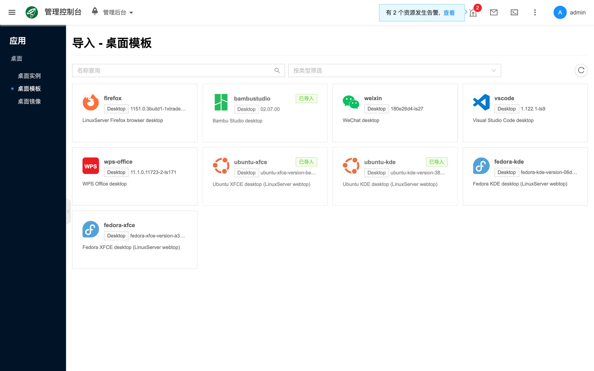
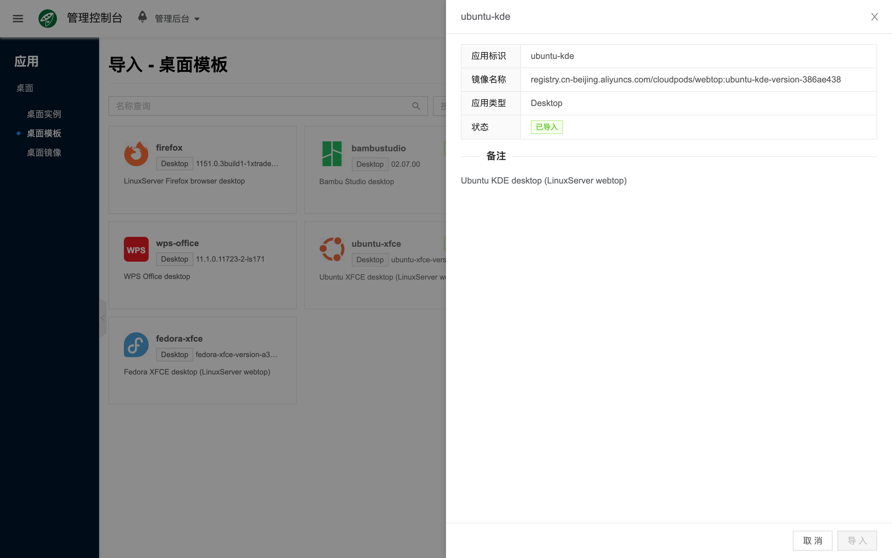
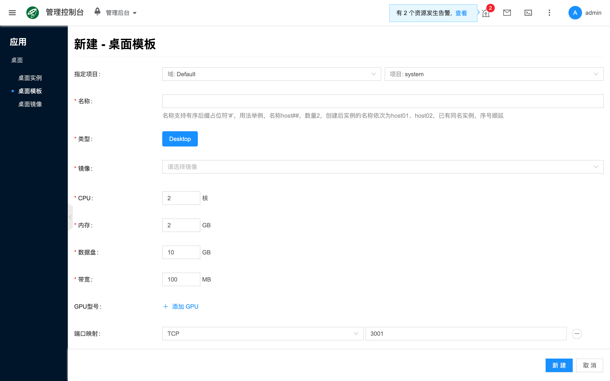
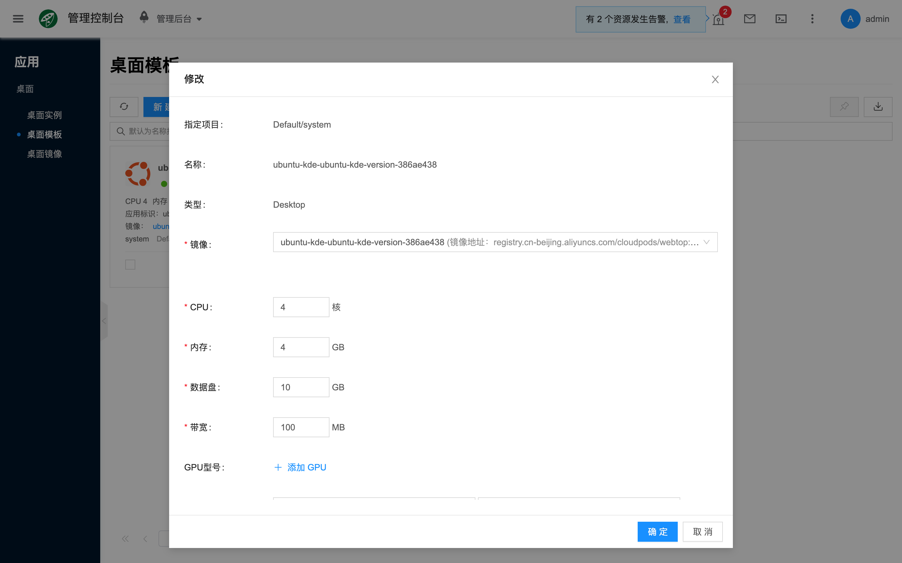

# 桌面模板

## 概念介绍

桌面模板为桌面实例预设可复用的运行配置。创建 [桌面实例](./instance) 时选择模板，即可复用类型、镜像、CPU、内存、GPU、数据盘与端口映射等规格。当节点资源不足或约束不满足时，实例会调度失败。端到端步骤见 [快速开始](./quickstart)。

与实例、镜像的关系如下：

- **桌面实例**：基于模板创建并运行桌面应用；见 [桌面实例](./instance)。
- **桌面镜像**：须与模板类型一致（Desktop）；见 [桌面镜像](./image)。

控制台路径为 **应用 → 桌面 → 桌面模板**。主入口为列表上的 **导入**（从社区目录导入桌面应用模板与镜像）。此处仅导入类型为 Desktop 的社区桌面应用。

## 常用操作

### 导入

列表点击 **导入**，在社区目录中选择目标桌面应用，按需配置 GPU 等规格后提交。导入成功后会生成对应的 [桌面镜像](./image) 与默认桌面模板，随后即可在 [桌面实例](./instance) 中 **新建** 实例。

社区条目可能展示 **应用标识**（`app_name`）及镜像地址等信息，用于区分不同桌面应用包。

### 新建

在已有镜像、需自定义规格且不走社区导入时，可使用 **新建**。也可对现有模板执行 **修改**；字段含义相同。

- **指定项目**：模板所属项目；修改时通常只读。
- **名称**：模板名称；修改时通常只读。
- **类型**：Desktop；须与镜像一致。
- **镜像**：选用与类型匹配的 [桌面镜像](./image)。
- **CPU**：容器 CPU 上限（核）。
- **内存**：容器内存上限。
- **数据盘**：持久化数据盘容量，用于应用数据、缓存等。
- **带宽**：网络带宽上限（如有）。
- **GPU 型号**：GPU 设备配置（可选）。桌面场景下共享模式可选 **UNLIMITED** / **EXCLUSIVE** 等（以表单可选值为准）；默认常为非独占。
- **端口映射**：容器监听端口与外部映射（Desktop 默认常见为 TCP `3001`，以实际模板为准）。
- **自定义参数 / 环境变量**：按应用需要传入的额外配置（如有）。

类型须与镜像一致，否则无法保存。

### 查看详情

打开某一模板的侧栏详情，可查看类型、镜像、资源规格与端口等；并结合操作日志排查创建与修改事件。

### 其他操作

- **修改**：调整镜像、规格、端口等（例如导入后按节点可用情况改 GPU 型号）。

- **更改项目** / **设置共享范围**：按项目管理与可见性需要使用。
- **删除**：确认无实例依赖后再删除。

## 常见问题

### 创建实例时调度失败

检查 [容器主机](../container/) 节点的 CPU、内存、数据盘与 GPU；若模板指定了宿主机或 GPU 型号，确认目标节点确有可分配资源。

### 模板里选不到镜像

确认已通过 **导入** 或自行创建类型为 Desktop 的 [桌面镜像](./image)，且镜像处于可用状态。
