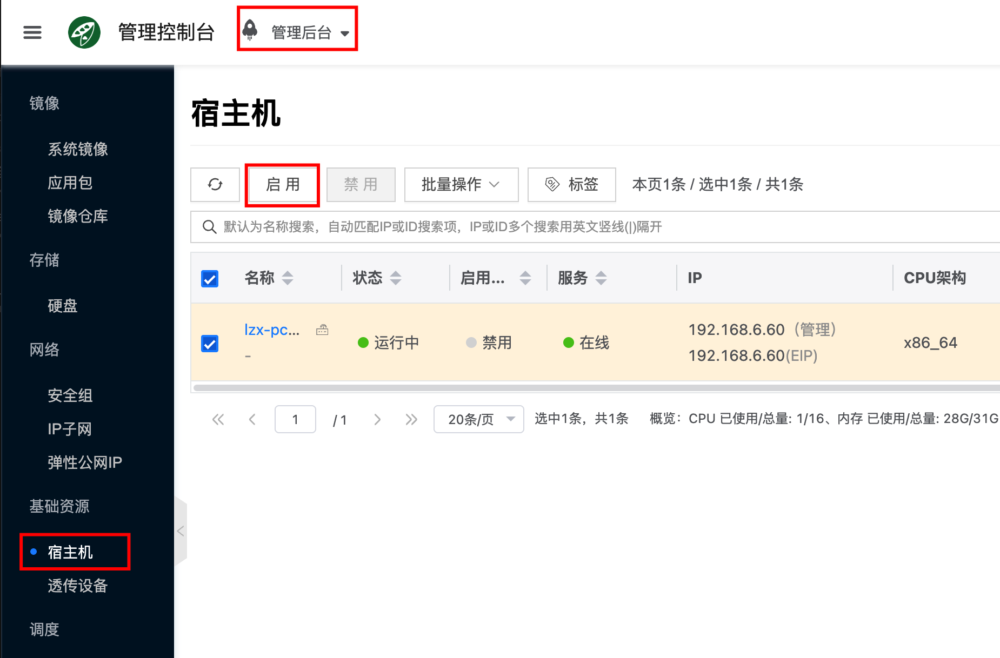

All in One 部署的节点会部署 Cloudpods host 计算服务，作为宿主机，具有创建和管理私有云虚拟机的能力。没有虚拟机界面应该是 Cloudpods 环境中没有启用宿主机。

请到 `管理后台` 界面，点击 `主机/基础资源/宿主机` 查看宿主机列表，启用相应的宿主机，刷新界面就会出现虚拟机界面。

:::note
如果要使用 Cloudpods 私有云虚拟机，并且宿主机是 CentOS 7 的发行版。需要宿主机使用 Cloudpods 编译的内核，可使用以下命令查看宿主机是否使用 Cloudpods 内核(包含 yn 关键字)。

```bash
# 查看是否使用 yn 内核
uname -a | grep yn
Linux office-controller 3.10.0-1160.6.1.el7.yn20201125.x86_64

# 如果内核不是带有 yn 关键字的版本，可能是第一次使用 ocboot 安装，重启即可进入 yn 内核
reboot
```
:::


