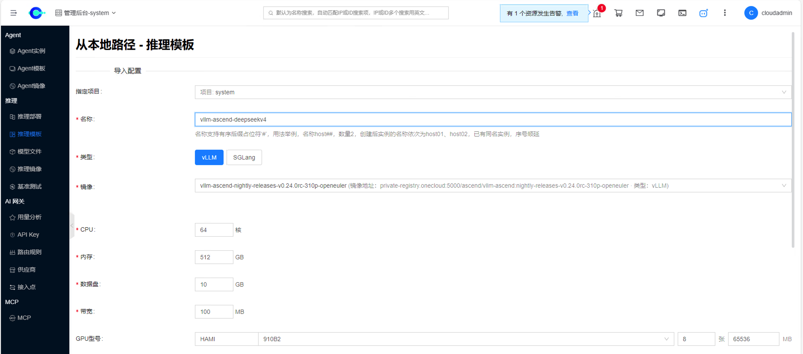
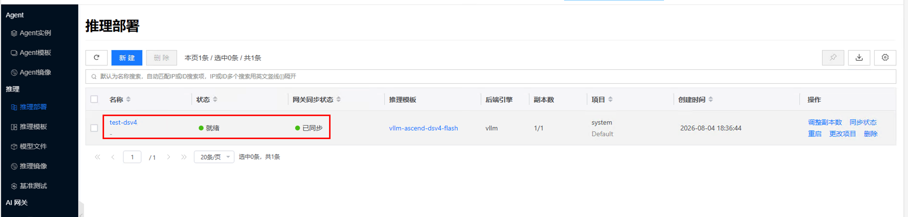
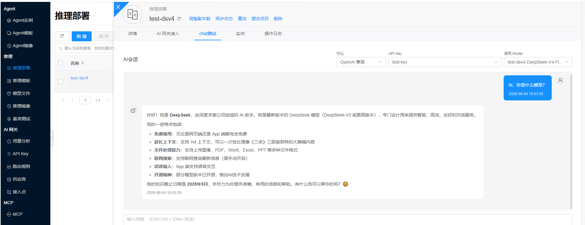
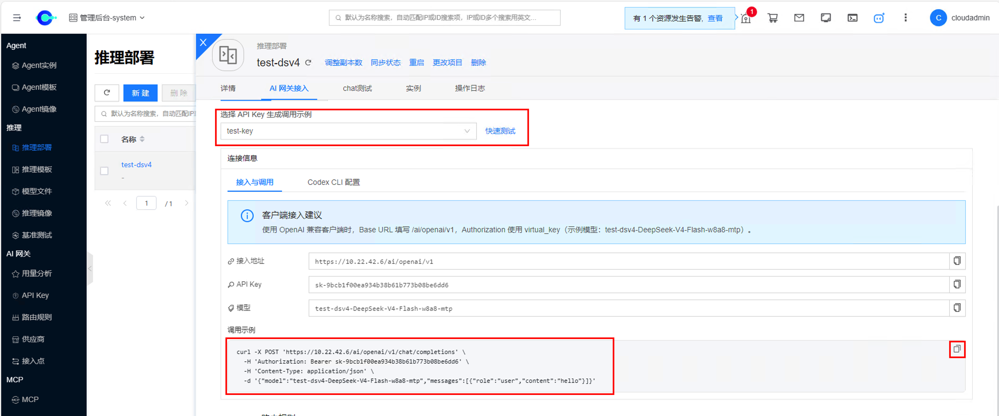

# Run DeepSeek V4 Flash on Ascend NPU

## Overview

This page describes how to deploy **DeepSeek-V4-Flash** on **Huawei Ascend NPU** nodes using the **vLLM Ascend** image (example weight directory name: `DeepSeek-V4-Flash-w8a8-mtp`). Unlike the NVIDIA CUDA path, Ascend depends on the Ascend driver, NPU devices (such as `/dev/davinci*`), and related tools (such as `npu-smi`).

The platform workflow is: **Inference Image** → **Inference Template** (import from local path) → **Inference Deployment**. For fields and general operations, see [Inference Images](../image), [Inference Templates/Import from Local Path](../template#import-local-path), and [Inference Deployments](../deployment). For chat / curl verification, see [AI Inference/Quick Start](../quickstart).

## Prerequisites

- Ascend drivers are installed on the target host, `npu-smi` can query NPUs, and the platform has onboarded the node as a container compute node.
- DeepSeek-V4-Flash weights are available on the host at an absolute path (example: `/opt/models/DeepSeek-V4-Flash-w8a8-mtp`; use the path in your environment).


- The **vLLM Ascend** image can be pulled from a registry or is already synced (example tag: `v0.22.1rc1-linuxarm64`).

## Reference: Bare-Metal Docker Startup {#bare-metal-docker}

The following commands are for comparison: how Ascend devices and driver directories are mounted on bare metal, and the `vllm serve` startup arguments.

When you create an inference deployment on the platform, the example `--device …` arguments (NPU devices and related) and `-v …` mounts (Ascend driver, tools, and config directories) are **injected automatically by the platform runtime**. You do not need to enter them in the template or custom parameters. Register the inference image, set the local model path, and configure custom parameters equivalent to the `vllm serve` arguments below.

```bash
# docker run command
docker run --rm \
  --name vllm-ascend \
  --net=host \
  --shm-size=512g \
  --device /dev/davinci0 \
  --device /dev/davinci1 \
  --device /dev/davinci2 \
  --device /dev/davinci3 \
  --device /dev/davinci4 \
  --device /dev/davinci5 \
  --device /dev/davinci6 \
  --device /dev/davinci7 \
  --device /dev/davinci_manager \
  --device /dev/devmm_svm \
  --device /dev/hisi_hdc \
  -v /usr/local/dcmi:/usr/local/dcmi \
  -v /usr/local/Ascend/driver/tools/hccn_tool:/usr/local/Ascend/driver/tools/hccn_tool \
  -v /usr/local/bin/npu-smi:/usr/local/bin/npu-smi \
  -v /usr/local/Ascend/driver/lib64/:/usr/local/Ascend/driver/lib64/ \
  -v /usr/local/Ascend/driver/version.info:/usr/local/Ascend/driver/version.info \
  -v /etc/ascend_install.info:/etc/ascend_install.info \
  -v /etc/hccn.conf:/etc/hccn.conf \
  -v /opt/models/DeepSeek-V4-Flash-w8a8-mtp:/model \
  docker.io/ascendai/vllm-ascend:v0.22.1rc1-linuxarm64 \

# vllm serve command
vllm serve /model \
    --tensor-parallel-size 8 \
    --served-model-name DeepSeek-V4-Flash \
    --port 8000 \
    --host 0.0.0.0 \
    --trust-remote-code \
    --max-model-len 8192 \
    --gpu-memory-utilization 0.9 \
    --enforce-eager \
    --speculative-config '{"method": "mtp", "num_speculative_tokens": 1}'
```

Notes:

- `--device` and `-v` are listed only for bare-metal comparison; they are injected automatically on platform deployments and must not be entered as custom parameters.
- The example uses 8 NPUs (`davinci0`–`davinci7`) with `--tensor-parallel-size 8`; the card count and this parameter must match.
- Replace the image and weight paths with your registry and host paths.
- Some environments also set `HCCL_*`, `VLLM_ASCEND_*`, `quantization ascend`, a longer `max-model-len`, and similar options; follow the vLLM Ascend version you use.

## Platform Operations

### 1. Create an Inference Image

1. Go to **Artificial Intelligence → Inference → Inference Images**, and click **Create**.
2. Set **Type** to **vLLM**.
3. Fill in **Name**, **Image**, and **Tag**. Examples:
   - Image: `private-registry.onecloud:5000/ascend/vllm-ascend` (or public `docker.io/ascendai/vllm-ascend`)
   - Tag: `v0.22.1rc1-linuxarm64`
4. Submit and save.


For field descriptions, see [Inference Images/Create](../image).

### 2. Import an Inference Template from a Local Path

1. Go to **Artificial Intelligence → Inference → Inference Templates**, open **Import Model**, and choose **From Local Path**.


2. Enter the host model path (example: `/opt/models/DeepSeek-V4-Flash-w8a8-mtp`), set the engine to **vLLM**, and select the vLLM Ascend image registered above for **Image**.
3. Fill in CPU, memory, and other resources based on the node; for **GPU Model**, choose an Ascend-related specification (example: HAMI / `910B2` × 8; set per-card memory as required by the UI, such as `65536` MiB). For local-path import in HAMI scenarios, per-card memory must be entered manually.




4. Under **Custom Parameters**, add the key items equivalent to the `vllm serve` arguments above (examples). Device and driver mounts (`--device` / `-v`) do not need to be entered manually; see [Reference: Bare-Metal Docker Startup](#bare-metal-docker).

| Parameter | Example value |
| --- | --- |
| `device` | `ascend` |
| `trust-remote-code` | (toggle-style; may be left empty per UI convention) |
| `max-model-len` | `8192` |
| `gpu-memory-utilization` | `0.9` |
| `enforce-eager` | (toggle-style; may be left empty per UI convention) |
| `speculative-config` | `{"method": "mtp", "num_speculative_tokens": 1}` |

`tensor-parallel-size` is usually set automatically by the platform from the GPU/NPU count; do not conflict with the card count.


5. Submit the import and wait until the template is ready (for example **Ready vLLM**). For more fields, see [Inference Templates/Import from Local Path](../template#import-local-path).

### 3. Create an Inference Deployment

1. Click **Deploy** on the template card, or go to **Artificial Intelligence → Inference → Inference Deployments → Create** and select the template.
2. Enter a name; set **Host** to the Ascend node where the model is stored (the model must exist at the same path on the selected host).
3. Under **Deployment Configuration → Network**, select a NIC/subnet that can reach the inference service (example environment: `vh0`; use your actual network), then submit.


For operations and detail tabs, see [Inference Deployments](../deployment).

### 4. Verify

1. Wait until the deployment **Status** is **Ready** and **Gateway Sync Status** is **Synced**.



2. Create an [API Key](../../ai-proxy/api-key), then run a [chat test](../quickstart#chat-test) on the deployment details page. The `model` used in calls must match the model name shown in the UI (or the `served-model-name` used at startup).

Example chat with DeepSeek V4 Flash:



3. On **AI Gateway Access**, select an API Key and copy the sample curl. For steps, see [AI Inference/Quick Start/curl](../quickstart#aiproxy-curl).



4. Run the curl command in a terminal and confirm a normal response.


## FAQ

### NPU unavailable or scheduling failed

On the host, confirm the Ascend driver and `npu-smi`; check that the platform node is online and recognizes the NPU/Ascend device model; ensure the template card count matches allocatable cards on the node.

### Import or startup reports an invalid model path

Confirm the same absolute path exists on the selected host and that the directory contains weights and config files; if a host is specified at deploy time, do not switch to a node without the model.

### Custom parameters not applied or startup failed

Check that parameter names are supported by your vLLM Ascend version; verify boolean toggles and JSON parameters (such as `speculative-config`); inspect engine errors in the deployment/instance **Logs**. After changing the image version, re-check custom parameters.
