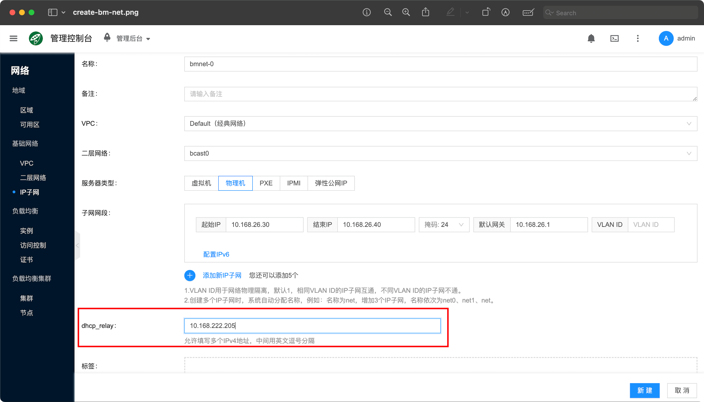
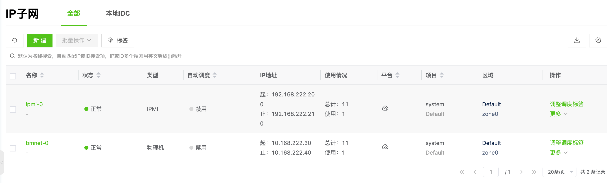
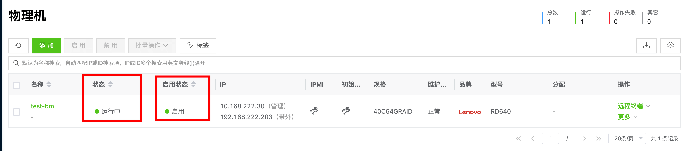
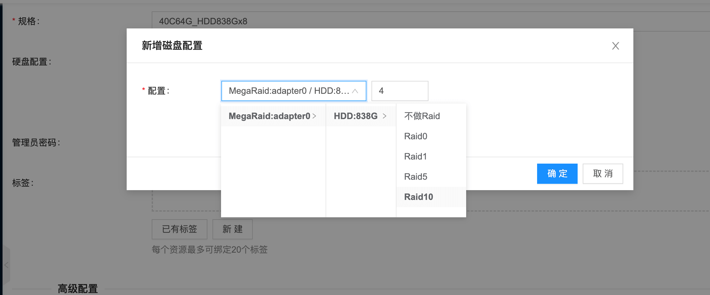
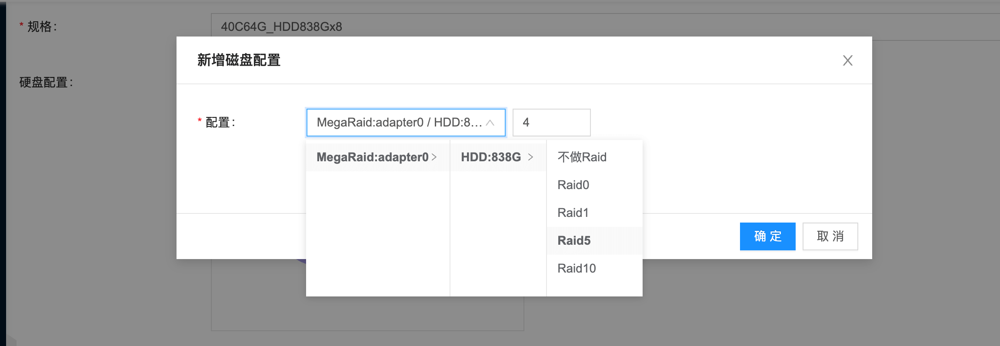

# Quick Installation via Docker Compose

Quickly deploy Cloudpods Baremetal bare metal management service using [Docker Compose](https://docs.docker.com/compose/).

## Environment Preparation

### Machine Configuration Requirements

- Minimum configuration requirements: CPU 2 cores, memory 4GiB, storage 100GiB
- docker version: ce-23.0.2
    - docker is recommended to install the latest ce version. New versions already include docker-compose plugin
    - docker needs to enable container networking and iptables

### Install and Configure docker

:::tip Note
If your environment already has a new version of docker installed, you can skip this step.
:::

Please refer to the official documentation for installation: [Install Docker Engine](https://docs.docker.com/engine/install/).

## Run Cloudpods Baremetal Service

1. Create a cloudpods-baremetal directory on the deployment machine and enter that directory.

```bash
mkdir cloudpods-baremetal
cd cloudpods-baremetal
```

2. Use the following command to download the docker compose configuration file for running bare metal management.

```bash
curl https://raw.githubusercontent.com/yunionio/ocboot/master/compose/baremetal/docker-compose.yml -o docker-compose.yaml
```

3. Run the following docker compose command in the cloudpods-baremetal directory.

Run the service, note that you need to set LISTEN_INTERFACE and PUBLIC_IP environment variables.

- **LISTEN_INTERFACE**: Network card that the service listens on, such as eth0. This network card will be responsible for accepting DHCP requests.
- **PUBLIC_IP**: IP address that the service listens on, which is the IP address on the corresponding LISTEN_INTERFACE network card. You can view the address on the corresponding network card through `ip addr show`.

The following command assumes that the ip address on the eth0 network card is 10.168.222.205. Please set according to your own environment.

```bash
LISTEN_INTERFACE=eth0 PUBLIC_IP=10.168.222.205 docker compose up
```

4. After the service starts, you can log in to **https://$PUBLIC_IP** to access the frontend service. The default login username and password are: admin and admin@123.


## Manage Bare Metal Test

After the bare metal management service is deployed, next manage bare metal for testing.

:::tip Note
- Physical machines to be managed need to be in the same broadcast domain as the node running the service
- Other dhcp services need to be disabled in this broadcast domain, because the baremetal bare metal management service will run a dhcp service
- If the physical machines to be managed run in other broadcast domains, you need to configure dhcp relay on the switch to the PUBLIC_IP address of the bare metal management service
:::

Physical machine information to be managed:

- Model: Lenovo RD640
- IPMI out-of-band information:
    - IP: 192.168.222.203
    - User: root
    - Password: YourIPMI@Password
- BIOS sets PXE network boot as the first boot order

### 1. Create Bare Metal Network Segment

To manage bare metal, you need to create 3 types of IP subnets: PXE, IPMI and bare metal.

- Bare metal type: This network segment is used for physical machine PXE network boot and bare metal (install operating system)
- IPMI type: Used to record physical machine BMC out-of-band control addresses

These two network segments need to be network reachable from the node where the service is running. Please set according to your network environment.

Click "Network/IP Subnet/New" on the frontend to create the following two subnets.

1. Create a bare metal type subnet. Assume the network segment for physical machine PXE boot is 10.168.222.30 to 10.168.222.40, gateway is 10.168.222.1, **and set dhcp_relay to PUBLIC_IP**, name is bmnet-0.

:::tip Note
- The start and end ip range of this bare metal type network segment, as well as the default gateway, are related to the actual environment network environment, corresponding to the configuration on switches and routers. Note that the divided ip should not conflict with existing environments
- **Here you must set dhcp_relay to PUBLIC_IP, which is 10.168.222.205 in this environment. Please modify according to your own environment.**
    - Because the baremetal-agent service will only respond to unicast dhcp requests from dhcp_relay. The service deployed with docker compose includes a dhcp_relay service, which also listens on PUBLIC_IP and will relay dhcp broadcasts to the agent service.
:::



2. Create an IPMI type subnet. This network segment needs to include the physical machine's ipmi ip. Assume it is 192.168.222.200 to 192.168.222.210, gateway is 192.168.222.1, name is ipmi-0.


4. View the 2 created network segments.




### 2. Manage Bare Metal

Add bare metal on the frontend. Click "Host/Bare Metal/Add", select "PXE Registration Boot", and enter the corresponding bare metal management information.

- Name: test-bm
- IPMI information (these should be based on the specific machine's environment)
    - IPMI address: 192.168.222.203
    - IPMI username: root
    - IPMI password: YourIPMI@Password
- Management port MAC address: 70:e2:84:07:78:16
    - MAC address of the network card for PXE network boot. If the physical machine supports Redfish API, this can be left blank. The platform can automatically detect it
- Management port IP: Select the bmnet-0 subnet created just now


After creation is complete, you can see in the bare metal list that the machine is in "Preparing" status and has detected the brand as Lenovo.


You can access the physical machine's out-of-band console and see that the physical machine starts PXE boot. If the network configuration is correct, the physical machine will obtain the grub boot configuration issued by the bare metal management service.

<!--  -->

After obtaining the grub configuration, the physical machine will download the kernel and initramfs from the management service's PUBLIC_IP.


After download is complete, it will enter the yunionos memory system.


After that, the platform's service will remotely probe and collect the physical machine's hardware information through ssh. When the physical machine becomes "Running" status, the management is successful.

Select the corresponding physical machine, click Enable, and you can perform subsequent operations such as installing operating systems.




### 3. Import Installation Image

Click the "Host/System Image/Upload" button to import the image needed for installation.

- Name: CentOS-7.6.1810-20190430.qcow2
- Enter image URL: https://iso.yunion.cn/vm-images/CentOS-7.6.1810-20190430.qcow2


Wait for the image status to become "Available", and you can use this image to install the operating system.

### 4. Create Bare Metal (Install Operating System)

Click the "Host/Bare Metal/New" button, fill in the following information to install the operating system.

- Name: bm-test
- Image: Select the CentOS-7.6.1810-20190430.qcow2 imported just now
- Specification: Hardware specification of the managed physical machine. For example, **40C64G_HDD838Gx8** in the screenshot below means the physical machine CPU has 40 cores, 64G memory, and 8 838G HDD mechanical disks


- Disk configuration: 
    - Select 4 disks to make RAID10 for system disk

    - The remaining 4 disks make RAID5 as data disk, format ext4 file system and mount to /data directory


    - View partition results


- Network: Select bmnet-0


After configuration is complete, click New and return to the bare metal list. You can see a bare metal record called "bm-test". After deployment is complete, the bare metal status will become "Running".


Then you can log in to the installed system through ssh or out-of-band control to check that the hostname, disk partition and network settings all meet expectations.


For more bare metal related principles and usage introduction, please refer to the documentation: [User Guide/Bare Metal](../guides/baremetal).

## Operation Instructions

### 1. Run Services in Background

You can use the '-d/--detach' parameter to run all services in the background. The command is as follows:

```bash
# Run all services in background
# The following command assumes that the ip address on the eth0 network card is 10.168.222.205. Please set according to your own environment.
$ LISTEN_INTERFACE=eth0 PUBLIC_IP=10.168.222.205 docker compose up -d

# After services are in background, you can view output logs through logs subcommand
$ docker compose logs -f
```

### 2. Log in to climc Command Line Container

If you want to use command line tools to operate on the platform, you can use the following method to enter the container:

```bash
$ docker exec -ti cloudpods-baremetal-climc-1 bash
Welcome to Cloud Shell :-) You may execute climc and other command tools in this shell.
Please exec 'climc' to get started

# source administrator authentication information
bash-5.1# source /etc/yunion/rcadmin
bash-5.1# climc user-list
```

### 3. Log in to Physical Machine PXE Memory System

When the physical machine successfully boots through pxe, it will boot into a memory linux system. You can ssh into this system through the following method for troubleshooting when encountering errors.

```bash
# 1. Enter climc container
docker exec -ti cloudpods-baremetal-climc-1 bash

# 2. View physical machine id
climc host-list

# 3. ssh to host's memory system
climc host-ssh $corresponding_physical_machine_id
```

You can also get the root user's login password through `climc host-logininfo $corresponding_physical_machine_id`.

If the physical machine pxe memory system fails to report login information, it will be set to the default password: mosbaremetal. The corresponding logic can refer to [notification code](https://github.com/yunionio/yunionos/blob/master/src_pxe/etc/init.d/S99notify#L12-L20).


### 4. View Service Configuration and Persistent Data

All service persistent data is stored in the *cloudpods-baremetal/data* directory. All configurations are automatically generated and generally do not need manual modification. The following explains each directory:

```bash
$ tree data
data
├── etc
│   ├── nginx
│   │   └── conf.d
│   │       └── default.conf    # Frontend nginx configuration
│   └── yunion
│       ├── *.conf  # cloudpods various service configurations
│       ├── pki     # Certificate directory
│       ├── rcadmin     # Command line authentication information
├── opt
│   └── cloud
│       └── workspace
│           └── data
│               └── glance # Image service stored image directory
└── var
    └── lib
        ├── influxdb    # influxdb persistent data directory
        └── mysql       # mysql database persistent data directory
```

### 5. Delete All Containers

All service persistent data is stored in the *cloudpods-baremetal/compose/data* directory. Deleting containers will not lose data. You can directly restart with *docker compose up* next time. The operation is as follows:

```bash
# Delete services
$ docker compose down
```

## Upgrade

Upgrading through docker compose is very convenient. Just update the docker-compose.yml configuration file and restart the service.

### Update compose Configuration File

When the upstream [ocboot/compose/baremetal/docker-compose.yml](https://github.com/yunionio/ocboot/blob/master/compose/baremetal/docker-compose.yml) is updated, you can download the latest configuration file through the curl command and restart. The steps are as follows:

```bash
# Note to switch to the corresponding cloudpods-baremetal directory
$ cd cloudpods-baremetal

# Download configuration file
$ curl https://raw.githubusercontent.com/yunionio/ocboot/master/compose/baremetal/docker-compose.yml -o docker-compose.yaml
```

### Restart compose Service

After pulling the latest docker-compose.yml configuration file, use the following command to restart the service.

```bash
$ docker compose down

# The following command assumes that the ip address on the eth0 network card is 10.168.222.205. Please set according to your own environment.
$ LISTEN_INTERFACE=eth0 PUBLIC_IP=10.168.222.205 docker compose up
```
