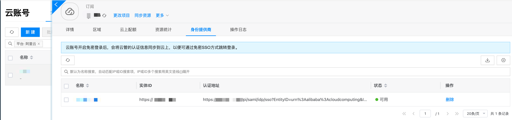
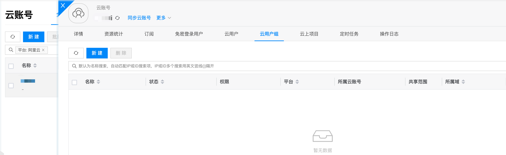
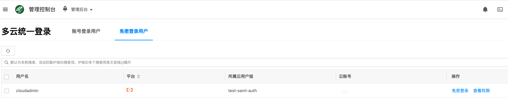

# Best Practices

## Enable Passwordless Authentication

- Find the cloud account that needs to enable passwordless login
- View the right side of the cloud account, click **More** > **Property Settings** > **Set Passwordless Login** as shown below

- Click the **Enable** button, then click **OK** to enable passwordless login as shown below

:::tip
If passwordless login is disabled, the cloud account will not delete the passwordless login resources underneath, it will only prohibit users from passwordless login
:::

## Identity Provider
After enabling, the cloud platform will create identity providers in each cloud subscription under this cloud account
- Select any cloud subscription under this cloud account to check if the identity provider was created normally, as shown below

:::tip
The platform will synchronize other registered identity providers, as long as one of them is available.
Some public clouds have limits on the number of identity providers. If the limit is exceeded, after deleting some identity providers, enable and disable the cloud account again, and the platform will start creating identity providers again
:::

## Create Cloud User Group
- As shown below

## Create Passwordless User
- As shown below

## Test Passwordless Login

- Click the username in the upper right corner of the platform, then click **Multi-Cloud Unified Login** as shown below

- Click **Passwordless Login Users** to switch to the passwordless user list, as shown below

- Click **Passwordless Login** on the right side of the user list to test

