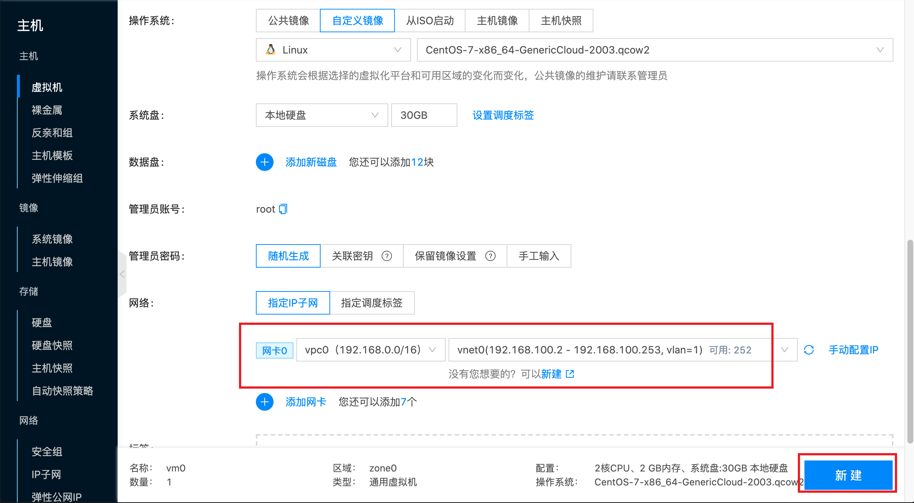

# Create Virtual Machine

Introduction to how to create virtual machines in local IDC environments.

:::tip
Before creating virtual machines, you need to create IP subnets, upload virtual machine images, enable hosts, and other operations in advance.
:::

## Create Through Frontend

In the **Host** menu, select **Virtual Machine**, then select **New**. On this interface, enter the hostname, select image and IP subnet, and create the virtual machine. Screenshots are as follows:

Enter virtual machine name vm0:


Select virtual machine configuration and image according to your needs. For example, the configuration in the screenshot below is: CPU 2 cores, memory 2G, image CentOS-7-aarch64-GenericCloud-2003.qcow2:


Select virtual machine network. Here select subnet vnet0 in vpc0, then click New:



After the virtual machine is created, the status becomes **Running**. You can click **Password** to get login information, then click the **Remote Control** button and select **VNC Remote Terminal** to log in to the virtual machine.

.

:::tip
For other login methods, please refer to: [Login to Virtual Machine](./connect).
:::


## Create Through climc

The `climc server-create` command provides operations to create cloud hosts. Because the platform can manage multiple private clouds and public clouds at the same time, different suppliers have their own authentication methods. Before creating cloud hosts, you need to do some different preparation work.


The command to create a machine is `server-create`. You can use `climc server-create --help` to view all parameters for creating a server. Common parameters are as follows:

|     Parameter Name    |   Type   |                            Function                           |
|:---------------:|:--------:|:--------------------------------------------------------:|
|     --ncpu     |    int   |                      Virtual machine CPU count                     |
|     --disk     | []string |   Specify the system disk image to create. Specifying multiple times means creating multiple disks for the virtual machine   |
|     --net      | []string | Specify the network used by the virtual machine. Specifying multiple times will add multiple network cards to the virtual machine |
|  --allow-delete |   bool   |                      Allow deleting virtual machine                      |
|   --auto-start  |   bool   |                      Auto start after creation                      |
|    --password   |  string  |                      Set virtual machine password                      |
|     --tenant    |  string  |                     Create to specified project                     |
| --prefer-region |  string  |                    Create to specified region                   |
|  --prefer-zone  |  string  |                      Create to specified zone                    |
|  --prefer-host  |  string  |                      Create to specified host                    |


:::tip
1. Name, memory or instance type must be used when creating hosts;
2. System disk images can be queried through `image-list` or `cached-image-list`. Public cloud image lists can be queried through the `cached-image-list` interface. Refer to: [Query Image](../glance/sysimage/show);
:::


The following creates machines by example:

Specifications to create:

| Name | Instance Type    | Memory | cpu | System Disk                 | Network | Others                                                                           |
|------|---------|------|-----|------------------------|------|--------------------------------------------------------------------------------|
| vm1  | -       | 4g   | 4   | centos7.qcow2 60g      | net1 | 2 data disks, one 100g ext4 mounted to /opt, another 50g xfs mounted to /data; auto start |
| vm2  | -       | 2g   | 2   | ubuntu18.04.qcow2 100g | net2 | Allow delete                                                                       |
| vm3  | t2.nano | -    | -   | centos6.qcow2          | net3 | -                                                                              |

```bash
# Create vm1
$ climc server-create --disk centos7.qcow2:60g --disk 100g:ext4:/opt --disk 50g:xfs:/data --ncpu 4 --net net1 --auto-start --mem-spec 4g vm1

# Create vm2
$ climc server-create --disk ubuntu18.04.qcow2:100g --net net2 --allow-delete --auto-start --ncpu 2 --mem-spec 2g vm2

# Create vm3
$ climc server-create --instance-type t2.nano --disk centos6.qcow2 --net net3 --auto-start vm3
```

### Hostname Expression Examples

Host (including virtual machines and bare metal) names support expressions. Expression format is: $\{variable_name\}, variable names need to be lowercase. For example, $\{host\} means the virtual machine name displays as the name of the host where the virtual machine is created; $\{region\}-$\{zone\} means display as region name-availability zone name, etc.

Supported variable names are as follows:

| Variable Name          | Example                                 | Description                                |
| ---------       | ----------                           | ---------                           |
| charge_type     | postpaid                             | Billing method                            |
| cloud_env       | onpremise/public/private             | Used to distinguish local IDC, private cloud and public cloud platforms |
| cloudregion_id  | default                              | Region id                              |
| cpu             | 1                                    | CPU count                             |
| host            | gobuild                              | Host name                              |
| host_id         | 16f49f8a-88cc-4715-8870-f78130196fa9 | Host id                              |
| ip_addr         | 192.168.1.1                          | IP address                              |
| mem             | 1024                                 | Memory                                |
| os_distribution | Operating System                             | CentOS                              |
| os_type         | Linux                                | Operating system type                        |
| os_version      | 6.9                                  | Operating system version                        |
| owner_tenant    | system                               | Project                                |
| owner_tenant_id | d56f5c37e36a42b782d7f32b19497c4c     | Project id                              |
| region          | Default                              | Region                                |
| hypervisor      | kvm                                  | Virtualization method                          |
| res_name        | server                               | Resource category                            |
| template_id     | 5199f56b-01c2-425c-8e29-0179d283e4a3 | Template id                              |
| zone            | zone1                                | Availability zone                              |
| zone_id         | 00f3f3c6-1d16-4053-81f1-4cb092f418f5 | Availability zone id                            |

